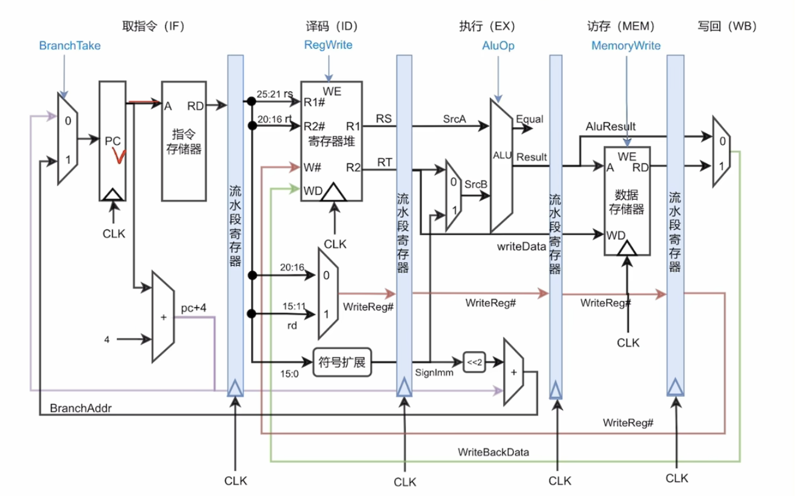

## 第3章 存储系统

### 存储器的三级层次结构（从微观到宏观）

1. **存储元 / 存储元件（Cell）：** 存储器的最基本物理单位，利用一个电容或触发器来保存 **1 位（1 bit）** 二进制代码（0 或 1）。

2. **存储单元（Unit）：** 由若干个存储元组合而成。CPU 每次进行读写操作时，都是**以存储单元为基本单位**进行的。一个存储单元包含的存储元个数称为**存储字长（宽度）**。

3. **存储阵列 / 存储矩阵（Array）：** 由成千上万个存储单元像方格纸一样整齐排列而成的矩阵。


### 突发传送的本质

只要在题干中看到**“送一个首地址，传输一整块/多个连续数据”**，不管是主存读写还是总线传输，指的都是它。

**（SDRAM 与 DDR）：** 同步 DRAM（SDRAM）和现代 DDR 内存引入的最重要特性就是支持**突发工作方式**。CPU 给出一次行列地址后，内存芯片可以在时钟驱动下连续向外吐出一串数据。

**（Cache 行填充）：** 当 Cache 发生未命中（Miss）时，需要从主存中调入一个完整的 **Cache 块（Cache Line）**。主存向 Cache 传输这一整块数据时，底层依靠的就是**总线的突发传送**。


### 高速缓冲存储器

**程序局部性原理的精准辨析**

- **时间局部性（Temporal Locality）**：最近被访问过的内存单元（数据或指令）在不久的将来**还会被再次访问**。典型场景是：循环控制变量、循环体内的指令、频繁累加的全局变量。
- **空间局部性（Spatial Locality）**：某个内存单元被访问过，其**相邻的内存单元**在不久的将来也会被访问。典型场景是：数组的顺序遍历、顺序执行的指令。

**Cache 缺失（Miss）的三种主要类型**

- **强制缺失（Compulsory Miss / 冷启动缺失）**：由于第一次访问某个内存块而必然引起的缺失。这是无法避免的，即使 Cache 容量无限大也会发生。
- **容量缺失（Capacity Miss）**：由于 Cache 容量有限，无法容纳程序运行所需的工作集，导致被替换掉的块再次被访问时发生缺失。
- **冲突缺失（Conflict Miss）**：在直接映射或组相联映射中，多个主存块映射到了同一个 Cache 组/块位置而引发的挤兑缺失。全相联映射**不存在**冲突缺失。

**Cache 关键控制位与状态管理**

- **有效位（Valid Bit）**：用于表示当前 Cache 块中的数据是否真实有效。系统刚开机或复位时全为 0。CPU 读 Cache 命中时，不仅要 Tag 匹配，**必须同时满足 Valid Bit = 1**。
- **脏位（Dirty Bit / 修改位）**：**只存在于“写回法（Write-back）”中**。当 CPU 写命中 Cache 时，只修改 Cache 不修改主存，并将脏位置 1。当该块被替换时，硬件根据脏位决定是否需要将其写回主存。而“写直达法（Write-through）”每次都直接写主存，因此**不需要**脏位。
- **标记位（Tag）**：保存主存地址的一部分，用于硬件比对当前块是否是 CPU 所需的目标块。

**映射方式与块冲突概率**

- 块冲突概率从高到低排序：**直接映射 > 组相联映射 > 全相联映射**。
- **直接映射**不需要替换算法，因为每个主存块的位置是唯一固定的，发生冲突时直接覆盖。

**替换算法的本质区别**

- **LRU（最近最少使用）**：核心思想是“如果数据最近没被访问，以后也不大可能被访问”。它淘汰的是**历史上最久没有被 CPU 访问过**的那个块（看的是时间间隔）。
- **LFU（最不经常使用）**：核心思想是“如果数据访问频率低，说明不常用”。它淘汰的是**在一段时间内被 CPU 访问次数最少**的那个块（看的是访问计数）。

**多核缓存一致性**

- 在对称多处理器（SMP）系统中，每个核心有自己的私有 L1 Cache。当多个核心读写同一主存变量时，为了防止看到旧数据，必须在**硬件级别实现缓存一致性协议（如 MESI 协议）**，而软件锁（Mutex）属于上层操作系统或并发编程层面的互斥手段，无法代替硬件一致性。


### cache和主存和外存

| **特性对比** | **Cache - 主存层次**            | **主存 - 外存层次（虚拟存储）**           |
| ------------ | ------------------------------- | ----------------------------------------- |
| **主要目的** | 提高 **速度**                   | 扩大 **容量**                             |
| **映射方式** | 直接、全相联、组相联均可        | **必须是全相联映射**                      |
| **交换单位** | 主存块（Block，几十字节）       | 页面（Page，几 KB）                       |
| **替换管理** | **纯硬件** 实现（追求极致速度） | **操作系统（软件）** 实现（追求低缺失率） |
| **写策略**   | 全写法 或 回写法                | **只采用回写法**（因为外存太慢）          |
| **缺失代价** | 极小（几纳秒到几十纳秒）        | **极大**（毫秒级，需访问磁盘）            |


## 第5章 中央存储器

### 取指令和操作数

**核心寄存器（Register）角色定位**

在 CPU 内部，与内存（RAM）打交道主要依赖以下几个关键寄存器：

- **PC（Program Counter，程序计数器）：** 存放**下一条将要执行的指令的内存地址**。它是整个流程的“发动机”。
- **MAR（Memory Address Register，内存地址寄存器）：** 专门用来存放 **CPU 即将要访问的内存单元的地址**（无论是读指令还是读数据）。它直接连接到**地址总线（Address Bus）**。
- **MDR（Memory Data Register，内存数据寄存器）：** 专门用来存放 **从内存中读出或准备写入内存的数据**。它直接连接到**数据总线（Data Bus）**。
- **IR（Instruction Register，指令寄存器）：** 用来存放**当前正在执行的指令**。从内存取出的指令会暂存到这里，等待译码器（ID）解析。
- **GPRs / AC（General Purpose Registers / Accumulator，通用寄存器/累加器）：** 用于存放最终参与运算的**操作数或中间计算结果**（如常规的 R0~R3 寄存器）。

***流程一：取指令与地址流程（Instruction Fetch）***

这个阶段的目的是：**CPU 顺着 PC 提供的地址，去内存把“指令”当成数据拿回来。**

1. **地址送出：** CPU 的控制单元（CU）发出控制信号，将 **PC** 中存放的指令地址传送到 **MAR** 中。
2. **发出读请求：**
   - **MAR** 将这个地址投递到地址总线（Address Bus）上，传给内存。
   - 同时，控制单元通过控制总线（Control Bus）向内存发送一个“读（Read）”信号。
3. **内存响应与数据传输：** 内存根据地址总线上的地址找到对应的存储单元，将该单元里存放的**指令**读出，并投递到数据总线（Data Bus）上。
4. **接收指令：** 数据总线上的指令被传送到 CPU 的 **MDR** 中。
5. **指令入库：** 由于当前拿来的是一条指令，指令会从 **MDR** 被复制到 IR（指令寄存器）中。
6. **PC 自增：** 在取指的同时，**PC** 的内容会自动加 1（或者加一条指令的字节数），指向下一条顺序执行的指令地址，为下一次循环做准备。

***流程二：取操作数/数据流程（Data Fetch）***

当指令进入 IR 后，**指令译码器（ID）\**会对其进行解析。如果发现这条指令需要去内存加载数据（例如 `LOAD R0, [0x2000]` 或 `ADD R1, [0x3000]`），CPU 就会启动\**取数据流程**：

1. **解析数据地址：** 译码器解析 **IR** 中的指令，提取出其中的**地址码（即数据所在的内存地址）**。
2. **地址再次送出：** 这个数据的内存地址被传送到 **MAR** 中（如果有间接寻址或变址寻址，会先由算术逻辑单元 ALU 或专用地址生成单元计算出有效地址，再送入 MAR）。
3. **发出读请求：**
   - **MAR** 将数据的地址投递到**地址总线**。
   - 控制单元再次通过**控制总线**向内存发出“读”信号。
4. **内存读取数据：** 内存根据地址找到数据，将其投递到**数据总线**上。
5. **接收数据：** 数据总线上的数据被传送到 CPU 的 **MDR** 中。
6. **数据落库：** 因为这次拿来的是运算所需的数据（操作数）而不是指令，所以数据不会去 IR，而是从 **MDR** 传送到通用寄存器（GPRs，如 R0、R1）或直接送入 ALU（算术逻辑单元）准备计算。


### 双操作数流程

> 不能再用MDR->MAR替代IR->MAR了

**一、 完整的“取”流程（取指 + 取双操作数）**

这个阶段的任务是：**先把指令拿进 CPU，再把两个生死未卜的操作数从内存里捞出来。**

**1. 取指令（所有指令通用）**

- **$T_0$：** `PC -> Bus -> MAR`, `Read`
  - **大白话：** PC 把下一条指令的地址丢上内部总线，灌进 MAR；同时向主存发出“读”命令。
- **$T_1$：** `M(MAR) -> Data Bus -> MDR`
  - **大白话：** 主存把处于该地址的指令（`ADD [A], [B]`）通过外部数据总线，送到大门口的 MDR。
- **$T_2$：** `MDR -> Bus -> IR`, `(PC) + 1 -> PC`
  - **大白话：** 指令从 MDR 挪到 IR 锁死，指令译码器开始分析；同时 PC 自动加 1，指向下一条指令。

**2. 取第一个操作数**

- **$T_3$：** `IR(A) -> Bus -> MAR`, `Read`
  - **大白话：** 译码器发现要用地址 A，控制单元（CU）把 IR 里的地址码 A 丢上总线，灌进 MAR，再次对主存发“读”信号。
- **$T_4$：** `M(MAR) -> Data Bus -> MDR`
  - **大白话：** 主存把地址 A 里的第一个数（比如数字 `5`）读出来，送进 MDR。
- **$T_5$：** `MDR -> Bus -> Y`
  - **大白话（关键）：** 为了防止等会读第二个数时把 `5` 冲掉，CPU 把 `5` 从 MDR 挪到**暂存器 Y** 里藏起来。

**3. 取第二个操作数**

- **$T_6$：** `IR(B) -> Bus -> MAR`, `Read`
  - **大白话：** 此时 MAR 腾出来了，CU 把 IR 里的第二个地址码 B 丢上总线，送进 MAR，第三次发“读”信号。
- **$T_7$：** `M(MAR) -> Data Bus -> MDR`
  - **大白话：** 主存把地址 B 里的第二个数（比如数字 `10`）读出来，送进 MDR。

至此，**“取”的流程全部结束**。此时的战局是：第一个数 `5` 在暂存器 Y，第二个数 `10` 在 MDR。


**二、 核心的“算”流程（ALU 轰鸣）**

这个阶段极短，通常只需要一个节拍，但在芯片内部电光石火。

- **$T_8$：** `Y + MDR -> ALU -> Z`
  - **大白话：** 暂存器 Y 的 `5` 和 MDR 的 `10` 同时喂给 ALU 的左右两路输入。CU 发出加法控制信号，ALU 吐出结果 `15`。这个结果会被立刻锁存到 **ALU 的输出暂存器 Z** 中。


**三、 完整的“存”流程（结果写回主存）**

算完之后，结果 `15` 还在暂存器 Z 里。因为我们要把结果写回内存 A，所以接下来要执行“存”：

- **$T_9$：** `IR(A) -> Bus -> MAR`
  - **大白话：** CPU 要把结果写到 A 地址。CU 重新把 IR 里的地址码 A 提取出来，丢上总线，灌进 MAR（告诉主存这次要写到 A）。
- **$T_{10}$：** `Z -> Bus -> MDR`, `Write`
  - **大白话：** 暂存器 Z 里的计算结果 `15` 走内部总线，送到对外大门口的 MDR 坐镇；同时 CU 向主存发出 `Write`（写）信号。
- **$T_{11}$：** `MDR -> M(MAR)`
  - **大白话：** 闸门合上，MDR 里的 `15` 顺着外部数据总线，精准地砸进 MAR 所指向的内存 A 单元中。整个指令完美谢幕。


### 地址译码器和多路选择器

| **特征**      | **地址译码器 (Decoder)**                                    | **多路选择器 (MUX)**                                      |
| ------------- | ----------------------------------------------------------- | --------------------------------------------------------- |
| **核心目的**  | **找位置**（根据编码找唯一的线）                            | **挑数据**（从多条线里挑一个放行）                        |
| **信号流向**  | **1 变多**（$n$ 位二进制输入 $\rightarrow$ $2^n$ 根输出线） | **多变 1**（$2^n$ 个数据输入 $\rightarrow$ 1 个数据输出） |
| **控制引脚**  | 输入的二进制本身就是控制信号                                | 有专门的“选择控制端”来决定放行谁                          |
| **经典比喻**  | **点名册**：喊到名字（编码）的那一个人站起来。              | **火车站闸机**：好几队人排队，调度员按按钮放行某一队。    |
| **CPU 写/读** | 负责**写（Write）**控制（精准激活某一个）                   | 负责**读（Read）**控制（多路数据中选一路输出）            |


### CU输入端和输出端

CU 是整个 CPU 的“大脑”，它负责发出各种控制信号（如 `PCin`, `MDRout` 等）。

- **CU 的输入端（信息来源）：**
  - **IR（指令寄存器）的输出**：送来指令的**操作码（Opcode）**，告诉 CU 这条指令是要干嘛（加法、减法还是跳转）。
  - **FR（标志寄存器）的输出**：送来运算状态（如 `SF` 符号、`OF` 溢出、`ZF` 零标志），主要用于条件转移指令（如“结果为负则跳转”）。
  - **时钟脉冲（CLK）**：提供时间步调，决定微操作的先后顺序。
- **CU 的输出端（去往何处）：**
  - 发出图中密密麻麻的所有**微操作控制信号**（控制寄存器进出的 `in` / `out` 信号，以及控制 ALU 做何种运算的 `ALUop` 信号）。


### 逻辑表达式

**下标 15（如 $A_{15}$）**：代表这个数的**最高位（符号位）**。因为是 16 位机器字长，从 0 数到 15，第 15 位就是最左边决定正负的那一位。

**字母上面的横线（如 $\overline{A_{15}}$）**：代表**取反（NOT）**。如果 $A_{15} = 0$（正数），那 $\overline{A_{15}}$ 就是 `1`。

**字母连写（如 $A B$）**：代表**逻辑“与”（AND）**，意思是“必须同时满足”。

**加号（$+$）**：代表**逻辑“或”（OR）**，意思是“满足其中一种情况就行”。


### 为什么要设置暂存器Y和Z

由于该CPU采用的是**内部单总线结构**（所有部件都连接在同一条内部总线上）：

- **设置暂存器Y的原因：** ALU有两个输入端（A和B），而单总线在同一时刻只能传输一个操作数。因此，必须先将一个操作数通过总线送入暂存器Y保存，然后再通过总线将第二个操作数直接传给ALU的B端，这样ALU才能同时获得两个输入。
- **设置暂存器Z的原因：** ALU是一个组合逻辑电路，没有存储功能。当运算结果 $F$ 输出时，如果不加暂存直接放回总线，由于输入端B也连在总线上，会导致输出信号对输入信号产生干扰（形成竞争冒险或反馈环路）。因此需要暂存器Z先锁存运算结果，隔离ALU输出与内部总线。


###  **三态门**

**作用：** 控制移位寄存器 SR 的输出是否放上 CPU 内部总线。当该部件导通时，数据传送到总线上；当其关闭时，输出呈高阻态，从而**防止多个部件同时向总线发送数据而导致的总线冲突**。


### 区分内容or地址访问组件

| **组件名称**          | **访问方式** | **核心硬件支撑**       | **考研高频考法**                  |
| --------------------- | ------------ | ---------------------- | --------------------------------- |
| **主存 / 通用寄存器** | **按地址**   | 地址译码器             | 基础常识，不可选错                |
| **页表（慢表）**      | **按地址**   | 索引计算 + 主存寻址    | 容易和 TLB 混淆，它是常规主存访问 |
| **快表（TLB）**       | **按内容**   | 相联存储器（CAM）      | 标志性的“按内容访问”高频考点      |
| **全相联 Cache**      | **按内容**   | 全部 Tag 并行比较      | 灵活性最高，成本最高              |
| **组相联 Cache**      | **混合**     | 组间按地址，组内按内容 | 现代 CPU 的主流选择               |


### 中断和异常

- 关中断指令（CLI）的作用边界与内中断的区别: 这是一个核心盲区。你在多道题中混淆了关中断（CLI）的屏蔽范围。需要明确：CLI 指令（清除 IF 标志位）**只能屏蔽可屏蔽外中断（INTR）**。对于由于代码引发的**内中断（异常，如非法指令、除 0、保护违例、故障等）**以及硬件触发的**不可屏蔽中断（NMI）**，CLI 是完全无效的。即使处于关中断状态，CPU 遇到非法指令或内中断也必须立即响应并强行转入内核态处理，绝不能“不予响应”或“直接忽略”。
- 用户态执行特权指令的惩罚机制: 你对处理器保护模式下的权限控制存在误解。在用户态下，如果普通程序试图执行特权指令或不符的非法指令，CPU 绝不会为了安全“自动切换为开中断状态”或“忽略它”，而是会立即触发一个**保护违例（General Protection Fault）的内中断（异常）**，强行把控制权交还给内核，由内核来中止该恶意或错误的程序。
- 中断嵌套的前提条件与外中断响应条件: 你需要理清多源中断的处理逻辑。第一，关中断指令（CLI）是纯粹的硬件状态控制，它并不具备“自动识别并放行高优先级电信号”的智能特性；实现中断嵌套的唯一核心前提，是前一个中断服务程序在起始阶段**主动执行了开中断指令（STI）**。第二，外部设备发出 INTR 时，CPU 响应的条件包括 IF=1、指令周期结束、信号在引脚保持有效等，但**不要求** CPU 当前必须执行内核态指令（用户态下完全可以被外中断打断）。
- 异常细分类别（故障、终止）与不可屏蔽中断（NMI）的特性: 需要注意不同中断处理完后的恢复特征：首先，故障（Fault）通常可修复且返回原指令重试，终止（Abort）对应灾难性硬件错误（如奇偶校验错误）且无法恢复。其次，由主板电源不稳触发的 NMI 属于外部中断（硬件引发，与当前指令无关），因此它在处理完毕后，应当返回原本序列中的**下一条指令**继续执行，而不是重新执行当前指令。


### 指令流水线

5段 MIPS 流水线（Pipelined）CPU 的数据通路（Datapath）



图里用这 4 根柱子，把 CPU 物理上隔成了 5 个相互独立的房间：

1. **取指令（IF）**：最左边。`PC` 寄存器发出地址，从 **指令存储器** 里把 32 位的机器码读出来。同时下面有一个 `+4` 的加法器，为下一条指令准备好地址。
2. **译码（ID）**：进入第二个房间。在这里拆解机器码，去 **寄存器堆（Register File）** 寻找到需要用的操作数（R1, R2），或者把立即数进行 **符号扩展（Sign Extension）**。
3. **执行（EX）**：核心是 **ALU（算术逻辑单元）**。在这里做真正的数学运算（加减乘除）、逻辑运算，或者计算分支跳转的实际地址。
4. **访存（MEM）**：专门读写 **数据存储器（Data Memory）**。只有 `lw`（从内存读到寄存器）和 `sw`（从寄存器写回内存）指令会在这里真正干活。
5. **写回（WB）**：最右边。把最终运算出来的结果，准备写回到目标寄存器中。

### 多处理器

多处理器系统（Multiprocessor）共享同一个物理地址空间；而多计算机系统（Multicomputer）每个节点有独立的物理地址空间，通过消息传递进行通信。

硬件多线程通过在硬件级别保留多个线程的状态，当一个线程遭遇Cache缺失等长延迟事件时，快速切换到另一个工作线程，从而隐蔽停顿，提升CPU的吞吐率。


### 主存储器和控制存储器

| **比较维度**   | **主存储器（MM / 主存）**          | **控制存储器（CM / 控存）**                       |
| -------------- | ---------------------------------- | ------------------------------------------------- |
| **物理位置**   | CPU 外部（通过系统总线连接）       | **CPU 芯片内部**（控制器核心区域）                |
| **存储内容**   | 操作系统、用户应用程序、数据       | 驱动硬件工作的**微程序（微指令）**                |
| **面向对象**   | **程序员**（汇编/高级语言可见）    | **CPU 硬件/固件**（对程序员完全透明/不可见）      |
| **容量与介质** | 容量**大**（GB 级别），主要用 DRAM | 容量**极小**（几 KB，几百条微指令），用 ROM/SRAM  |
| **访问速度**   | 较慢（以几十纳秒计，受总线限制）   | **极快**（与 CPU 内部逻辑等速，1 个微周期内完成） |
| **地址寄存器** | **$MAR$**（存储器地址寄存器）      | **$\mu CMAR$**（微地址寄存器）                    |
| **数据寄存器** | **$MDR$**（存储器数据寄存器）      | **$\mu CMDR$**（微指令数据寄存器）                |


```
  kubeadm join apiserver.k8s.fakecyber.com:10002 --token c4h94s.omds50q2m38ytpsk \
        --discovery-token-ca-cert-hash sha256:1ad154a05b8b1b7cad49cd4db8f8ccb186cbc472cfd296bf5ff0734ae5cc2675 \
        --control-plane --certificate-key 02da62c2490cf80ea7f919329a5e7755fbb4aefaf6919ffa017d7c77b4dcc524

Please note that the certificate-key gives access to cluster sensitive data, keep it secret!
As a safeguard, uploaded-certs will be deleted in two hours; If necessary, you can use
"kubeadm init phase upload-certs --upload-certs" to reload certs afterward.

Then you can join any number of worker nodes by running the following on each as root:

kubeadm join apiserver.k8s.fakecyber.com:10002 --token c4h94s.omds50q2m38ytpsk \
        --discovery-token-ca-cert-hash sha256:1ad154a05b8b1b7cad49cd4db8f8ccb186cbc472cfd296bf5ff0734ae5cc2675 
```


## 第6章 总线

### 总线定时

| **定时方式**   | **核心特征（做题眼）**                 | **谁来决定时间？**       | **缺点**                 | **典型应用**               |
| -------------- | -------------------------------------- | ------------------------ | ------------------------ | -------------------------- |
| **同步定时**   | 统一时钟，固定时钟周期                 | 统一的时钟信号           | 强制齐步走，迁就慢速设备 | CPU内部、高速Cache总线     |
| **异步定时**   | 握手应答（全/半/不互锁）               | 主从设备互相决定         | 控制复杂，存在握手延迟   | 系统总线、外设总线、I/O    |
| **半同步定时** | 同步+**$\overline{\text{WAIT}}$ 信号** | 时钟为主，慢速设备可插队 | 还是依赖时钟，灵活性适中 | 早期微机系统（如8086）     |
| **分离式定时** | **拆分为两个子周期**，中途释放         | 各自申请，互相作为主设备 | 控制逻辑最恐怖，开销大   | 现代高性能服务器总线、PCIe |


### 突发传输（Burst Transfer）的应用场景

Cache（缓存）与主存之间的数据块交换、现代内存（DDR SDRAM）的内部读写控制、DMA（直接内存访问）的大块数据搬运、显卡与显存（VRAM）之间的高速画面渲染、片上系统（SoC）的高速总线协议（如 ARM AXI）


### 桥接器（Bridge）的核心功能

总线是分层的，不同的总线**时钟频率不同、数据宽度不同、传输协议也不同**。这就好比中国高铁和普通地铁，轨距、电压都不一样，它们之间怎么接轨？必须有一个“换乘枢纽”。桥接器（比如以前主板上的北桥、南桥芯片，或者现在的片上 PCI 控制器）就是这个枢纽。它负责**电平转换、速度匹配、协议翻译和数据缓冲**。因此，不同总线之间必须通过桥接器连接。


### 现代高速总线“串行化”的颠覆性常识

**PCIe、SATA、USB、SAS** 都是 **串行** 总线

传统的 **PCI、AGP、ISA** 才是 **并行** 总线。


## 第7章 输入输出系统

### 数据到底是怎么传的

$$\text{CPU 通用寄存器} \xleftrightarrow{\text{I/O 指令 (程序控制)}} \text{I/O 端口 (接口内)} \xleftrightarrow{\text{接口控制逻辑 (硬件控制)}} \text{I/O 设备}$$


### I/O 接口和I/O 设备

**I/O 接口（Interface / Controller / Adapter）**： 是 CPU 和外设之间的**桥梁**，属于芯片或电路板级别。它负责协调数据传输、电平转换和命令译码。在命名上，通常带有 **“适配器（Adapter）”**、**“控制器（Controller）”** 或 **“接口”** 字样。

**I/O 设备（Device / Peripheral）**： 是具体的**物理外设**，用来实现真正的物理输入输出或存储（如机械部件、光学部件等）。


### 异步串行通信

在没有发数据的时候，线路上一直维持着**高电平（1）**，代表“空闲状态”。

一旦要开始传一个字符（一帧），就必须严格按照下面的规矩来排队：

1. **起始位（Start Bit）**：强行把电平拉低（0），维持1位的时间。这就好比发送方大喊一声：“**注意，我要开始发货了！**” 接收方听到这个信号，立刻清醒过来，准备收货。
2. **数据位（Data Bits）**：紧跟在起始位后面，就是真正要传的内容。通常是 5~8 位（比如题目里说的是 7 位 ASCII 码）。
3. **校验位（Parity Bit）**：可选的。用来检查刚才传的数据对不对（奇校验或偶校验），占 1 位。
4. **停止位（Stop Bit）**：最后把电平重新拉高（1），可以维持 1 位、1.5 位或 2 位的时间。代表“**这一个字符传完了**”，同时线路恢复空闲，等待下一个起始位的到来。

## 

