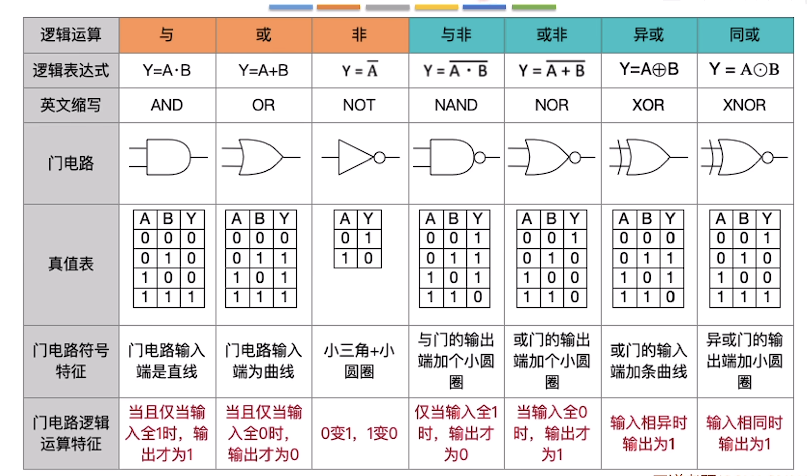

| **时段**  | **具体时间**      | **复习科目**       | **核心任务与重点建议**                                       |
| --------- | ----------------- | ------------------ | ------------------------------------------------------------ |
| **清晨**  | **07:00 - 07:30** | 起床/洗漱/早餐     | 开启大脑，可以听听英语播客或磨耳朵。                         |
| **早读**  | **07:30 - 08:15** | **英语单词/短语**  | 利用晨间记忆力背诵 408 专业词汇和考研核心词。                |
| **上午**  | **08:15 - 09:15** | **概率论**         | **重点**：多维随机变量、标准化、数字特征（趁头脑清醒搞定逻辑）。 |
| (数学)    | **09:15 - 11:00** | **高等数学**       | **重点**：微积分、中值定理（时间最长，攻克大题）。           |
|           | **11:00 - 12:00** | **线性代数**       | **重点**：矩阵、特征值、二次型（公式多，适合收尾）。         |
| **午休**  | 12:00 - 13:30     | 午餐 + 深度午睡    | **必须午睡**，否则下午 3 小时的 408 核心课会撑不住。         |
| **下午**  | **13:30 - 15:00** | **计算机组成原理** | **(🎯1.5h)**：重点攻克 IEEE 754、存储器层次、Cache。          |
| (408核心) | **15:00 - 16:30** | **操作系统**       | **(🎯1.5h)**：重点攻克 PV 操作、分页存储、进程调度。          |
|           | **16:30 - 17:30** | **计算机网络**     | 重点：IP 子网划分、TCP 流量/拥塞控制。                       |
|           | **17:30 - 18:30** | **数据结构**       | 重点：算法代码实现、树与图的性质。                           |
| **晚上**  | **19:30 - 20:30** | **英语语法**       | 梳理长难句，分析考研阅读中的结构陷阱。                       |
| (实战)    | **20:30 - 21:30** | **英语翻译/作文**  | 实战练习，积累属于自己的翻译技巧和作文模板。                 |
|           | **21:30 - 22:30** | **运维实战**       | 维护 K8s 环境，练习 Istio/Envoy 或脚本自动化。               |
|           | **22:30 - 23:30** | **开发实战**       | 迭代 Django 资产管理系统，优化 Vue3 前端体验。               |
| **休息**  | 23:30 - 07:00     | 睡眠               | 保证 7.5 小时睡眠，维持复习的可持续性。                      |