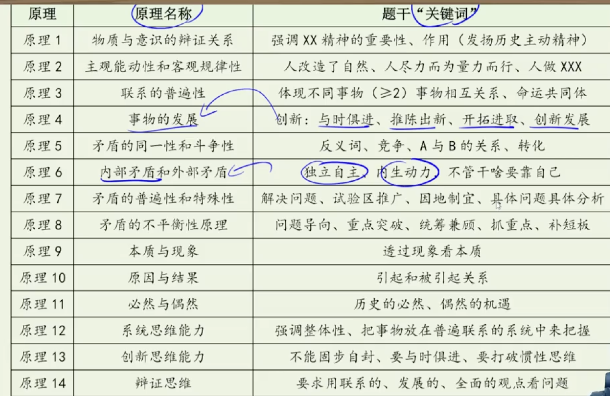
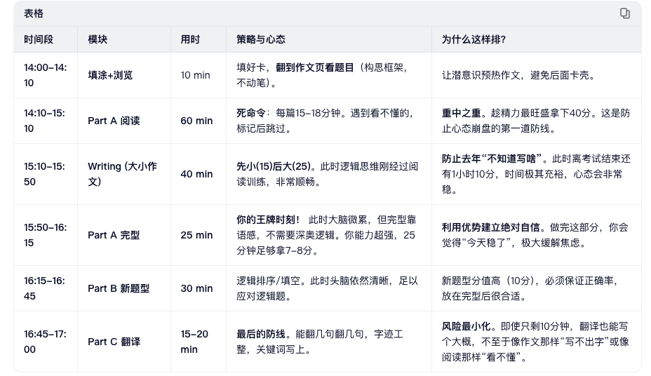
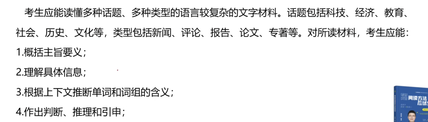

```http
Conspicuously, the above scene can be associated with a host of adj + 什么人。
Admittedly/Nowadays，an increasing number of 什么人，now， do sth when doing sth，(such 。。。 and so forth)，(which reflects a negative attitude)。
This phenomenon deserves particular attention because sb focus only on sth，which is essential for achieving personal success(/shaping one’s moral character)./which hinders/undermines/prevents personal development./which can foster personal growth but also hinder it under certain circumstances.
//积极
Besides, 积极属性 contributes to our overall well-being and happiness, as it plays a profound role in enhancing our confidence(/nurturing sense of responsibility) and fostering our positive mindset.
Moreover, as modern society places ever higher demands on individuals, cultivating 积极属性(an optimistic mindset) becomes all the more essential in helping us adapt to the fast-paced and unpredictable world.
//消极
Besides, young people often get lost in their own world and forget the importance of __消极主题词对应的积极主题词__. As a result, they may fall into patterns that negatively affect their well-being.
Moreover, amid growing competition and uncertainty, people may subconsciously adopt maladaptive coping mechanisms, such as(immersing themselves in the virtual world/paying excessive attention to their phones), as a way of managing anxiety and stress.
And we must acknowledge the undeniable responsibility of social media in the matter of __消极主题词__, as they have exerted a negative influence on the general public.
//正面和反面都需要论证时：
In my view, the sth can be likend to a double-edged sword.
On the one hand, as modern society places higher demands on individuals, it is imperarive for us to develop 积极属性 so as to better adapt to the fast-changing society.
On the other hand, in a world characterized by intense competition and uncertainty, individuals may inadvertently turn to unhealthy coping strategies, such as Sth（immersing themselves in the virtual world）, to deal with anxiety and stress


In a nutshell, as the picture subtly reminds us, the ability to 积极 plays a crucial role in promoting both personal growth and social harmony.
Therefore, parents should attach importance to developing this quality in their children from an early age.
Meanwhile, social media bears the responsibility of raising public awareness of its enduring significance.

//消极
In a nutshell, as the picture subtly reminds us, 消极 exerts a negative influence on individual development and social cohesion.
Therefore, parents should attach importance to correcting such tendencies in their children from an early age so as to prevent these unfavorable habits from becoming deeply ingrained. 
Meanwhile, social media bears the responsibility of raising public awareness of the long-term harm such behavior may generate.
//均衡
In a nutshell, Sth plays a crucial role in fostering personal growth and social progress but also hinder it under certain circumstances.
In addition, social media also has the responsibility to highlight both its benefits and its potential harms to the public.


.
```


```http
// 图表+图画
Two extraordinary and meaningful pictures unfold before our eyes. 
In the left picture, there is a boy with a smile on his face, saying that the park near his home is very pleasant. Meanwhile, other people are exercising in the park’s community fitness area in the warm sunshine. 

On the right, a chart clearly illustrates the number of parks in a certain city from 2020 to 2022. Specifically, the number of parks increased significantly from 406 to 670. // 柱状

The pie chart above clearly reveals the results of a survey (on the average times of consumers' ordering takeaway per month in China in 2021). According to the data, the percentage of xxx is the largest among the 共几个(five) groups, accounting for 35.2%; the percentage of xxx is 27%. In contrast, the percentage of xxx merely takes up 18.5%.//饼状

```


2015消极

```
An extraordinary and meaningful drawing unfolds before our eyes. At a party, several young people sit on chairs with different expressions on their faces; however, they are neither interacting with one another nor enjoying any food.

Conspicuously, the above scene can be associated with a host of ordinary people. Admittedly, an increasing number of youngsters now immerse themselves in their phones in various situations, such as walking or attending parties and so forth, which reflects a negative phenomenon. This phenomenon deserves particular attention because young people focus only on their phones, which hinders their personal development. Besides, young people often get lost in their own world and forget the importance of interacting with others in reality. As a result, they may fall into patterns that negatively affect their well-being. Moreover, in a world characterized by intense competition and uncertainty, individuals may inadvertently turn to unhealthy coping strategies, such as paying excessive attention to their phones, to deal with anxiety and stress.

In a nutshell, as the picture subtly reminds us, ignoring others’ feelings due to the overuse of personal phones exerts a negative influence on individual development and social cohesion. Therefore, parents should attach importance to correcting such tendencies in their children from an early age so as to prevent these unfavorable habits from becoming deeply ingrained. Meanwhile, social media bears the responsibility of raising public awareness of the long-term harm such behavior may generate.
```


2016

```
Two extraordinary and meaningful drawings unfold before our eyes. In the left picture, a boy lies on a chair, saying that he has so many books, yet he does not seem inclined to read them. However, in the right picture, a boy sits at his desk, declaring that he plans to read twenty books this year, and he is indeed engaged in reading.

Conspicuously, the above scene can be associated with a host of ordinary people. Admittedly, an increasing number of individuals now make plans to read books, which reflects a positive attitude. This phenomenon deserves particular attention because individuals should not only set reading goals but also put what they have learned into practice, a process that is essential for achieving personal success. Besides, taking action rather than merely talking contributes to our overall well-being and happiness, as it plays a profound role in enhancing our confidence and fostering a positive mindset. Moreover, as modern society places ever higher demands on individuals, both acquiring knowledge through reading and turning it into action become all the more important in helping us adapt to an increasingly fast-paced and unpredictable world.

In a nutshell, as the picture subtly reminds us, the ability to put ideas into practice plays a crucial role in fostering both personal growth and social harmony. Therefore, parents should attach importance to developing this quality in their children from an early age. Meanwhile, social media bears the responsibility of raising public awareness of its enduring significance.
```


2018

```
An extraordinary and meaningful drawing unfolds before our eyes. A youngster sits on a chair, selecting lessons which he is going to take on his computer, with an anxious expression. There are two types of lessons: one is new, more innovative and more difficult, yet the other one is easy to pass, quick to finish and involves very little homework.

Conspicuously, the above scene can be associated with a host of undergraduates. Admittedly, an increasing number of college students tend to select the former, which reflects a positive attitude, although it will be a difficult process. This phenomenon deserves particular attention because undergraduates should focus on learning new knowledge and enhancing their ability for innovation, which is essential for shaping one’s character. Besides, studying to improve one’s abilities contributes to our overall well-being and happiness, as it plays a profound role in enhancing our confidence and nurturing a sense of responsibility. Moreover, as modern society places ever higher demands on individuals, cultivating an active mindset toward study becomes all the more essential in helping us adapt to the fast-paced and unpredictable world.

In a nutshell, as the picture subtly reminds us, the ability to take a serious mindset toward study plays a crucial role in fostering both personal growth and social harmony. Therefore, parents should attach importance to developing this quality in their children from an early age. Meanwhile, social media bears the responsibility of raising public awareness of its enduring significance.
```


2019

```
An extraordinary and meaningful drawing unfolds before our eyes. Two men are climbing a mountain. The man on the left is handing a bottle of water to his partner, encouraging him not to give up, to take a short rest, and then continue climbing. This is because his partner on the right wears a sad expression, saying that he is exhausted and wants to give up.

Conspicuously, the above scene can be associated with a host of ordinary people. Admittedly, an increasing number of individuals now tend to give up when facing difficulties, such as climbing a mountain, which reflects a negative attitude. This phenomenon deserves particular attention because individuals should focus on braving hardships and overcoming them, which is essential for achieving personal success. Besides, persistence contributes to individuals’ overall well-being and happiness, as it plays a profound role in enhancing our confidence and fostering a positive mindset. Moreover, as modern society places ever higher demands on people, cultivating a mindset of persistence becomes all the more crucial in helping us adapt to the fast-paced and unpredictable world.

In a nutshell, as the picture subtly reminds us, the ability to persist plays a vital role in fostering both personal growth and social harmony. Therefore, parents should attach importance to developing this quality in their children from an early age. Meanwhile, social media bears the responsibility of raising public awareness of its lasting significance
```


```
An extraordinary and meaningful drawing unfolds before our eyes. Two girls are standing in front of a board that includes some information about a campus lecture. The girl on the left points that the lecture is not about her major and is useless. However, the girl on the right argues that attending it will be useful for her, with a curious expression on her face.

Conspicuously, the above scene can be associated with a host of ordinary undergraduates. Admittedly, an increasing number of undergraduates are now reluctant to acquire additional knowledge outside of their major, which reflects a negative attitude. This phenomenon deserves particular attention because undergraduates should attach importance to all-round development, which is essential for fostering personal growth. Besides, all-round learning contributes to our overall well-being and happiness, as it plays a profound role in enhancing our confidence and fostering a positive mindset. Moreover, as modern society places ever higher demands on individuals, well-rounded education becomes all the more essential in helping us adapt to a fast-paced and unpredictable world.

In a nutshell, as the picture subtly reminds us, all-round development plays a crucial role in promoting both personal growth and social harmony. Therefore, students should attach importance to cultivating this quality in themselves. Meanwhile, social media bears the responsibility of raising public awareness of its enduring significance.
```


# 建议

```http
Dear friends，
  How are you getting along with your life these days？(I‘m honored to represent Students' Union in welcoming you and offering a few humble/practical suggestions./I'm so glad to receive your email, in which you mentioned that you wanted to ___. I'm writing this letter to share some of my humble suggestions.)
  To begin with，doing sth(planning your time)should be addressed first，and i think it would be a good idea to do sth(seek advice from senior students). Furthermore，I strongly recommend doing sth(getting familiar with everyday Chinese)--it'll make your preparation much smoother and more effective. I believe these suggestions will surely help you get better results and feel more confident about your tasks.
  I hope my advice will be of some help to you. Please don't hesitate to let me know if you need more information. I’m looking forward to hearing your good news soon.
                                                                              yours，                                                                                 LiMing
Dear [Friend's Name], (注意：题目没给名字就用 Dear Friend)

I was so glad to receive your email asking for advice on [题目主题，e.g., how to prepare for the exam]. Knowing that you are facing this challenge, I am writing to share some practical suggestions that worked well for me.

To begin with, priority should be given to [建议1核心词，e.g., time management]. It would be highly beneficial if you could [具体做法，e.g., make a detailed schedule]. Furthermore, I strongly recommend [建议2核心词，e.g., communicating with seniors], which will help you avoid common pitfalls and save much effort.

I hope these tips will be helpful for you to [具体目标，e.g., adapt to the new semester]. Please feel free to contact me if you need further assistance.

Yours sincerely,
Li Ming
```

## 邀请

```http
Dear Professor,
  I'm student from the School of Law and i am writing this letter to invite you to participate in the upcoming 活动, which will be held at auditorium next Sunday.
  To start with, the event aims to encourage innovation, enhance students' skills, and enrich their campus life. We believe your experience and advice will greatly inspire the participants and contribute to the overall success of the activity. Furthermore, during the event, you will be invited to 受邀角色. Specifically, the event will start at around 7:00 p.m. and last for 2 hours at most. At the end of it, we will have some hand-made presents for each participant.
  We would be very grateful if you could accept our invitation and look forward to your favorable reply at your earliest convenience.
                                                                       Yours sincerely,
                                                                                Li Ming

2027考研·全场景通用邀请信模板
Dear [Name],
I am Li Ming, [你的身份，e.g., a student from... / the monitor of...]. I am writing to cordially invite you to [核心动作：见下方填空指南], which is scheduled to take place on [时间] at [地点].
The main purpose of this [gathering/project/visit] is to [目的：见下方填空指南]. Given your [对方的优势，e.g., expertise / enthusiasm / friendship], we firmly believe that your participation would [带来的好处，e.g., be of great value to us / add much joy to the occasion].
Regarding the details:
We plan to [具体做什么：见下方填空指南]. The whole process is expected to last for [时长]. To express our sincere appreciation, we have prepared [礼物/款待：见下方填空指南] for you.
We would be immensely grateful if you could accept this invitation. Please let us know your availability at your earliest convenience.
Yours sincerely,
Li Ming

| A. 正式活动/比赛
(如：讲座、竞赛) | attend the [Activity Name]
(参加...活动) | promote innovation / exchange ideas
(促进创新/交流思想) | hold the ceremony and awards
(举行仪式和颁奖) | a certificate and a souvenir
(证书和纪念品) |
| B. 吃饭/聚会
(如：春节聚餐、生日宴) | join us for a [Dinner/Party]
(参加我们的晚宴/派对) | celebrate the festival / strengthen friendship
(庆祝节日/增进友谊) | enjoy traditional food and chat
(享用传统美食并聊天) | some homemade delicacies
(一些自制美食) |
| C. 加入团队/项目
(如：志愿者、课题组) | join our [Team/Project]
(加入我们的团队/项目) | conduct research / help the community
(进行研究/帮助社区) | hold regular meetings and field work
(定期开会和实地考察) | a letter of appointment
(聘书) |
| D. 来做客/旅游
(如：来家里、来中国) | visit my hometown / come to my home
(参观我的家乡/来我家) | experience local culture / relax yourself
(体验当地文化/放松身心) | show you around the scenic spots
(带你游览景点) | a guided tour and local gifts
(导游服务和当地礼物) |
都遵循“我是谁 -> 请你干嘛 -> 为什么要你 -> 具体安排 -> 给你什么好处”的闭环。
```


介绍

```http
Dear Mr. Smith,

How have you been recently? I am writing to recommend/introduce [the person/place/thing], which is one of my favorite [topics/choices/activities]. The reasons for my recommendation are as follows.

To begin with, [the recommended person/thing] has attracted wide attention and has earned high praise for its unique features [or specific qualities]. Furthermore, having personally experienced and learned about its strengths and advantages, I am confident that you will find it enjoyable, meaningful, and helpful. In my view, these qualities make it a perfect [place to visit / person to work with / option to consider].

I sincerely hope the above information will be of some help to you. If you have any further questions, please feel free to contact me.

Yours sincerely,
Li Ming

Dear Mr. Smith,
How is everything going? Knowing that you are interested in [题目主题，e.g., Chinese traditional culture / improving your speaking skills], I am writing to highly recommend [具体推荐对象，e.g., the book "The Red Chamber" / Mr. Wang, a senior teacher] to you, which I believe will be of great benefit to your current needs.
My recommendation is primarily based on the following two reasons. First and foremost, what makes [推荐对象] stand out is its/his/her [核心特点1，填名词短语，e.g., profound cultural connotation / extensive teaching experience]. Unlike others, it/he/she offers a unique perspective that allows you to [具体作用1，填动词原形，e.g., gain a deep insight into history / master practical skills efficiently]. Furthermore, having personally experienced [推荐对象], I can attest to its/his/her [核心特点2，填形容词，e.g., accessibility and charm / patience and enthusiasm]. It is precisely these qualities that render it/him/her an indispensable choice for anyone seeking to [最终目的，e.g., broaden their horizons / overcome language barriers].
I am convinced that [推荐对象] will not only meet your expectations but also bring you unexpected surprises. Should you require any further information, please do not hesitate to contact me.
Yours sincerely,
Li Ming
```


道歉-------

```http
Dear [收信人姓名或称谓],
【表示歉意】
I am writing to express my sincere apologies for [简要说明道歉事由，如：missing the deadline / not being able to attend the meeting / the inconvenience caused by my recent absence]. I truly regret any trouble or disruption this may have brought to you.
【说明原因】
The reason for this is that [简要说明原因，如：I unexpectedly fell ill / there was an urgent family matter / I encountered some unforeseen difficulties]. Please be assured that this situation was entirely unintentional, and I deeply regret any inconvenience it may have caused to your schedule.
【再次表示歉意给出补偿措施】
Once again, please accept my heartfelt apologies. I sincerely hope for your kind understanding regarding this matter, and I will make every effort to avoid such situations in the future.
Yours sincerely,
[你的名字]
```


```
Dear Bob,

I am writing to extend my sincere apology for forgetting to return your music CD. Unfortunately, an urgent matter came up, and I accidentally left the CD in my luggage when I returned. I truly regret the inconvenience this has caused you.

It was never my intention to cause any trouble, and I can’t express how sorry I am. Please believe that this kind of oversight rarely happens to me. To make up for it, I’d like to return the CD to you as soon as possible—perhaps the next time we meet or by mail if that’s more convenient.

I sincerely hope this arrangement is acceptable and that you can accept my apologies. Thank you for your understanding, and I look forward to continuing our pleasant friendship.

Yours sincerely,

Li Ming
```


祝贺-------

```http
I was delighted to hear that 主题（you have been admitted to…）. Congratulations! It is truly a joy to share in your happiness and celebrate this well-deserved success with you.

Your hard work, perseverance, and dedication have clearly paid off, and this honor is entirely yours to claim. Over the years, it has been inspiring to see your steady progress and the many accomplishments you have achieved. Given what you have already done, I am confident that you will continue to excel in all your future endeavors.

Once again, congratulations on this remarkable milestone. I sincerely wish you even greater success and every happiness in the years ahead.

得知您已被录取，我感到非常高兴。恭喜！能与您分享这份喜悦，共同庆祝这来之不易的成功，我由衷地感到高兴。

您的辛勤付出、坚持不懈和专注奉献显然得到了回报，这份荣誉完全属于您。多年来，看到您稳步前进并取得诸多成就，我深受鼓舞。鉴于您已经取得的成就，我相信您在未来的所有努力中都会继续取得卓越成就。

再次祝贺您取得这一非凡的里程碑。衷心祝愿您在未来的岁月里取得更大的成功，并拥有幸福美满的生活。
```


通知

```http
Notice
Dec. 21, 2025

Notice is hereby given to all students that [主题]. The following details are provided for your reference.

The event will take place at 3:00 p.m. on December 30, 2025, in the school gymnasium. Prospective participants are expected to meet the following criteria. Firstly, perseverance and a positive attitude are essential. Additionally, those with relevant experience will be given priority. Participants will have the opportunity to engage in collaborative activities, which will provide a valuable and enjoyable experience.

Please feel free to contact us at abc@123.com if you are interested. We look forward to your active participation and hope you make the most of this opportunity.

通知

2025年12月21日

特此通知全体学生[主题]。以下详情供您参考。

活动将于2025年12月30日下午3:00在学校体育馆举行。有意参加者需符合以下条件。首先，坚持不懈和积极的态度至关重要。此外，有相关经验者优先考虑。

参与者将有机会参与合作活动，这将是一次宝贵而愉快的经历。

如有兴趣，请随时联系我们：abc@123.com。我们期待您的积极参与，并希望您充分利用这次机会。
```


感谢

```http
Dear Mr. Smith,

I am writing to express my sincere gratitude to you for [the support/help you provided with…]. I truly appreciate your kindness and support during that time.

It was your generosity and thoughtfulness that enabled me to achieve such satisfying results and ensured that everything went smoothly. What impressed me most was your [quality, e.g. professionalism / patience / dedication], which not only inspired me but also taught me a valuable lesson that I will always remember.

Please accept my heartfelt thanks once again for all that you have done for me. I sincerely hope that I will have the opportunity to return your kindness someday.

Yours sincerely,
Li Ming
```


投诉

```http
Dear Mr. Smith,

I am writing to express my dissatisfaction with [the product/service] that I purchased/experienced at your store on [date]. Unfortunately, it has failed to meet my expectations due to several issues.

To begin with, [problem 1], which has caused considerable inconvenience in my daily life. In addition, I attempted to contact your support staff, but I have not yet received any effective response, which has only added to my disappointment.

I would appreciate it if you could look into this matter as soon as possible and provide an appropriate solution. Thank you for your attention to this matter. I look forward to hearing from you at your earliest convenience.

Yours sincerely,
Li Ming


、、
It is a shame/pity to let you know that the behavior of some people in our neighborhood is far from acceptable // 原因状语 due to the fact that 同位语从句

they drop litter / they don’t keep their dogs on leashes / they don’t classify garbage as required and ruin / imperil

the environment / the safety of our community, significance of which should never be disregarded.
```


请求

```http
Dear Mr. Smith,

I am currently a fourth-year undergraduate in the School of Law, and I am writing to seek your guidance on [the topic]. I would greatly appreciate your professional advice on some difficulties I have encountered.

First, [difficulty 1] has been particularly challenging, and any suggestions you could offer would be highly valuable. Second, [difficulty 2] is another concern of mine, and your insights would be extremely helpful. Your expertise would undoubtedly assist me in addressing these issues.

Thank you very much for your time and consideration. I would be most grateful if you could share your advice at your earliest convenience, and I look forward to your reply.

Yours sincerely,

Li Ming

尊敬的史密斯先生：

我目前是法学院四年级本科生，写信是想就[主题]向您请教。我遇到了一些难题，非常希望您能提供专业的建议。

首先，[难题1]对我来说尤其棘手，您能提供的任何建议都将对我大有裨益。其次，[难题2]也是我关注的问题，您的见解将对我非常有帮助。您的专业知识无疑会帮助我解决这些问题。

非常感谢您抽出宝贵时间阅读此信。如果您能尽快回复，我将不胜感激。

此致，

李明
```


纪要

````http
Meeting Minutes on “主题”

Time: 2:00 p.m. – 4:00 p.m., December 21, 2025
Place: Room 101, Student Center
Presided by: Zhang San
Present: All members concerned

Summary of the Meeting

The minutes of the previous meeting have been attached for your reference. The following is a summary of the discussions concerning 主题.

To begin with, the meeting reviewed previous achievements and experiences, which provided meaningful guidance for the current tasks. Subsequently, detailed plans for the upcoming work related to 主题 were formulated, covering the division of responsibilities and the scheduling of key activities. In addition, participants exchanged opinions and reached a consensus on improving efficiency and strengthening cooperation. Finally, all members were encouraged to fulfill their respective duties and work collaboratively to ensure the successful implementation of the discussed items.

Should you notice any errors or omissions in these minutes, please feel free to contact me for corrections.

Submitted by: Li Ming
Date: December 21, 2025

关于“主题”的会议纪要

时间：2025年12月21日下午2:00至4:00

地点：学生中心101室

主持人：张三

出席人员：所有相关成员

会议概要

上次会议纪要已附上，供您参考。以下是关于“主题”讨论的概要。

首先，会议回顾了以往的成果和经验，为当前任务提供了有益的指导。随后，制定了与“主题”相关的后续工作计划，包括职责划分和重点活动的安排。此外，与会人员就提高效率和加强合作交换了意见并达成共识。最后，鼓励所有成员履行各自的职责，通力合作，确保各项讨论事项的顺利落实。

如果您发现本纪要有任何错误或遗漏，请随时与我联系进行更正。

提交人：李明

日期：2025年12月21日
````


申请/求职

```http
Dear Mr. Smith,

I am currently a senior undergraduate student in the School of Law and am writing to apply for the position of [职位] recently advertised by your company.

I believe I am well qualified for this role for the following reasons. From an academic perspective, my solid theoretical foundation has equipped me with the essential knowledge required for the position. From a practical perspective, my experience in relevant part-time work has strengthened my ability to handle real-world tasks efficiently. In addition, my proactive attitude and strong communication skills enable me to work effectively both independently and as part of a team.

(This paragraph can be replaced with a recommendation-related paragraph if needed.)

Thank you very much for your time and consideration. I’m happy to discuss my application or provide further details.

Yours sincerely,
Li Ming

尊敬的史密斯先生：

我目前是法学院的一名大四本科生，特此申请贵公司近期发布的[职位]职位。

我相信我完全胜任此职位，原因如下：从学术角度来看，我扎实的理论基础使我具备了该职位所需的必要知识。从实践角度来看，我相关的兼职工作经验增强了我高效处理实际工作的能力。此外，我积极主动的态度和出色的沟通能力使我能够独立工作，也能与团队成员有效协作。

（如有需要，此段可替换为推荐信相关段落。）

非常感谢您抽出宝贵时间审阅我的申请。我期待有机会与您进一步探讨我的申请，并乐意根据您的要求提供任何其他信息。

此致，

李明
```










#### 1. 告诉对方一件事 $\rightarrow$ 用 `inform`

只要题目里含有“信息单向传递”的性质，闭着眼睛用它。

- **句型：** `I am writing to inform you of...` (我写信是想通知/告知你...)
- **能干掉哪些体裁：**
  - 活动通知 (`inform you of the event`)
  - 介绍说明 (`inform you of the details`)
  - 会议纪要 (`inform you of the meeting summary`)
  - 招募启示 (`inform you of our recruitment`)
  - 辞职信 (`inform you of my resignation`)

#### 2. 找对方要个东西/要个动作 $\rightarrow$ 用 `request`

只要题目里你“有求于人”，闭着眼睛用它。

- **句型：** `I am writing to formally request...` (我写信正式请求...)
- **能干掉哪些体裁：**
  - 请求信 (`request your help`)
  - 申请信 (`request an opportunity / request the position`)
  - 邀请信 (`request your presence at the ceremony` - 请求您的出席，极其地道)

#### 3. 宣泄你的某种情绪 $\rightarrow$ 用 `express`

只要这封信带着强烈的个人主观色彩，闭着眼睛用它。

- **句型：** `I am writing to express my...` (我写信表达我的...)
- **能干掉哪些体裁：**
  - 感谢信 (`express my gratitude for...`)
  - 道歉信 (`express my apologies for...`)
  - 投诉信 (`express my dissatisfaction with...`)
  - 建议信 (`express my suggestions on...`)
  - 推荐信 (`express my recommendation for...`)

### 组件库 II：核心业务逻辑（绝对常量 + 13大变量字典）

**绝对常量（接口）：**

- **`I am writing to...`**

**变量字典（Payload，请精准背诵加粗部分）：**

#### 模块一：客观信息传递类 (POST请求 —— 官方、直接)

- **1. 活动通知 / 介绍说明：** ... **officially inform you of the specific details regarding** [某活动].
- **2. 招募启事：** ... **announce our recruitment plan and seek dedicated candidates for** [某职位].
- **3. 会议纪要：** ... **summarize the key resolutions and discussions concerning** [会议主题].
- **4. 辞职信：** ... **formally tender my resignation from the position of** [你的职位]**, effective** [生效时间].

#### 模块二：礼貌交际类 (GET/PUT请求 —— 不卑不亢、诚恳)

- **5. 邀请信：** ... **extend my earnest invitation to you to participate in** [某活动].
- **6. 推荐信：** ... **recommend [某人/物] without reservation for your consideration.**
- **7. 请求信：** ... **formally request your invaluable assistance in** [需要帮忙的事].
- **8. 申请信：** ... **formally apply for the position of [职位名词], which was advertised on your website.**

#### 模块三：情绪与态度表达类 (PATCH/DELETE请求 —— 亮明态度)

- **9. 感谢信：** ... **express my profound gratitude for your generous support during** [某事/某时期].
- **10. 道歉信：** ... **express my sincere apologies for my unexpected failure to** [没做成的事].
- **11. 投诉信：** ... **express my utmost dissatisfaction regarding the poor quality of** [某产品/服务].
- **12. 建议信：** ... **offer some constructive suggestions regarding the improvement of** [某系统/服务].


活动说明 

```http
#### 第二段
维度 A（个人成长/体验）： 拓宽视野 (broaden one's horizons)、积累实践经验 (accumulate hands-on experience)、带来独特的文化体验 (offer a unique cultural experience)。
维度 B（事物本身特质）： 内容丰富详实 (informative and comprehensive)、设计独具匠心 (innovative design)、极具启发性 (highly inspiring)。
维度 A（软技能要求）： 团队合作精神 (a strong spirit of teamwork)、良好的沟通能力 (excellent communication skills)、熟练的英语表达 (proficiency in spoken English)。
维度 B（活动硬性细节）： 互动问答环节 (an interactive Q&A session)、知名专家讲座 (lectures delivered by renowned experts)。

The meeting/forum is scheduled for October 15th at the Student Center

Not only will this [活动/事物] enrich your [某方面经验，如：campus life / academic background], but it will also pave the way for [长远影响/收获].

The schedule features a variety of highlights, including [填入维度B名词短语], aiming to maximize your engagement.


The defining hallmark of [事物/服务] lies in [核心特征], which [带来什么效果] do sth.

Characterized by being [填入维度B形容词/特质(adj unique and delicate/culturally profound/intellectually stimulating)], this [事物/活动] is guaranteed to leave a lasting impression on you.
以[极具启发性]为特征，这个[研讨会]注定会给你留下深刻的印象。

This [活动/事物] provides a pragmatic opportunity/avenue for you to [填入维度A词汇], which will undoubtedly benefit your future development.
这个[项目]为你提供了一个绝佳的机会去[拓宽视野]，这无疑将有益于你未来的发展。


It has gained immense popularity among young people/[特殊群体] due to its [维度 B].

To guarantee a smooth audience experience, all attendees are kindly requested to strictly adhere to the venue guidelines, particularly regarding noise control and punctuality.

活动结尾
```


招募

```
Applicants are expected to possess excellent communication skills and a strong sense of responsibility.

Prior experience in [event planning or photography] will be considered a major plus, though it is not mandatory.

Successful applicants will be assigned to (assist in organizing daily operations and coordination work.)


结尾
Interested candidates are requested to send their resumes to [example@email.com] no later than [May 20th].

Don't hesitate to join us! We are looking forward to your active participation.
```


感谢 -

```
First and foremost, I am deeply indebted to you for [填入对方的具体帮助/礼物], without which I could hardly have [填入没有帮助就无法做成的事].

Furthermore, not only did [填入对方的帮助/礼物] provide me with practical value, but it also inspired me to [填入积极的动作].

Finally, words can hardly convey my full appreciation, but please rest assured that your kindness will be deeply engraved in my mind.


First and foremost, I am deeply indebted to you for your study materials, without which I could hardly have made such great progress. Furthermore, not only did your continuous encouragement provide me with practical value, but it also inspired me to stay positive under pressure. Finally, words can hardly convey my full appreciation, but please rest assured that your kindness will be deeply engraved in my mind.
```


投诉、建议 -

```
#### 第一段
(正式)As a student of this university / As a regular customer, I am writing to share some thoughts on (分享关于...的想法).I have outlined a few relevant details below, which I hope will be of some help.

(朋友)Hope this letter finds you well.I am writing to share some thoughts on (分享关于...的想法).I have outlined a few relevant details below, which I hope will be of some help.


#### 第二段
维度 A（效率/体验受损）： 严重影响工作效率 (severely hinder working efficiency)、带来极大的不便 (cause immense inconvenience) inevitably damage the reputation of your esteemed organization(不可避免地损害贵单位的良好声誉)

维度 B（具体解决方案）： 升级现有系统 (upgrade the current system)、提供及时的售后服务 (provide prompt after-sales service)、seek help from AI tools、use AI to sift through massive data、leverage AI to customize a personalized plan

First and foremost,
Furthermore,
Finally,
(To rectify this issue, 投诉)it is highly recommended that [动词原型], which goes toward [].

I encourage you to consider [doing sth], as it has proven to be remarkably effective in [].
我鼓励你考虑[]，因为它已经被证明可以有效地[]

I sincerely advise that [动词原型], which has been widely acknowledged as a pragmatic approach.

#### 第三段
Your time and attention to this letter are highly appreciated. I am looking forward to hearing from you at your earliest convenience.

I sincerely wish you all the best in your daily life and study. I am looking forward to hearing from you soon.

```


邀请

```
you would be expected to do sth

Given your distinguished expertise and extensive knowledge in [cryptography/computer science], we firmly believe your presentation will greatly enlighten our students.

We would greatly appreciate it if you could confirm your availability by [next Friday, September 20th].

As we have not seen each other for a long time, it would be a great opportunity for us to catch up.
```


通知开头和结尾

```
开头
[The Student Union] is going to hold [an International Food Festival] for all students and faculty members.
The meeting/forum is scheduled for October 15th at the Student Center

结尾
All students who are interested in this event are warmly welcome to attend/join.
For further information or inquiries, please feel free to contact us at [123456@email.com].
```


申请

```
My academic background in [Computer Science / English Literature] has equipped me with a solid theoretical foundation and practical skills in [system administration / translation].

In addition to my technical capability, I am known for my strong sense of responsibility, adaptability, and excellent communication skills.

I am confident that my enthusiasm, coupled with my relevant skill set, makes me a suitable candidate for this role

Enclosed with this letter is my detailed resume for your kind consideration.

Character-wise, I am an open-minded, responsible, and diligent person.
```


投诉

```
To begin with, the item I purchased turned out to be defective / damaged, which [failed to function as promised].
Contrary to what was advertised on your website, the actual condition of [the facility/room] was far from satisfactory.

What disappointed me most was that the staff member was unhelpful and exhibited a surprisingly rude attitude when I sought assistance.

This unfortunate experience has caused me considerable inconvenience and frustration in my [daily work / travel schedule].

I hope you can thoroughly investigate this matter and provide me with a reasonable explanation.
```


纪要

```
MINUTES OF MEETING

Date: July 20, 2026
Time: 2:00 p.m. - 3:30 p.m.
Location: Room 402, Student Center
Presided by: Li Ming (President of the Student Union)
Attendees: Executive members of the Student Union

Main Topics & Decisions:
1. Event Scheduling: The upcoming English Speech Contest is scheduled to be held on October 15th in the Main Auditorium.
2. Responsibilities Allocation: 
   - The Academic Department was assigned to collect registration forms before October 5th.
   - The Publicity Department will be responsible for designing posters and online banners.
3. Budget Approval: The preliminary budget for prizes and venue decoration was unanimously approved.

Adjournment:
The meeting was adjourned at 3:30 p.m. The next meeting will take place next Monday to finalize details.

Recorded by: Li Ming
```


### 框架一：非正式（写给朋友/亲朋好友）

这类信件的开头必须轻松自然，像日常聊天。

- **第一句（万能寒暄，死记这一句）：** Hope this letter finds you well. (希望你一切都好。)
- **第二句（表明目的 = 固定句式 + 题型参数）：** I am writing to **[填入题型参数]**. (我写信是为了...)
- 第三句，**Let me tell you a bit more about it.** /Let me share a few more details with you

### 框架二：正式（写给机构/校长/餐厅经理/陌生人）

这类信件绝对不能寒暄“你最近好吗”，而是要直接、礼貌地切入正题，或者简单交代一下自己的身份。

- **第一句（万能客套/背景，死记这一句）：** As a student of this university / As a regular customer, I am writing to **[填入题型参数]**. (作为本校学生/老顾客，我写信是为了...) *(注：如果是写给陌生人的求职信、推荐信，不适合用老顾客，就直接去掉前半句，用 I am writing to... 开始即可。)*
- 第二句，To be more specific, I would like to elaborate on the relevant details from the following aspects.

### 核心法宝：题型参数表（The "Variables"）

你只需要把精力花在记住下面这几个短语上。在考场上看到题目，判断完是“朋友”还是“机构”后，直接把对应的短语塞进 `I am writing to...` 后面。

| **题目要求（题型）** | **你需要填入的参数（高级词组）**                             | **完整套用的第一段（示例）**                                 |
| -------------------- | ------------------------------------------------------------ | ------------------------------------------------------------ |
| **提建议**           | **share some thoughts on** (分享关于...的想法)               | *朋友版：* Hope this letter finds you well. I am writing to **share some thoughts on** your travel plan. |
| **道歉**             | **extend my sincere apology for** (对...致以诚挚的歉意)      | *朋友版：* Hope this letter finds you well. I am writing to **extend my sincere apology for** missing our appointment. |
| **推荐**             | **recommend [某物/人] to you** (向你推荐...)                 | *机构版：* As a student of this university, I am writing to **recommend a book to you**. |
| **投诉**             | **express my dissatisfaction regarding** (表达关于...的不满) | *机构版：* As a regular customer, I am writing to **express my dissatisfaction regarding** your poor service. |
| **申请/求职**        | **apply for the position of** (申请...职位)                  | *机构版：* I am writing to **apply for the position of** volunteer in your program. |
| **感谢**             | **express my deepest gratitude for** (对...表达最深的感谢)   | *朋友版/机构版皆可：* I am writing to **express my deepest gratitude for** your generous help. |
