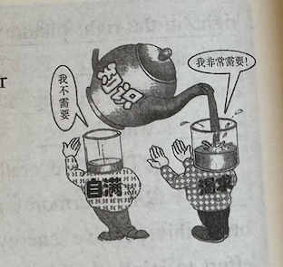

# 全国硕士研究生招生考试英语（一）全真模拟卷

## Section I: Use of English

**Directions:**

Read the following text. Choose the best word(s) for each numbered blank and mark A, B, C or D on the ANSWER SHEET. (10 points)

Psychological research can help shine a light on why humans think, feel, and act the way we do. Yet when a finding doesn't match up with someone's identity or personality, new research `___1___`, that person may be more likely to discredit it.

In one study, participants `___2___` to two personality psychology findings. They `___3___` how closely their lived experience matched up with the findings, how comfortable they were with them, and how much they denied their `___4___`. They `___5___` completed measures of the Big Five and other relevant traits.

Participants who perceived their personal experience as `___6___` the research were more likely to feel uncomfortable with it and to deny it than those who found the findings align with their personality. How much their `___7___` personality scores matched up was a less consistent `___8___` of discomfort and denialism. "Perceptions are everything," says study author Nicholas Evans. Feeling `___9___` everyone else— `___10___` that's based more on perception than fact—can be mentally uncomfortable. "A natural reaction to `___11___` the discomfort is to deny the science."

This could `___12___` pre-existing distrust in psychology, Evans argues, with `___13___` that extend far beyond personality science. If people are `___14___` of findings on the importance of mental health, they may not take mental health issues seriously or could `___15___` the negative impact of mental illness.

Scientists and journalists should be conscious of their `___16___` when sharing discoveries, noting how strong effects are and if there are caveats. `___17___`, people may believe that the findings do or should apply to everyone—and that's `___18___` ever the case. Psychological research `___19___` lived experience doesn't make either invalid. We're all unique. Having experiences that don't align with research simply `___20___` that.

1. [A] confirms [B] warns [C] denies [D] promises
2. [A] resorted [B] adapted [C] responded [D] adhered
3. [A] wondered [B] observed [C] valued [D] rated
4. [A] authenticity [B] availability [C] productivity [D] sensitivity
5. [A] still [B] again [C] instead [D] also
6. [A] peculiar to [B] related to [C] inconsistent with [D] parallel with
7. [A] normal [B] special [C] actual [D] common
8. [A] predictor [B] pattern [C] standard [D] response
9. [A] dubious about [B] different from [C] jealous of [D] inferior to
10. [A] given that [B] even if [C] as if [D] so long as
11. [A] reduce [B] expose [C] reject [D] endure
12. [A] restore [B] eliminate [C] diminish [D] bolster
13. [A] expectations [B] consequences [C] reasons [D] approaches
14. [A] tolerant [B] nervous [C] ashamed [D] skeptical
15. [A] alleviate [B] overcome [C] downplay [D] overrate
16. [A] language [B] standpoint [C] purpose [D] identity
17. [A] Moreover [B] Otherwise [C] However [D] Therefore
18. [A] never [B] already [C] rarely [D] almost
19. [A] contradicting [B] involving [C] counteracting [D] duplicating
20. [A] minimizes [B] controls [C] enhances [D] highlights

------

## Section II: Reading Comprehension

### Part A

**Directions:** Read the following four texts. Answer the questions below each text by choosing A, B, C or D. Mark your answers on the ANSWER SHEET. (40 points)

**Text 1** 

In an era saturated with social media platforms and personal-brand building, you might expect a steep rise in the average person’s desire to stand out. After all, every swipe of the thumb reveals carefully curated Instagram feeds, viral TikTok dances, and a seemingly endless supply of aspiring YouTubers. But paradoxically, our culture is fostering new forms of seemingly bold self-promotion while also becoming more risk-averse. How do we reconcile these conflicting trends?

A fascinating new book, “*The Social Paradox: Autonomy, Connection, and Why We Need Both to Find Happiness*” by William von Hippel, a social psychologist, offers some insight. Drawing from decades of research in social and evolutionary psychology, von Hippel argues that human beings are pulled by two needs: autonomy (our desire to control our own life) and connection (our need to belong). For our hunter-gatherer ancestors, connection took precedence. Over time, however, modern lifestyles have elevated autonomy at the expense of connection, leaving many people struggling to balance these twin drives.

Von Hippel argues that the pursuit of autonomy often comes with a trade-off: If we want both independence and companionship, we may feel the need to influence or control others to align with our preferences. But this approach is rarely sustainable. Relationships built on control rather than mutual understanding create tension and, ultimately, a hollow sense of connection. It may sound paradoxical, but this very drive for autonomy actually evolved for social purposes: We strive for personal success in order to be seen as an appealing person.

This tension between connection and autonomy can help us to understand how it is possible that people want to both fit in and stand out. In the era of social media, being too conspicuous risks criticism, public humiliation, or cancellation. Thus, people increasingly prefer to stay in the middle of the pack rather than invite unwanted scrutiny.

Yet refusing to stand out in day-to-day life does not mean giving up the dream of curated fame. A well-lit, expertly edited live stream isn’t the same as seeing someone in the unpredictability of actual everyday life. The performance—even when deemed “authentic”—remains at least partially staged.

The very real risk of being watched, recorded, and judged may be driving people to be more risk-averse. But perhaps the worst thing about social media is how it makes us both cautious and lazy in our social lives. Why go to a party when you can just scroll and comment from your couch? Why make the effort to grab coffee or drinks with someone when FaceTime is right there? In those moments, the convenience of social media can easily outweigh the potential (but uncertain) rewards of showing up in person.

The result is a world where people are more connected than ever, yet lonelier than ever. The unpredictability of face-to-face interactions cannot be reproduced through a screen. That’s the real paradox of our time. Young people today have more platforms than ever to present themselves to the world, yet less willingness to engage with it in real life. They want to be seen, but only on their own terms.

**21. It can be learned from Paragraph 1 that**
[A] people’s desire to be unique is rising sharply.
[B] people today want to both fit in and stand out.
[C] social media is creating new cultural conflicts.
[D] personal-brand building is commercially risky.

**22. Which of the following best represents William von Hippel’s view?**
[A] We have evolved from valuing autonomy to connection.
[B] We can rarely build genuine connection by controlling others.
[C] We strive for personal success in order to acquire autonomy.
[D] We balance autonomy and connection so as to be appealing.

**23. The underlined sentence (Para. 5) most probably implies that**
[A] not everyone can become famous on social media.
[B] actual daily life is more exciting than social media.
[C] social media sets a stage for amateur performers.
[D] social media enables people to build an ideal image.

**24. The worst thing about social media may be that it**
[A] puts us at the risk of being watched and judged.
[B] leaves us less motivated to interact face to face.
[C] allows us to post negative comments without reason.
[D] makes us blind to the uncertainty of social life.

**25. Which of the following best summarizes the real paradox of our time?**
[A] Young people want connection but not in the real world.
[B] Social media makes social life both interesting and boring.
[C] Young people feel lonely but are unwilling to admit it.
[D] Social media is both loved and hated by the public.

**Text 2** 

In the wake of the novel coronavirus pandemic, countless colleges and universities shifted from A-F grades to a pass/fail system. Many K-12 school districts have done the same. But not everyone is happy with this outcome.

Consider the fact that the permanent nature of grades makes them an incredibly high-stakes affair for students. This has a serious impact on the degree to which teachers can use grades to effectively communicate student progress. Think of how a low grade, intended to convey that a young person doesn't yet understand a concept, will instead read to the student as an act of cruelty—an attempt to ruin her future. And the student wouldn't necessarily be wrong to see it that way; transcripts in a self-proclaimed meritocratic world mean that grades, like diamonds, are forever.  

Similarly, using letter grades as a currency across agencies and institutions has, in reality, negatively distorted student motivation for generations. Regardless of their inclination to learn, many students strive first and foremost to get good grades. This was even the case in 1918, when American economist and sociologist Thorsten Veblen observed that the pursuit of grades “progressively sterilizes all personal initiative and ambition that comes within its sweep”.  

Americans have long been aware of the problems with the current model. Grade inflation is an epidemic, particularly at elite schools. And “grade-grubbing”, the pestering of teachers to change scores, is a huge problem too. Yet despite these obvious problems, grades are deeply embedded into the culture and function of American education; they are used for state graduation requirements, community college transfers, and scholarship determinations; and they are one of the chief mechanisms for linking America’s 100,000 schools with over 5,000 colleges and universities.  

In short, this grading conundrum won’t be easy to solve. But the inherent flaws of A-F grading have never been clearer. And, because of that, several sensible reform ideas may offer a path forward.  

One smart proposal involves the use of student portfolios. Rather than reducing everything a student has learned to a single score or letter symbol, schools and colleges might ask students to assemble evidence of what they know and can do. Portfolios are by no means a silver bullet, but they have a number of important strengths: emphasizing the substance of learning, encouraging revision and acknowledging the different paces at which students reach proficiency. Perhaps most importantly, they motivate students to improve their work and not merely their grades.  

Our present use of grades is a matter of historical accident, not design. The result is that grades fail to advance the multiple purposes they supposedly serve. Pass/Fail grading—the stopgap that many have turned to in the wake of the pandemic—is not a long-term solution. The problem can only be addressed at its root. Shaken from our complacency by a crisis, perhaps we can begin the conversation about what comes next.  

**26. It can be inferred from Paragraph 2 that grades**
[A] aren’t effective in conveying student progress.
[B] can’t really facilitate student-teacher communication.
[C] pressure students to improve their academic performance.
[D] drive ambitious students to reach a higher social status.

**27. Thorsten Veblen is quoted to illustrate**
[A] a widely adopted strategy to motivate students to learn.
[B] a generally accepted way to achieve personal ambitions.
[C] a serious consequence of striving for good grades.
[D] a major obstacle to reforming the grading system.

**28. According to the author, to solve the grading problem is**
[A] an unattainable target.
[B] a strenuous task.
[C] an eye-catching attempt.
[D] a desperate need.

**29. What does the phrase “a silver bullet” (Line 3, Para. 6) most probably mean?**
[A] A cure-all medicine.
[B] A flawed approach.
[C] A feasible plan.
[D] A quick solution.

**30. We can learn from the last paragraph that pass/fail grading**
[A] is a historical product of American education.
[B] is well designed to serve diverse purposes.
[C] just serves as a temporary measure.
[D] helps rebuild Americans’ shaken confidence.

**Text 3**

After half a century of painstaking restoration under the Clean Water Act, streams and wetlands nationwide are once again at risk of contamination by pollution and outright destruction as a result of a ruling on Thursday by the Supreme Court.  

The Environmental Protection Agency has long interpreted the Clean Water Act as protecting most of the nation's wetlands from pollution. But now the court has significantly limited the reach of the law, concluding that it precludes the agency from regulating discharges of pollution into wetlands unless they have "a continuous surface connection" to bodies of water the court described as streams, oceans, rivers and lakes. At least half of the nation's wetlands could lose protection under this ruling.  

It is the latest sign that many decision makers in Washington have lost touch with the increasingly fragile state of the natural systems that provide drinking water, flood protection and critical habitat for people and wildlife in every state. Congress had also long failed to clarify language in the Clean Water Act that caused confusion among judges and put the law in the Supreme Court's cross hairs.  

This is not the time to backslide. Will Congress step up and undo the damage the court has done by revising the law to fulfill its stated goal to "restore and maintain the chemical, physical, and biological integrity of the nation's waters"? Will it take a pre-emptive look at laws facing legal challenges to address potential issues? Or will lawmakers continue to allow what Justice Elena Kagan called "the court's appointment of itself as the national decision maker on environmental policy"?  

Contrary to some very loud choruses by polluting interests, activities like agriculture have not been hurt or unduly constrained by strong protections. Both the law and its applying rules have exempted pollution from agricultural runoff as well as from stock ponds and irrigated wetlands. A weak Clean Water Act, by contrast, is a threat to agriculture and other business interests. Farming relies on a stable, nontoxic water supply and insulation from flood threats. Stripping away basic protections of irrigation supplies and opening up critical flood-absorbent wetlands to development hurt farmers.  

Moreover, with the twin threats of increased weather variability and breakneck development, the nation is already knee-deep in an era of increased drought and more intense flooding, made worse by the loss of wetlands. Hurricane Harvey in 2017 should have been an alarm for Washington about the critical role wetlands will play as our cities grow and the climate warms. With lawn and concrete replacing wetlands, there was nowhere for the record rainfall to go but inside homes and businesses. It caused one of the most expensive disasters in United States history.  

Americans continue to show overwhelming support for strong clean-water protections. Congress needs to listen to the American people and to the science. They need to block the Supreme Court's retreat from protecting the environment and call it what it is: disgraceful. 

------

31、According to the first two paragraphs, the recent Supreme Court ruling has
[A] limited EPA's power to curb climate change.
[B] narrowed the scope of protected wetlands.
[C] strengthened national ocean governance.
[D] revised the definition of bodies of water.

32、The author holds that Congress fails to
[A] avoid ambiguity in legislation.
[B] realize the growing wildlife crisis.
[C] stay connected to local inhabitants.
[D] keep environmental policy updated.

33、The author suggests in Paragraph 5 that the effect of wetland protection on agriculture is
[A] desirable.
[B] limited.
[C] harmful.
[D] debatable.

34、Hurricane Harvey is cited as an example to stress
[A] the negative impacts of concrete on lawns.
[B] the difficulties in dealing with wetland losses.
[C] the chain effects of intense drought and floods.
[D] the value of wetlands in fighting climate crisis.

35、According to the author, which of the following should be seen as disgraceful?
[A] Expanding the power of Congress.
[B] Catering to the people mindlessly.
[C] Weakening environmental protections.
[D] Overriding Supreme Court's rulings.

------

**Text 4**

This week Microsoft published a joint study with Carnegie Mellon which sought to establish how AI was impacting how people think. Their findings were extremely disturbing.

When we replace particular tasks with tech, we erode our ability to perform those tasks ourselves. Yet on the whole we've been okay about this. Partly because we either don't particularly value such tasks or we were never that good at them. And also because in doing so we've freed up time and lightened our cognitive load. This has enabled us in theory to focus on higher order more productive things, but in practice perhaps simply to scroll more on TikTok and watch more Netflix.

Why the outsourcing of thought to AI is fundamentally different and so troubling, however, is this. It is not just a few discrete areas we are today delegating. Instead from drafting emails to writing business plans, from analysing contracts to assessing financial data, we're increasingly relinquishing more and more of our own independent critical thought.

This all matters for a number of reasons. First, because unlike our calculators or spell-checkers, AI still gets a lot wrong. This is not the only problem. Our increased reliance on AI presents a more existential threat. As we delegate ever more to AI the danger is not only that we will end up thinking critically less, it is that we risk not being able to think critically at all. Given the extent to which AI is already being used this could lead to a mass, global dumbing down exactly when we need our wits about us more not less.

This is undoubtedly true of the workplace where for some time yet human oversight will be essential, especially given AI's limitations and mistakes. Yet the implications are broader still. For we're speeding towards a near-term future in which AI will increasingly be deployed to influence, manipulate and hoodwink us. Adverts so personalised they'll be impossible to discern from a good friend's advice; Newsfeeds so convincing they'll be impossible to differentiate from fakes; and healthy democracy itself increasingly at risk from these manipulations.

This is because for democracies to function people need to be able to interrogate, question and assess what it is that we are told. Should we collectively lose sharpness in these skills the ability for malign interests to manipulate us would skyrocket, especially given how easy it will increasingly be to deceive us with ever harder to discern AI generated dis- and mis-information.

With so much at stake one would have expected that across the globe governments would not only be publicising AI's great potential, but also its limitations and taking urgent steps to reform our education system to ensure Gen Z and Alpha retain their smarts. Yet instead, obsessed with growth and suffering from a major "Fear Of Missing Out", governments are racing in the opposite direction. At the recent AI Summit in Paris the tone was clear: innovation above safety, competitiveness above all else. Could it be that politicians have forsaken their own critical thinking because they've been using ChatGPT too much?

36、According to the first two paragraphs, replacing particular tasks with tech
[A] has made human skills less valuable.
[B] has freed us up for higher level work.
[C] has enhanced our productivity at work.
[D] has led to more entertainment activities.

37、In Paragraph 3, the author is concerned that we are
[A] breaking down jobs into discrete tasks.
[B] outsourcing cognitive efforts to AI.
[C] relying on AI in various business areas.
[D] leaving financial data analysis to AI.

38、Which of the following best represents the author's view?
[A] We should reduce dependency on spell-checkers.
[B] We need to accept a global dumbing down.
[C] AI might improve to be free from mistakes.
[D] AI could cause the loss of critical thinking abilities.

39、Adverts and newsfeeds are mentioned to show that AI
[A] suffers from inherent limitations.
[B] needs human oversight to thrive.
[C] is posing challenges to democracy.
[D] is transforming the media landscape.

40、The author holds that governments should
[A] balance AI innovation with safety concerns.
[B] prompt AI adoption for economic growth.
[C] harness AI's potential for competitiveness.
[D] integrate ChatGPT into their education system.

### **Part B**

**Directions:** The following paragraphs are given in a wrong order. For Questions 41-45, you are required to reorganize these paragraphs into a coherent article by choosing from the list A-G and filling them into the numbered boxes. Two paragraphs have been placed for you in Boxes. (10 points)

(41) Cathy Bernard

Professor Grant makes a clean job of it—a grade represents "mastery of the material"; "high marks are for excellence, not grit." Assessment, though, is not always so accurate or easy, and when I look back at my 50 years in the classroom, the students I most remember are the ones I wish I had graded more generously. They may not have aced their exams, but they worked with such diligence and approached literary texts with an open and curious mind, making heartfelt connections with their own lives and the world outside. And I suspect they took away more from the course than some of their A-driven classmates did. Most of us who have spent our lives in the classroom know that real learning is sometimes hard to measure. And that teaching is an art, not a science.

(42) Deborah Krieger  Jennings

I agree wholeheartedly with Adam Grant. Grades are given for evidence of mastering a concept and/or a skill. Too many parents let me know that their children had been in the school for years, or had siblings who had attended the school, or came from a family paying full tuition rather than receiving financial aid. In each case, I reminded parents that none of that matters; the way to earn higher grades is for students to successfully master material. Consistent effort is important but should not be a major factor in calculating student grades. A school system that includes indications of how well students perform on other metrics—cooperation, perseverance, creativity, etc.—provides valuable information. But what counts in calculating a student's grade is achievement. Teachers should provide clear rubrics about what goes into a grade, students should work to improve their mastery, and parents should support their children instead of questioning the instructors or the institution.

(43) Alex Snider 

Adam Grant's essay highlights the importance of accountability but goes too far in dismissing effort. While effort doesn't guarantee success, it's the foundation for becoming the best student or colleague we can be. Effort is the one thing we can control. Instead of panning it, let's revere it as the key to growth and resilience. Dr. Grant compares education to the Olympics, where only the top performers get medals. But teaching is so much more than sorting winners from losers—it's helping students move closer to their potential. The same goes for the workplace. A manager who ignores the effort behind a missed target misses the bigger picture. Results matter,but mistakes and uncertainty are part of every job. Ignoring effort leads to toxic cultures where people feel valued only for output, and "competent jerks" thrive. 

(44) David A. Rosenbaum 

If effort isn't rewarded, effort won't be applied. Those who doubt that they can find the right answer won't even try. The richness that comes from inviting students to do their best will be left by the wayside. New approaches to old problems won't be pursued, new solutions won't be chased, and new problems that might be recognized by those who see themselves as outside the box won't emerge. 

(45) Judith Kroll 

Adam Grant is quite right that effort alone is not sufficient to produce excellence or even passable success. But what's wrong is that the focus should not be on effort per se but on the other E word—engagement. I teach incredibly talented students, including many first-generation college students from immigrant families and international students who aren't always sure they belong at the university. We should be focused on how to create meaning and confidence in students who don't always see themselves as sufficiently entitled to seek either. Engagement is hard work, but it's exactly what we need to be doing, especially at this time when academic success has been misunderstood as elitism. I think we need to think first about how the learning environment might provide a means for inviting our students to engage and to learn to connect that engagement with their own experience. The effort and excellence will follow.

[ A ] If effort is ignored, students will lose their drive and passion for pursuing innovation.

[ B ] All too often, grades fail to reflect the true gains that a hardworking and engaged student reaps from their learning.

[ C ] The grading system should be reformed to measure cooperation, perseverance, and other metrics of student performance.

[ D ] Educators should first foster students' deep involvement in learning, from which diligence and success will naturally follow.

[ E ] The overemphasis on grades themselves is the root cause of declining student engagement in class.

[ F ] Grades should be based primarily on a student's mastery of the material, not on their effort, background, or other factors.

[ G ] Effort alone is insufficient to produce excellence, but it is essential for unlocking a person's innate potential and driving meaningful progress.

### **Part C**

**Directions:** Read the following text carefully and then translate the underlined segments into Chinese. Your translation should be written clearly on ANSWER SHEET. (10 points)

Globally, 1.2 million species of organisms have been scientifically identified. Scientists have deduced the diversity of under-researched groups from the number of species and higher-level taxonomic categories in extensively studied groups, such as birds. On average, wild populations monitored by biologists over the past 50 years lost 69 percent of their members, according to the Living Planet Index. Our immediate biodiversity crisis isn't one of species loss; it's the lost abundance of wild things. The problem has become prevalent and systemic in recent decades.

Many experts and policy makers accept the incidental damage as a cost of doing business on this planet. That's because their economic scorecards count what's measurably good for human beings. Something that's good for two people is twice as good as something that's good for one person.` (46) From this point of view, a world drained of wildlife with a lot of people making increasing amounts of money is heading in the right direction. `The losses of joy, wonder, and ethical interspecific relations are real, but, in contrast to our material gains, resist measurement.  

Economics is nicknamed the "dismal science," but many of its practitioners are far more optimistic than biologists about our species' future.` (47) They propose that economic growth can continue forever on a planet that is staying the same size, because scarcity is not the sad opposite of abundance, but the mother of invention.` When goods become scarce, substitutes become valuable. If ready substitutes aren't available, people innovate and tame scarcity. Over and over. Substitution is seen as a remedy both for the shortage of production's inputs and, nowadays, for the menacing excess of its emissions. But substitution won't save us indefinitely, and typically leads to another round of unforeseen damage.  

It's not too late for an abundant Earth. `(48) Recovery starts with making wild abundance an explicit objective and letting our economic and social lives center around it. `The most important thing people can do for wild populations is to give them space, starting with the spaces that aren't yet fragmented. Twenty percent of Earth's forests, for instance, are still big and unfragmented, "intact forest landscapes". `(49) Securing these forests now is a bargain compared with the cost of removing roads and industry to regrow them later.`

We also need laws that go beyond sustaining scarcity and regrow biological plenty. Rather than attempting to codify abundance on a species-by-species basis, as the Endangered Species Act does for extinction risk, `(50) such laws must consider life at the ecosystem level and reduce the causes of wildlife depletion without knowing precisely how much natural abundance will return. `Let's nurture the Earth so that people once again can know they are part of a wild world disposed—and able—to host abundant life.

------

## Section III: Writing

### Part A (10 points)

**Directions:**

51、Write an email to the IT department at your university, making suggestions for improving the university's online learning platform. You should write about 100 words on the ANSWER SHEET. 

**Do not** use your own name at the end of the email. 

Use "Li Ming" instead.

### Part B (20 points)

**Directions:**

52、Write an essay of 160–200 words based on the following picture. In your essay, you should

1. describe the picture briefly,
2. interpret the implied meaning, and
3. give your comments.

