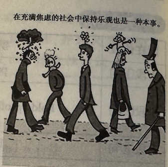

# 全国硕士研究生招生考试英语（一）全真模拟卷

## Section I: Use of English

**Directions:** Read the following text. Choose the best word(s) for each numbered blank and mark A, B, C or D on the ANSWER SHEET. (10 points)

We know that emotions enhance our process of reasoning and aid our decision-making. __1__, we can’t make decisions, or even think, __2__ being influenced by our emotions.

In a study, researchers analysed the work of 118 professional traders. Some were highly successful, but many were not. The relatively less successful traders for the most part denied that emotion played a(n) __3__ role. They tried to suppress their emotions, __4__ at the same time denying that emotions had an effect on their decision-making. The most successful traders, __5__, showed a great willingness to __6__ their emotion-driven behaviour. __7__ that emotions were necessary for high performance, they tended to reflect __8__ about the origin of their intuitions and the role of emotion.

If emotions aid rational reasoning, how does that __9__? Perhaps the most important discovery regarding the role of emotion is that __10__ you believe you are __11__ cold, logical reason, you aren’t. People aren’t usually __12__ of it, but the very framework of their thought process is highly influenced by what they’re feeling at the time—sometimes subtly, sometimes not. Each emotion is a(n) __13__ state of the mind that puts your brain in a particular mode of operation that adjusts your goals, directs your attention, and __14__ the weights you assign to various factors as you do mental __15__.

What can we learn from this? The first and most crucial step is __16__. By learning about our emotions we can __17__ others better and communicate more effectively. And by understanding how emotions affect our thoughts and reasoning, we can learn to recognise and __18__ them. Then, __19__ we’re in touch with our true feelings, we can take steps to manage them __20__ that would be of benefit.

1. [A] In turn   [B] In addition   [C] In return   [D] In fact
2. [A] without   [B] with   [C] for   [D] after
3. [A] meaningless   [B] significant   [C] ambiguous   [D] perplexing
4. [A] while   [B] so   [C] if   [D] because
5. [A] as a result   [B] for instance   [C] in contrast   [D] in particular
6. [A] cover up   [B] reflect on   [C] stick to   [D] give up
7. [A] Challenging   [B] Supposing   [C] Accepting   [D] Regretting
8. [A] negatively   [B] mistakenly   [C] indifferently   [D] critically
9. [A] change   [B] work   [C] hurt   [D] end
10. [A] only if   [B] as if   [C] ever since   [D] even when
11. [A] exercising   [B] exhausting   [C] examining   [D] executing
12. [A] ashamed   [B] afraid   [C] aware   [D] capable
13. [A] functional   [B] abnormal   [C] confused   [D] defensive
14. [A] predicts   [B] reviews   [C] reveals   [D] modifies
15. [A] tests   [B] calculations   [C] treatments   [D] practices
16. [A] self-discipline   [B] self-criticism   [C] self-awareness   [D] self-satisfaction
17. [A] read   [B] control   [C] convince   [D] instruct
18. [A] protect   [B] discuss   [C] ignore   [D] monitor
19. [A] until   [B] unless   [C] once   [D] though
20. [A] however   [B] whenever   [C] whatever   [D] wherever

------

## Section II: Reading Comprehension

### Part A

**Directions:** Read the following four texts. Answer the questions below each text by choosing A, B, C or D. Mark your answers on the ANSWER SHEET. (40 points)

**Text 1** 

Our reliance on comfort-driven technologies has created a fragile foundation, leaving us ill-equipped to navigate life without them. Burnout, once a rarity, has become nearly universal.

All of this can be traced to our growing dependence on digital crutches—social media, instant entertainment, algorithm-driven distractions—designed to offer quick relief but often at the expense of deep, meaningful engagement. Platforms engineered to capture our attention also rewire our stress response: constant notifications, doom-scrolling, and the pressure to curate an online identity all heighten chronic stress, reduce real-world coping mechanisms.

Take GPS. It has undeniably transformed how we travel, offering seamless navigation at our fingertips. But this convenience comes at a cost. A 2020 study published in *Scientific Reports* found that frequent GPS users struggle more with self-guided navigation, relying less on their brain’s natural wayfinding abilities. Over time, those who depended more on GPS showed a steeper decline in hippocampal-dependent spatial memory. This suppression not only makes us prone to getting lost but also impairs memory and problem-solving skills, leading to broader cognitive decline. Even our bodies aren’t spared. Sedentary lifestyles, fueled by convenience technologies, contribute to rising rates of obesity, heart disease, and mental health challenges.

The problem is that the very discomfort we avoid is often what strengthens us. Just as physical muscles grow through resistance, mental resilience builds through effort. Research shows that viewing stress as a challenge rather than a threat leads to better outcomes. Neuroscience reveals that neuroplasticity is enhanced through challenging experiences. This adaptability is crucial for developing resilience. Chronic comfort, however, stifles this process, leading to a less adaptable and more fragile mind.

Nowhere is our discomfort with discomfort more evident than in our inability to tolerate boredom. It’s often dismissed as an annoyance, but research from the University of Central Lancashire found that boredom sparks creativity and problem-solving. When we resist the urge to scroll, we give our minds space to wander and innovate. This aligns with the concept of a growth mindset, as proposed by American psychologist Carol Dweck, which emphasizes that abilities can be developed through dedication and hard work, and sometimes, tolerating the boredom we experience.

To be clear, the solution isn’t to reject comfort entirely; it’s to balance it with intentional discomfort. Think of it as “microdosing hardship”—a series of small, manageable challenges that keep our mental and emotional muscles strong. Whenever possible, tackle the hardest task first, whether it’s a workout, a tough conversation, or deep work.

These small acts aren’t revolutionary—but they’re enough to reawaken the dormant resilience we’ve buried under layers of ease. Comfort, like sugar, is tempting but deceptive. It delivers an instant lift, only to leave us sluggish and unprepared in the long run. Discomfort, by contrast, is the crucible of growth, pushing us to confront uncertainty, adapt to challenges, and find meaning in effort.

Thankfully, resilience is not a trait you are born with, but a skill that can be developed through intentional practice. So, the next time you feel the pull of ease, pause. Ask yourself: Is this momentary comfort helping me grow or is it keeping me stuck?

**21. According to the first two paragraphs, comfort-driven technologies** 
[A] can leave us poorly prepared for setbacks. 
[B] help turn burnout from common to rare. 
[C] are intended to promote deep engagement. 
[D] actually fail to alleviate our daily stress.

**22. The example of GPS is used to illustrate** 
[A] the great convenience brought by modern technologies. 
[B] the hidden price imposed by technology dependence. 
[C] the importance of spatial memory for natural navigation. 
[D] the causality between technologies and health challenges.

**23. It can be learned from Paragraph 4 that stress** 
[A] causes physical and emotional discomfort. 
[B] can be overcome through conscious effort. 
[C] can indirectly contribute to mental growth. 
[D] is inherently harmful to resilience building.

**24. The author suggests that boredom** 
[A] is an intolerable experience to be avoided. 
[B] is an annoying feeling to be disregarded. 
[C] is a necessary component of a growth mindset. 
[D] is a positive stimulus to creativity and problem-solving.

**25. Which of the following statements would the author agree with?** 
[A] Comfort should be completely rejected despite its appeal. 
[B] Discomfort should be avoided because it entails hardships. 
[C] Comfort, though momentary, can be beneficial for immediate growth. 
[D] Discomfort, when practiced intentionally, is essential for building resilience.

**Text 2** 

"We must crack down on low-value university degrees." Who claimed that and when? It might have been Rishi Sunak last October. Or Sunak last July. Or Sunak the previous August. This time, it was Sunak on the election trail last week. Sunak promised to scrap "rip-off degrees", replacing them with 100,000 vocational apprenticeships. Politicians keep repeating this argument, seeing it as tapping into popular hostility towards the "university-educated liberal elite".

What, though, is a "low-value" degree? For many policymakers, the worth of a degree is measured primarily by metrics such as the proportion of students who fail to complete their course and the number who land high-skilled, well-paid jobs. Ironically, though, the highest dropout rates at universities are in computer sciences, business and administrative studies, and engineering and technology. The lowest, apart from medicine, dentistry and veterinary science, are in languages and historical and philosophical studies. Stereotypes and reality don't necessarily coincide.

Also often ignored is the impact of class on student experiences and outcomes. A study last year by London South Bank University's Antony Moss showed that students who had been eligible for free school meals, an indicator of poverty, are less likely to complete their degree, achieve a good grade or get into a graduate-level job or further study. Improving the quality of courses barely challenged such inequality.

The background to all this is the colonisation of policymaking by a more instrumental view of education as valuable primarily because of its economic benefits, whether personal or national. It is a perspective that has turned universities into businesses, students into consumers and knowledge into a commodity. The notion of learning as being a good in itself, as a means of elevating the quality of our lives, is now scorned as hopelessly naive, or at least as something that should be the preserve of elite students.

The instrumental view of education is often presented as a means of advancing working-class students by training them for the job market. In reality, what it does is tell them to study whatever best fits them for their station in life. As the *Observer*'s Martha Gill observed last year, many politicians and commentators value university education as a means "to elevate human lives and nourish the soul, regardless of any job market benefit"—but only for a certain class of people. "The sorts of students to whom we tend to apply a financial—rather than spiritual—calculation when it comes to higher education," she wrote, "tend to be those from poorer backgrounds."

For the affluent, education is about enriching the soul. For working-class students, it is viewed primarily as a route to the job market. They are seen as the kind of people who benefit from more "vocational" learning. As education analyst Jim Dickinson observes: "When we say 'low-value' courses, isn't there a danger that we really mean 'low-value students'?"

**26. Rishi Sunak's promise is mentioned to show** 
[A] the necessity to offer vocational training courses. 
[B] the difficulty of implementing educational reforms. 
[C] public dissatisfaction with higher education systems. 
[D] politicians' insistence on abolishing low-value degrees.

**27. It can be inferred from Paragraph 2 that policymakers** 
[A] tend to regard humanities degrees as being of low value. 
[B] aim to reduce dropout rates in science and engineering. 
[C] have adopted a narrow definition of high-skilled jobs. 
[D] have broken the stereotypes about college majors.

**28. What can be learned from the study last year by Antony Moss?** 
[A] The importance of free school meals is often ignored. 
[B] Many university students value outcomes over experiences. 
[C] Poorer students are more likely to drop out of university. 
[D] Low-quality courses have a bigger impact on poorer students.

**29. From an instrumental point of view, the value of education mainly lies in** 
[A] its ability to expand students' knowledge. 
[B] its potential to provide economic returns. 
[C] its power to shape people's perspectives. 
[D] its intrinsic benefits to society as a whole.

**30. According to the last two paragraphs, working-class students are generally thought to** 
[A] benefit much from financial management courses. 
[B] face difficulty in finding suitable jobs for themselves. 
[C] have greater spiritual needs than affluent students. 
[D] receive education primarily for employment purposes.

**Text 3**

While the rise of AI could revolutionize numerous sectors and unlock unprecedented economic opportunities, its energy intensity has raised serious environmental concerns. In response, tech companies promote frugal AI practices and support research focused on reducing energy consumption. But this approach falls short of addressing the root causes of the industry’s growing demand for energy.

Developing, training, and deploying large language models (LLMs) is an energy-intensive process that requires vast amounts of computational power. To mitigate the environmental impact of emerging technologies, the tech industry has begun to promote the concept of frugal AI, which involves raising awareness of AI’s carbon footprint and encouraging end users—academics and businesses—to select the most energy-efficient model for any given task.

But while efforts to promote more conscious AI use are valuable, focusing solely on users’ behavior overlooks a critical fact: suppliers are the primary drivers of AI’s energy consumption. Currently, factors like model architecture, data-center efficiency, and electricity-related emissions have the greatest impact on AI’s carbon footprint. And as technology evolves, individual users will have even less influence on its sustainability, especially as AI models become increasingly embedded within larger applications, making it harder for end users to discern which actions trigger resource-intensive processes.

These challenges are compounded by the rise of agentic AI—independent systems that collaborate to solve complex problems. While experts see this as the next big thing in AI development, such interactions require even more computational power than today’s most advanced LLMs, potentially aggravating the technology’s environmental impact.

Moreover, shifting the responsibility for reducing AI’s carbon footprint to users is counterproductive, given the industry’s lack of transparency. Most cloud providers do not yet transparently disclose emissions data specifically related to generative AI, making it difficult to assess the environmental impact of their AI use.

A more effective approach would be for AI providers to provide consumers with detailed emissions data. With access to the data, consumers could compare AI applications and select the most energy-efficient model for a specific task. Businesses, too, could more easily choose a traditional IT solution over an energy-intensive generative AI system if the overall impact is clear from the beginning. By working together, AI companies and consumers could balance AI’s potential benefits with its environmental costs.

To be sure, frugal AI may lead to some efficiency gains. But it does not address the core problem of AI’s insatiable energy demand. By providing greater transparency about energy consumption, sharing comprehensive emissions data, and developing standardized metrics for AI models, companies could help clients optimize their carbon budgets and adopt more sustainable practices.

Just as fuel-efficiency standards allow car buyers to compare different models and hold manufacturers accountable, businesses and individual users need reliable tools to evaluate the environmental impact of AI models before deploying them. By introducing transparent metrics, tech companies could not only steer the industry toward more sustainable innovation but also ensure that AI helps combat climate change instead of contributing to it.

**31. Which of the following belongs to the frugal AI practices?**
[A] Limiting the development of large language models. 
[B] Reducing the computational power of AI models. 
[C] Funding studies focused on building energy efficiency. 
[D] Encouraging users to choose energy-efficient AI models.

**32. What does Paragraph 3 suggest about individual users?** 
[A] They are the main contributors to AI’s high energy consumption. 
[B] Their influence on AI’s sustainability will diminish over time. 
[C] They tend to overlook the environmental impact of their AI use. 
[D] Their AI-related carbon footprint is inherently unquantifiable.

**33. The author indicates that agentic AI could** 
[A] solve complex problems with lower energy consumption. 
[B] lower computational power through independent operations. 
[C] intensify environmental concerns due to higher energy use. 
[D] outperform LLMs at interacting with the external environment.

**34. According to Paragraphs 5 and 6, the author is concerned that** 
[A] businesses prefer AI systems to traditional IT solutions. 
[B] AI providers tend to misreport their emissions output. 
[C] AI companies prioritize efficiency over environmental impact. 
[D] consumers are not informed about AI-related emissions data.

**35. What does the author suggest in the last two paragraphs?** 
[A] AI users should value sustainability over affordability. 
[B] AI providers should establish energy efficiency metrics. 
[C] Tech companies should work to meet AI’s energy demand. 
[D] Businesses should delay standardized AI evaluations.

------

**Text 4**

“We're pleased,” ExxonMobil’s CEO, Darren Woods, said on an earnings call last month, speaking about the Inflation Reduction Act. He called the bill, now making its way through the US Congress, “clear and consistent”.

That the Inflation Reduction Act (IRA) passed is undoubtedly good news. That something being called climate policy passed at all is thanks to the tireless work the climate movement has done to put it on the agenda. But it also reflects just how much power the fossil fuel industry has amassed. The IRA itself contains a remarkable poison pill, requiring that 60m acres of public waters be offered up for sale each and every year to the oil and gas industry before the federal government could approve any new offshore wind development for a decade.

Then again, maybe the oil and gas CEOs have finally come around, and such sweeteners are a distraction from the real story. After decades of lobbying against climate policy perhaps they’ve seen the inexorable march of history towards decarbonization and decided to **hitch their wagons to it**. Unfortunately, we’ve seen this show before. Over a decade ago the likes of BP and ConocoPhillips joined the US Climate Action Partnership, a coalition of green groups and corporations that set about trying to pass climate legislation at the start of the Obama presidency. The House of Representatives went on to pass the hulking carbon pricing bill it supported, only to see it die in the Senate. The same was true this time around; the critical difference this time is that their bill passed.

Understanding what’s just happened demands a longer view. For decades, oil and gas executives have worked to create a political climate wholly allergic to comprehensive climate action. Part of that has been lobbying against climate legislation, of course. But for nearly a century the same corporations have conducted an all-out attack on the ability of the US government to get big, good things done.

Climate change is ultimately a planning problem: there is no entity other than the state that can electrify the country, expand the grid, build enormous amounts of mass transit and wind down coal, oil and gas production in time to keep warming short of catastrophic levels. For all its many shortcomings, Franklin D. Roosevelt’s New Deal sought to construct a state capable of tackling such complicated problems. The right—supercharged by fossil fuel funding—set out to destroy it, polluting our politics with the idea that efficient markets are the only reasonable answer to what troubles society. Predictably, they railed against the Green New Deal, too, which rejected that logic.

The IRA’s most promising elements are a series of modest incentives to get corporations to do the right thing on climate—demanding they actually do so feels so far out of reach. This bill is seriously inadequate, featuring a cruel, casual disregard for those at home and abroad who will live with the consequences of boosting fossil fuel production as a bargaining chip for boosting clean energy. And it’s almost certainly better than nothing.

**36. According to the first two paragraphs, which of the following is true about the IRA?** 
[A] It has been criticized by climate campaigners. 
[B] It made concessions to the fossil fuel industry. 
[C] It aims to cut back on oil and gas production. 
[D] It helps to make wind energy more affordable.

**37. What does the phrase “to hitch their wagons to it” (Line 3, Para. 3) most probably mean?**
[A] To fight against it. 
[B] To retreat from it. 
[C] To accelerate it. 
[D] To make use of it.

**38. The example of BP and ConocoPhillips is mentioned to illustrate** 
[A] the insincerity of oil and gas companies in decarbonizing. 
[B] the feasibility of corporations working with green groups. 
[C] the difficulty of passing climate bills through the Senate. 
[D] the uselessness of lobbying against climate legislation.

**39. By referring to the New Deal, the author intends to show that** 
[A] the fossil fuel industry keeps obstructing climate policies. 
[B] the government lacks the ability to tackle climate change. 
[C] the efficiency of the oil and gas market needs improving. 
[D] the Green New Deal was promising but logically flawed.

**40. The author’s overall attitude towards the IRA is** 
[A] skeptical. 
[B] ambiguous. 
[C] supportive. 
[D] contemptuous.

### **Part B**

**Directions:** The following paragraphs are given in a wrong order. For Questions 41-45, you are required to reorganize these paragraphs into a coherent article by choosing from the list A-G and filling them into the numbered boxes. Two paragraphs have been placed for you in Boxes. (10 points)

[A] Define your goals
[B] Remove environmental distractions
[C] Tune into your energy patterns 
[D] Exercise your brain's attentiveness 
[E] Restore your attention reserves 
[F] Interrupt your autopilot 
[G] Lay the groundwork

You sit down at your computer ready to tackle the work you’ve been promising yourself you’d do. But inevitably, your inbox pings and your phone rings. Then, just as you’re about to dive in, you reflexively reach for your phone, scan headlines, and scroll social media. These interruptions have become our default mode. Many of us believe we’re adept at juggling interruptions, but research tells a different story. So how can you strengthen your focus skills and stay on track? What simple techniques can help you cut down on interruptions? Here’s what experts suggest.

41、`___________________________`

Optimizing your brain for focus starts with fundamental self-care, according to Zelana Montminy, a positive psychologist. “You need to prioritize foundational habits like sleep, hydration, and physical activity,” she says. Furthermore, Montminy recommends establishing “focus rituals,” or signals that tell your brain it’s time to concentrate—like a dedicated workspace, a particular desk setup, or a consistent routine that primes you for deep work. Gloria Mark, Chancellor’s Professor of Informatics at the University of California, suggests practical steps to eliminate distractions: turn off notifications, lock away your phone when working, and use app blockers to hide digital temptations. The goal is to “create friction” and make it harder to be distracted.

42、`__________________________ `

You need to harness your natural focus. Our attention is goal-directed, meaning we naturally concentrate on what aligns with our objectives and priorities, explains Mark. “If your goals are very clear, that’s going to keep you focused.” To tap into this attentional bias and selectively focus on certain stimuli while ignoring others, Mark recommends a concrete approach: “Write down your goals and put them in a place where they’re in your visual field,” she says. “Put them on a post-it if that’s what it takes for you to be constantly reminded of what you’re trying to accomplish.” Surrounding yourself with visual reminders of your goals helps train your brain to zero in on what’s essential.

43、`__________________________ `

Attention comes in different forms, says Mark. There’s the intentional kind, where we’re consciously focused on a specific task; and the mechanical kind, where actions occur without deliberate thought—like when you reflexively grab your phone, swipe it open, and scroll through Instagram mid-workday. To break these unconscious habits, Mark says you need to cultivate meta-awareness: observing your mental processes as they unfold. When you feel the impulse to check social media, pause, and ask yourself: What’s driving this behavior? Am I procrastinating? Am I avoiding challenging work? Asking these questions transforms an unconscious habit into a deliberate choice. Meta-awareness is like a muscle—the more you practice catching and redirecting your attention, the stronger it becomes.

44、`__________________________ `

 Your peak focus times are affected by your chronotype, or your natural circadian rhythm. Mark’s research finds that most people have peak focus times around 11 AM and mid-afternoon, though this varies depending on whether you’re an early bird or night owl. To discover your personal rhythm, keep a diary tracking your concentration levels throughout the day. “The desire to scroll or check your socials is a sign of your focus starting to quiver, usually toward the end of one of your cycles,” says Montminy. Then, schedule demanding tasks during your peak cognitive hours and reserve less-complex work, like email, for when you are tired. “Understanding and adapting to your natural cycles helps you align your work schedule with your personal rhythm,” she says.

45、`__________________________ `

 Just as artists use negative space to create balance, you can learn to strategically recover your cognitive resources by taking purposeful breaks, says Mark. “We tend to pack our days with tasks,” she notes. “We don’t realize we have to build in time for when we’re not working that will help us refuel.” When your cognitive resources are running low, give yourself permission to rest and reset. “But resetting does not mean scrolling socials,” says Montminy. “Consuming content is not taking a break.” Instead, she recommends stretching, meditating, reading poetry, or taking time to stare out a window. “Give your brain time and space to regroup.”

### **Part C**

**Directions:** Read the following text carefully and then translate the underlined segments into Chinese. Your translation should be written clearly on ANSWER SHEET. (10 points)

Will artificial intelligence bring about an intellectual revolution as profound as the Enlightenment? Enthusiasts like to make this claim, and even use the term “second Enlightenment” to describe what A.I. may ultimately generate.

The parallels are, admittedly, striking. Like the proponents of A.I., with their ceaseless talk of an imminent revolution, the 18th-century French mathematician and philosopher Jean le Rond d’Alembert spoke of “a watershed in the history of the human mind” being underway and a “revolution” in ideas and history. **(46) <u>Enlightenment authors also hoped to advance their goals by providing new ways of organizing human knowledge and conveying it to the public.</u>** The “Encyclopédie,” the most creative and original reference work in history, exemplified this ambition.

A.I. is already transforming how we learn, as universities rush to incorporate the tool into their teaching. **(47) <u>Enlightenment authors had similarly ambitious goals, sharply criticizing the traditional educational institutions of the day, which were mostly run by churches, and proposing new schemes for instruction at every level, from the cradle to the doctorate.</u>**

Indeed, one of the most exciting aspects of A.I. is its ability to deliver personalized, interactive instruction on virtually any topic. Enlightenment authors imagined books in an oddly similar manner: not as moralizing brochures, but as sites in which to engage readers in virtual dialogue. **(48) <u>It is here, with this question of engagement, that the comparison between the Enlightenment and A.I.’s supposed “second Enlightenment” breaks down and reveals something important about the latter’s limits and dangers.</u>** When readers interact imaginatively with a book, they are still following the book’s lead, attempting to answer the book’s questions, responding to the book’s challenges and therefore putting their own convictions at risk.

When we interact with A.I., on the other hand, it is we who are driving the conversation. **(49) <u>We formulate the questions, we drive the inquiry according to our own interests and we search, all too often, for answers that simply reinforce what we already think we know.</u>** And why should it? It is, after all, a commercial internet product. And such products generate profit by giving users more of what they have already shown an appetite for, whether it is funny cat videos, instructions on how to fix small appliances or lectures on Enlightenment philosophy.

**(50) <u>By its nature, A.I. responds to almost any query in a manner that is weirdly clear and easy to follow—one might say almost intellectually predigested.</u>** For most ordinary uses, this clarity is entirely welcome. But Enlightenment authors understood the importance of having readers grapple with a text. Many of their greatest works came in the form of enigmatic novels, dialogues presenting opposing points of view or philosophical parables abounding in puzzles and paradoxes. Unlike the smooth syntheses provided by A.I., these works forced readers to develop their judgment and come to their own conclusions.

In short, A.I. can bring us useful information, instruction, assistance, entertainment and even comfort. What it cannot bring us is Enlightenment. In fact, it may help drive us further away from Enlightenment than ever.

## Section III: Writing

### Part A (10 points)

**Directions:**

Suppose the Student Union of your university is going to hold an intangible cultural heritage workshop. You are assigned to inform the international students about this event.

Write a notice in about 100 words on the ANSWER SHEET.

**Do not** use your own name in the notice. Use "The Student Union" instead.

### Part B (20 points)

**Directions:**

Write an essay of 160–200 words based on the following picture. In your essay, you should

1. describe the picture briefly,
2. interpret the meaning, and
3. give your comments.

