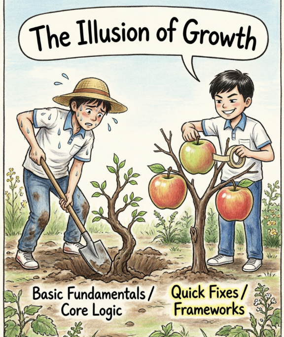

# 全国硕士研究生招生考试英语（一）全真模拟卷

## Section I: Use of English

**Directions:** Read the following text. Choose the best word(s) for each numbered blank and mark A, B, C or D on the ANSWER SHEET. (10 points)

The promise of a fully automated infrastructure was supposed to liberate engineers from the drudgery of routine maintenance. Yet, as systems have grown exponentially in complexity, this utopian vision has been somewhat 1 . We are now witnessing the rise of decentralized architectures, which, 2 offering unprecedented scalability, have introduced a labyrinth of operational challenges.

Historically, monolithic servers were easily 3 . If a component failed, the diagnostic path was linear. Today, the 4 of microservices means that a single user request might traverse dozens of isolated environments before 5 . This fragmentation has 6 an environment where visibility is obscured, and traditional monitoring tools are rendered 7 .

Consequently, the focus has shifted from mere uptime to "observability." 8 relying on pre-defined metrics, modern engineers must deploy sophisticated telemetry that can 9 anomalies in real-time. This requires not just technical 10 , but a philosophical shift in how we 11 failure. Instead of treating outages as anomalies to be eradicated, they must be 12 as inevitable byproducts of complex systems.

Furthermore, the 13 of security protocols within these distributed networks has become paramount. With data constantly in transit, the 14 surface for potential breaches has expanded. Encryption must now be implemented seamlessly, lest it 15 system performance. The challenge lies in striking a 16 between robust security and operational agility.

In this new paradigm, the engineer is less of a mechanic and more of an architect. They must 17 through layers of abstraction to understand the underlying logic. 18 the tools have evolved, the fundamental requirement remains: a deep, almost intuitive 19 of how discrete components interact to form a cohesive 20 .

1. [A] amplified [B] compromised [C] fulfilled [D] anticipated
2. [A] since [B] while [C] unless [D] provided
3. [A] comprehended [B] discarded [C] fabricated [D] manipulated
4. [A] proliferation [B] deterioration [C] integration [D] substitution
5. [A] terminating [B] resolving [C] culminating [D] vanishing
6. [A] suppressed [B] engendered [C] accommodated [D] revoked
7. [A] indispensable [B] obsolete [C] versatile [D] intuitive
8. [A] Rather than [B] Other than [C] More than [D] Less than
9. [A] disguise [B] rectify [C] pinpoint [D] overlook
10. [A] intuition [B] consensus [C] proficiency [D] ambiguity
11. [A] conceptualize [B] penalize [C] subsidize [D] rationalize
12. [A] dismissed [B] embraced [C] condemned [D] scrutinized
13. [A] vulnerability [B] integration [C] exemption [D] suspension
14. [A] contact [B] friction [C] attack [D] defense
15. [A] bolster [B] bottleneck [C] bypass [D] benchmark
16. [A] bargain [B] balance [C] contrast [D] parallel
17. [A] pierce [B] scan [C] drift [D] stumble
18. [A] Because [B] If [C] Although [D] Once
19. [A] illusion [B] grasp [C] denial [D] bias
20. [A] fraction [B] entity [C] vacuum [D] illusion

------

## Section II: Reading Comprehension

### Part A

**Directions:** Read the following four texts. Answer the questions below each text by choosing A, B, C or D. Mark your answers on the ANSWER SHEET. (40 points)

**Text 1** 

The encryption debate consistently resists easy resolution, largely because it is animated by competing but equally valid imperatives. On one hand, law enforcement agencies articulate a compelling need to prevent the digital sphere from functioning as an impenetrable sanctuary for illicit activities. On the other hand, privacy advocates and technology firms argue that ubiquitous end-to-end encryption (E2EE) is the indispensable bedrock of modern digital civil liberties. Both perspectives are anchored in legitimate societal foundations, making the legislative proposition of "exceptional access"—often termed "backdoors"—a profoundly polarizing dilemma rather than a straightforward policy fix.

While authorities understandably view E2EE as an acute impediment to lawful surveillance, cryptographers caution against the structural fragility inherent in mandated vulnerabilities. Mechanisms such as key escrow systems, which conceptually present themselves as an elegant middle ground, frequently translate into systemic weaknesses in practice. They are predicated on a level of perpetual containment and flawless administration that the history of cybersecurity suggests is highly improbable. From a purely architectural standpoint, an access point designed for judicial oversight is indistinguishable from a vulnerability waiting to be exploited by malicious entities.

Beyond the immediate technical precariousness, there is a complex jurisdictional conundrum that warrants consideration. Imposing domestic encryption restrictions within a globally integrated network may inadvertently penalize local enterprises while failing to deter sophisticated actors. The latter possess the agility to seamlessly pivot to open-source or foreign alternatives situated beyond the reach of domestic subpoenas. Consequently, the economic friction generated by diminished consumer trust and compromised commercial infrastructure might ultimately overshadow the localized intelligence dividends that such mandates are intended to secure.

Therefore, framing the discourse exclusively as a zero-sum collision between individual privacy and public safety tends to obscure a more pragmatic trajectory. Acknowledging the absolute necessity of robust legal investigation does not inherently require endorsing the structural sabotage of global cryptographic protocols. Instead, attention might be more productively directed toward the realities of the contemporary digital footprint. The exponential proliferation of connected devices generates unprecedented volumes of peripheral information. By recalibrating investigative tradecraft to leverage traffic analysis, metadata harvesting, and targeted endpoint exploitation, authorities could potentially fulfill their security obligations while leaving the foundational architecture of the digital economy intact.

**21. In the first paragraph, the author views the encryption debate as .**
[A] a policy dilemma fueled by equally justifiable social demands. 
[B] a legislative failure stemming from technological misconceptions. 
[C] an inevitable conflict between civil liberties and commercial interests. 
[D] a straightforward issue complicated by polarizing political agendas.

**22. According to paragraph 2, what is the underlying problem with "key escrow systems"?** 
[A] They inevitably fail to distinguish between legal and illegal surveillance. 
[B] They depend on an unrealistic presumption of absolute operational security. 
[C] They represent an elegant compromise that is rejected by cryptographers. 
[D] They are structurally identical to the tools utilized by malicious entities.

**23. The author mentions the "jurisdictional conundrum" (Para. 3) to illustrate that local encryption mandates might .** 
[A] force domestic technology enterprises to relocate to overseas markets. 
[B] encourage sophisticated actors to completely abandon encrypted networks. 
[C] result in a disproportionate disadvantage for law-abiding domestic entities. 
[D] deprive domestic intelligence agencies of their core investigative dividends.

**24. What does the author suggest law enforcement do in the final paragraph?** 
[A] Sabotage the structural protocols of malicious decentralized networks. 
[B] Restrict the proliferation of devices that generate complex digital footprints. 
[C] Prioritize the harvesting of peripheral data over traditional content decryption. 
[D] Readjust their legal obligations to accommodate the modern digital economy.

**25. Which of the following would be the most appropriate title for the text?** 
[A] The Zero-Sum Game: Privacy vs. Security 
[B] Exceptional Access: A Threat to Digital Trust 
[C] Beyond Backdoors: Rethinking Digital Surveillance 
[D] End-to-End Encryption: The End of Judicial Oversight

**Text 2** 

The "productivity paradox" has haunted the tech industry for decades. As companies pour billions into workplace automation, artificial intelligence, and sophisticated management software, the corresponding surge in macroeconomic productivity has been conspicuously absent. Economists debate whether the tools are flawed, or our metrics are simply outdated. Nobel laureate Robert Solow famously quipped that "we see computers everywhere except in the productivity statistics," a sentiment that remains strikingly relevant in the age of machine learning.

A compelling new theory suggests the issue lies not with the technology, but with structural friction. When a firm adopts a new automated system, it rarely redesigns its underlying workflows. Instead, it superimposes the new technology onto antiquated organizational charts. For instance, implementing an advanced collaborative platform often results in a proliferation of unnecessary meetings and endless communication loops, paradoxically reducing the time available for "deep work." The technology acts as a layer of digital paint over a crumbling foundation, masking inefficiencies rather than resolving them.

Moreover, the cognitive load imposed by managing these myriad systems is substantial. Employees spend a significant fraction of their day switching contexts between different applications, troubleshooting minor glitches, and managing notifications. This "tool fatigue" erodes focus and diminishes output. The supposed efficiency gains are entirely offset by the administrative overhead of maintaining the digital infrastructure itself. We are witnessing a phenomenon where the tools designed to save time end up consuming it, creating a cycle of constant digital maintenance that leaves little room for actual value creation.

To truly harness the benefits of automation, companies must be willing to undertake painful structural redesigns. It requires stripping away legacy processes and rethinking the division of labor from the ground up. Simply purchasing the latest software is a superficial fix; genuine productivity leaps demand an architectural reimagining of the firm itself. Until organizations align their human capital and operational structures with their digital capabilities, the paradox will likely persist, leaving us with advanced tools but stagnant results.

26、The "productivity paradox" refers to the phenomenon where ________.
[A] technological investments fail to yield expected economic output
[B] automated systems cause widespread unemployment
[C] new software leads to the decline of employee morale
[D] tech companies struggle to innovate due to bureaucracy

27、According to Paragraph 2, a major mistake firms make is ________.
[A] investing exclusively in artificial intelligence rather than human capital
[B] failing to update their organizational structure to match new tools
[C] abandoning traditional communication methods too quickly
[D] overestimating the cognitive abilities of their employees

28、The term "tool fatigue" (Para. 3) is used to illustrate ________.
[A] the physical exhaustion caused by prolonged screen time
[B] the psychological resistance to learning new software
[C] the productivity loss caused by managing multiple digital systems
[D] the financial burden of upgrading legacy infrastructure

29、What is the author's primary recommendation for maximizing automation benefits?
[A] Providing extensive technical training for all employees.
[B] Undertaking a fundamental redesign of organizational workflows.
[C] Developing proprietary software instead of relying on open-source.
[D] Implementing stricter regulations on digital communications.

30、The tone of the passage is best described as ________.
[A] analytical and prescriptive
[B] nostalgic and pessimistic
[C] enthusiastic and subjective
[D] defensive and controversial

**Text 3**

For decades, the dominant metaphor for human memory was that of a vast, neurological filing cabinet. Experiences were thought to be encoded as discrete files, meticulously stored away and later retrieved in their original, unaltered state. However, contemporary cognitive neuroscience has dismantled this archival model, replacing it with a paradigm of dynamic reconstruction. Memory, it turns out, is less like a video recording and more like a theatrical production, scripted anew each time a past event is called to mind.

The evolutionary rationale for this malleability is profound. The brain's primary imperative is not objective historical accuracy, but future survival. According to the predictive processing framework, our brains constantly synthesize past experiences to simulate potential future scenarios. Consequently, a rigid, immutable memory system would be an evolutionary liability. We need memories that can be updated with new semantic information, allowing us to adapt our behavior in a fluid environment. Every act of recollection is simultaneously an act of modification; the simple act of remembering subtly alters the neural pathway of the memory itself.

This reconstructive nature of memory inevitably gives rise to the concept of "narrative identity." Human beings are innate storytellers, and we unconsciously curate our autobiographical memories to construct a coherent, unifying narrative of the self. Anomalous events that do not neatly align with our current self-concept are often marginalized or creatively reinterpreted. Thus, our past is perpetually held hostage by our present psychological needs, morphing to justify our current beliefs and social affiliations.

The legal and epistemic implications of these findings are unsettling, particularly concerning eyewitness testimony. The justice system has historically placed paramount importance on the confident recollections of witnesses. Yet, psychological studies repeatedly demonstrate how easily false memories can be implanted through suggestive questioning or the introduction of misleading post-event information. Acknowledging the inherent fragility of human memory forces a radical reassessment of how we establish truth in both the courtroom and the historical record.

**31. The traditional "archival model" of memory assumed that ________.**
[A] memories are frequently altered upon retrieval 
[B] experiences are stored and recalled with perfect fidelity 
[C] the brain categorizes memories based on their emotional weight 
[D] past events are reconstructed to aid future survival

**32. According to paragraph 2, the evolutionary advantage of malleable memory is that it ________.** 
[A] prevents the brain from being overwhelmed by irrelevant details 
[B] preserves the emotional intensity of our earliest experiences 
[C] enables individuals to better anticipate and adapt to future challenges 
[D] guarantees the objective accuracy of our historical narratives

**33. What does the concept of "narrative identity" (Para. 3) imply about human memory?** 
[A] We deliberately fabricate our past to deceive others. 
[B] Our memories are tailored to support our current sense of who we are. 
[C] Only traumatic events are excluded from our autobiographical narratives. 
[D] Storytelling diminishes the neurological strength of a memory.

**34. The author mentions "eyewitness testimony" in the last paragraph to illustrate ________.** 
[A] the necessity of psychological screening for all legal witnesses 
[B] the severe practical consequences of memory's reconstructive nature 
[C] the superiority of human observation over digital recording devices 
[D] the justice system's successful adaptation to cognitive neuroscience

**35. Which of the following is the most appropriate title for the text?** 
[A] The Legal Battles Over False Memories 
[B] From Archive to Stage: The Malleability of Memory 
[C] Narrative Identity: The Key to Emotional Well-being 
[D] The Neurological Foundations of Eyewitness Errors

------

**Text 4**

While the contemporary economic discourse routinely elevates "innovation" to the status of a secular religion, celebrating the architects of digital disruption as the primary engines of modern prosperity, this pervasive mythology inevitably obscures a profound structural reality. The overwhelming majority of human labor and capital expenditure is tethered not to the creation of the novel, but to the profoundly unglamorous, iterative process of sustaining the existing.

This cultural asymmetry translates into a stark misallocation of economic incentives. Venture capital cascades toward startups promising paradigm-shifting applications, yet institutional funding for the fortification of municipal grids or the stabilization of legacy digital architectures remains chronically anemic. Innovators are routinely heralded with lucrative equities and cultural cachet; conversely, the custodians of our infrastructure—those who tirelessly patch software vulnerabilities and mitigate systemic decay—are relegated to the status of depreciating overhead. Their indispensable contributions generally register in the public consciousness only when catalyzed by catastrophic systemic failures.

Furthermore, the inherent rhythm of maintenance defies the linear, milestone-driven narratives favored by modern corporate governance. Whereas innovation is punctuated by definitive product launches, maintenance constitutes a cyclical, unceasing war of attrition against technological obsolescence and physical entropy. As modern infrastructures evolve into labyrinthine webs of legacy code and interdependent microservices, the cognitive load imposed on operators has intensified exponentially, even as their professional prestige remains disproportionately stagnant.

Ultimately, acknowledging the undeniable necessity of technological advancement does not inherently justify the systemic marginalization of its custodians. A genuinely resilient economic architecture necessitates a recalibration of how value is assigned to labor. Moving beyond a myopic infatuation with disruption requires cultivating an ethos of preservation, recognizing that the viability of modern civilization rests less on those who lay the first digital bricks than on the invisible cohorts ensuring the foundation does not collapse beneath our feet.

**36. The author indicates in the first paragraph that the prevailing attitude toward innovation .** 
[A] hinders the efficient allocation of capital to traditional manufacturing. 
[B] overshadows the indispensable role of routine infrastructural preservation. 
[C] promotes a highly balanced distribution of human labor and resources. 
[D] encourages the rapid and deliberate obsolescence of digital frameworks.

**37. By mentioning "cultural asymmetry" (Para. 2), the author primarily intends to highlight .** 
[A] the frequency of catastrophic systemic failures in modern municipal grids. 
[B] the inherent tension between institutional funding and private venture capital. 
[C] the systemic disparity in recognizing and rewarding different forms of labor. 
[D] the reluctance of technology startups to invest in legacy architectures.

**38. It can be inferred from paragraph 3 that maintenance work .** 
[A] is effectively evaluated and quantified by modern corporate governance metrics. 
[B] demands significantly less cognitive effort than the initial phase of innovation. 
[C] mainly involves the deliberate replacement of interdependent microservices. 
[D] is characterized by a continuous struggle lacking definitive resolutions.

**39. The word "entropy" (Para. 3) in the context of the passage most likely refers to .**
[A] the strict regulatory frameworks imposed on system operators. 
[B] the intrinsic tendency of complex structures to degrade over time. 
[C] the sudden disruptions caused by paradigm-shifting applications. 
[D] the financial depreciation of overhead costs in corporate budgets.

**40. What is the author's primary purpose in the concluding paragraph?** 
[A] To warn against the imminent collapse of modern civilization due to technological hubris. 
[B] To advocate for a fundamental reassessment of how infrastructural upkeep is esteemed. 
[C] To propose a definitive compromise between technological advancement and physical preservation. 
[D] To urge the invisible cohorts of technicians to demand greater economic incentives

### **Part B**

**Directions:** The following paragraphs are given in a wrong order. For Questions 41-45, you are required to reorganize these paragraphs into a coherent article by choosing from the list A-G and filling them into the numbered boxes. Two paragraphs have been placed for you in Boxes. (10 points)

[A] This rigid hierarchy proved highly efficient for decades, facilitating the rapid expansion of the World Wide Web. However, as the volume of traffic exploded and the nature of internet usage shifted from simple document retrieval to dynamic, continuous data streaming—such as high-definition video and real-time gaming—the core routers began to choke. The centralized model, once a symbol of stability, became a bottleneck.

[B] The internet was not designed in a top-down fashion; it evolved. Its original architects, driven by the Cold War imperative of survivability, prioritized resilience over optimization. This philosophy resulted in a loosely coupled network of independent nodes, capable of routing around damage but lacking a unified, streamlined architecture for mass consumer usage.

[C] To alleviate this latency, engineers introduced the concept of localized edge caching. Instead of sending every request back to a distant central server, frequently accessed data is stored on servers geographically closer to the user. This approach mimics a distributed supply chain, placing inventory closer to the consumer to ensure rapid delivery.

[D] In contrast, modern network architecture increasingly resembles a biological neural net rather than a mechanical hierarchy. Intelligence is pushed to the periphery, allowing edge devices to make routing decisions autonomously. This shift represents a fundamental departure from the "dumb network, smart endpoints" dogma of the early 2000s.

[E] Yet, this decentralization brings its own nightmares. Managing thousands of dispersed edge nodes requires sophisticated orchestration algorithms and introduces complex security vulnerabilities. It fundamentally changes the role of a network engineer from a maintainer of static pipes to a dynamic traffic controller in a chaotic, software-defined environment.

[F] Initially, the structure was strictly hierarchical, relying on massive central backbones and Tier-1 carriers. All data had to traverse these main arteries, regardless of its origin or destination. This "hub-and-spoke" model mirrored the organizational charts of the large telecommunications monopolies that built the infrastructure.

[G] Consequently, the speed of data transmission became constrained not merely by bandwidth availability, but by the physical limits of the speed of light and the processing power of central bottlenecks. Users experienced "lag," a phenomenon where the sheer distance data had to travel rendered real-time interaction impossible.

**Order:** [B] → 41. [ ] → 42. [ ] → 43. [ ] → 44. [ ] → 45. [ ]

### **Part C**

**Directions:** Read the following text carefully and then translate the underlined segments into Chinese. Your translation should be written clearly on ANSWER SHEET. (10 points)

The study of foundational mathematics is less about crunching numbers and more about exploring the architecture of human reasoning. It serves as the bedrock for computer science, yet its value extends far beyond the binary logic of silicon chips. (46) `Unlike empirical sciences, where theories are constantly revised in the face of new observational data, mathematics builds an immutable edifice upon abstract axioms that are assumed to be true without proof.` Once a theorem is rigorously proven, it remains true eternally, independent of the physical universe or the passage of time.

This absolute certainty stands in stark contrast to the fluidity of the natural world. (47) `This unique characteristic has led some philosophers to argue that mathematical concepts exist in a platonic realm, waiting to be discovered rather than invented by the human mind, much like an explorer mapping a pre-existing continent.` However, this view is fiercely debated. Formalists contend that mathematics is merely a sophisticated game played according to arbitrary rules with meaningless symbols, devoid of any intrinsic connection to reality.

(48) `Whatever one's philosophical stance, there is no denying the unreasonable effectiveness of mathematics in describing the natural world—a phenomenon that deeply puzzled physicists like Eugene Wigner, who marveled at how abstract formulas could predict physical events with such precision.` We often construct abstract geometries for the sheer intellectual joy of it, only to find decades later that they perfectly describe the fabric of spacetime or the behavior of subatomic particles.

In the context of modern technology, this abstract rigor finds its most practical application in computer programming. (49) `Consequently, mastering data structures and algorithmic logic is not merely about writing efficient code that executes quickly; it is, at its core, an exercise in rigorous epistemological discipline that demands absolute clarity of thought.` It forces the thinker to break complex, ambiguous realities into discrete, undeniable steps, leaving no room for interpretation or error.

(50) `In an era overwhelmed by ambiguous information, algorithmic bias, and fragmented attention, cultivating this kind of stark, unforgiving logical clarity is perhaps the most vital intellectual defense mechanism one can possess against the chaos of the digital age.` It is not just a professional skill, but a way of preserving the integrity of human cognition in a world increasingly mediated by machines.

------

## Section III: Writing

### Part A (10 points)

**Directions:**
Read the following email from your classmate Paul and write him a reply.

> **Dear Li Ming,**
>
> I heard that you are organizing a seminar on "Network Security in the AI Era" next week. It sounds fascinating! Could you please tell me more about the specific agenda? Also, I have some academic resources on this topic. Please let me know if you need them.
>
> **Yours,**
> **Paul**

In your reply, you should:

1. **inform him of the details** (time, place, and specific topics),
2. **respond to his offer** of resources, and
3. **invite him to attend** the seminar.

You should write about 100 words on the ANSWER SHEET.
**Do not use your own name; use "Li Ming" instead.**

### Part B (20 points)

**Directions:** Write an essay of 160-200 words based on the following drawing. In your essay, you should:

1. describe the drawing briefly,
2. interpret its intended meaning, and
3. give your comments.

