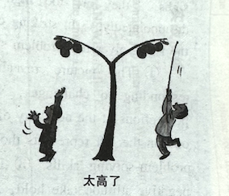

# 全国硕士研究生招生考试英语（一）全真模拟卷

## Section I: Use of English

**Directions:**

Read the following text. Choose the best word(s) for each numbered blank and mark A, B, C or D on the ANSWER SHEET. (10 points)

Everyone in the UK is talking about *Adolescence*. The `___1___` TV drama created by Jack Thorne and Stephen Graham. It has been so widely praised that UK Prime Minister Keir Starmer recently met the team behind *Adolescence* to discuss the online radicalisation of teenage boys. `___2___`, the leader of the UK’s Conservative party, Kemi Badenoch, `___3___` a minor media firestorm after revealing she hadn’t seen the series.

Television, perhaps more than any other `___4___`, is seen as a `___5___` for change. Thorne has called it the “empathy box”. Sometimes, it really does work like that. The 1960s drama *Cathy Come Home* `___6___` the creation of homelessness charity Crisis, while a 2018 survey found that women in the US who `___7___` watched *The X-Files* were more likely to believe that women should study STEM subjects.

But one `___8___` where this hasn’t happened is climate change. While documentaries have long played their part in `___9___` the public about ecological crises, they don’t seem to be enough. `___10___` the 2017 series *Blue Planet II*. This is widely `___11___` with raising awareness of marine plastic pollution, `___12___` there is little evidence it caused enduring changes to consumer habits.

So could television really help `___13___` our planet? Fiction, not fact, may be key. We know storytelling is a prosocial behaviour and that acting for the collective good is vital for `___14___` climate legislation. `___15___` viewers of fictional TV have also been shown to more strongly believe in justice than do viewers of news and documentaries, which could prove crucial in stopping climate doomism from `___16___`.

We also know that awe is a powerful `___17___` for preventing climate inaction. Science fiction may therefore be uniquely helpful; researchers found that sci-fi was `___18___` in its ability to inspire awe. What we need, then, is an *Adolescence* for climate change. Some yet-to-be-adapted sci-fi novels would be good. The `___19___` are endless—we just need some fantastic writers to take them. Perhaps that could be Thorne and Graham’s next `___20___`.


1. [A] classical [B] controversial [C] breakout [D] sensitive
2. [A] Instead [B] Meanwhile [C] Furthermore [D] Likewise
3. [A] evaded [B] initiated [C] resolved [D] endured
4. [A] medium [B] resource [C] industry [D] institution
5. [A] distraction [B] vehicle [C] target [D] barrier
6. [A] led to [B] aimed at [C] centered on [D] came with
7. [A] rarely [B] regularly [C] randomly [D] occasionally
8. [A] instance [B] incident [C] issue [D] context
9. [A] informing [B] entertaining [C] confusing [D] misleading
10. [A] Watch [B] Take [C] Forget [D] Compare
11. [A] identified [B] associated [C] credited [D] charged
12. [A] since [B] so [C] lest [D] yet
13. [A] depict [B] understand [C] reshape [D] save
14. [A] debating [B] delaying [C] passing [D] changing
15. [A] Heavy [B] Casual [C] Few [D] Intense
16. [A] fading away [B] turning up [C] losing ground [D] taking hold
17. [A] constraint [B] tool [C] reaction [D] urge
18. [A] inadequate [B] unclear [C] standard [D] distinct
19. [A] demands [B] perspectives [C] challenges [D] opportunities
20. [A] project [B] campaign [C] assignment [D] venture

------

## Section II: Reading Comprehension

### Part A

**Directions:** Read the following four texts. Answer the questions below each text by choosing A, B, C or D. Mark your answers on the ANSWER SHEET. (40 points)

**Text 1** 

America's supreme court has issued a momentous ruling—one that will have far-reaching consequences for the government's ability to curb the greenhouse-gas emissions. In *West Virginia vs. Environmental Protection Agency*, the court sharply limited the EPA's power to regulate the millions of tonnes of greenhouse gases discharged by coal-burning power plants each year. The Clean Air Act, the majority ruled, does not permit the agency to reshape the power network by relying more heavily on cleaner sources like solar and wind power.  

In his majority opinion, joined by all five of his conservative colleagues, Chief Justice John Roberts described the Clean Power Plan—the emissions guidelines that the EPA developed under the Clean Air Act—as an "unheralded" scheme affecting "a significant portion of the American economy". Reducing carbon dioxide emissions and forcing "a nationwide transition away from the use of coal to generate electricity", he wrote, "may be a sensible solution to the crisis of the day", but "it is not plausible that Congress gave EPA the authority to adopt on its own such a regulatory scheme".  

The Clean Air Act may empower the EPA to regulate greenhouse-gas emissions, Chief Justice Roberts wrote, but "separation of powers principles and a practical understanding of legislative intent" require "clear congressional authorisation" before systemic regulations affecting the entire power network can be drawn up. The decision did not write off all future alternatives for what the Clean Air Act stipulates as a "best system of emission reduction".

Under the court's ruling, when the EPA develops national emissions guidelines for existing power plants it must rely only on technological solutions that can be applied by existing plants, without assuming a fundamental change in their nature. In other words, guidelines must be drafted that allow a coal-fired power plant to remain a coal-fired power plant. In fact, power companies may find that replacing coal with renewables is more economical, as installing renewables becomes increasingly competitive with fossil fuels, and in particular coal.

Justice Elena Kagan's dissent expressed frustration with the majority's attitude towards "the most pressing environmental challenge of our time". Where the majority favours strong judicial oversight of "unelected officials", the dissenters would give regulatory bodies more leeway. "The subject matter of the regulation here," Justice Kagan wrote, "makes the court's intervention all the more troubling." Justices do "not have a clue" about "how to address climate change", she added. With stakes as high as the future of the planet, it was outrageous that the "court appoints itself—instead of Congress or the expert agency—the decisionmaker on climate policy".

By ruling in favour of the coal producers, the Supreme Court has restricted Mr Biden's ability to decarbonise the American power sector, responsible for 25% of the country's emissions, and the second-largest after transport. Achieving the climate target is not impossible without system-wide regulations on power-plant emissions. And other options, such as clean-energy tax credits and state-led regulation can pick up some of the slack. But by restricting the ways in which the EPA can devise its guidelines, the Supreme Court has considerably depleted the climate toolbox.

**21. It can be learned from Paragraph 1 that America's supreme court**
[A] overturned the Clean Air Act.
[B] ruled against coal-burning power plants.
[C] curbed the EPA's power to regulate greenhouse-gas emissions.
[D] prohibited the government from decarbonising the power sector.

**22. According to the majority, the EPA's Clean Power Plan**
[A] runs counter to the Clean Air Act.
[B] is a hindrance to America's economy.
[C] is drawn up without congressional authorisation.
[D] can't count as a best system of emission reduction.

**23. Under the court's ruling, national emissions guidelines should**
[A] encourage technological innovations.
[B] respect the nature of power plants.
[C] ensure a national transition to renewables.
[D] entail different sets of standards.

**24. According to Justice Elena Kagan, the majority**
[A] failed to realise the threats of climate change.
[B] gave agencies too much regulatory authority.
[C] interfered too much in the climate policy.
[D] addressed climate change issues without expert advice.

**25. The author suggests the ruling's effect on decarbonisation is**
[A] harmful.
[B] desirable.
[C] minimal.
[D] uncertain.


**Text 2** 

Last year CSX Transportation, the fourth biggest railroad in the U.S., announced that it would acquire PanAm railways, a regional railroad that operates in New England. The merger would allow CSX to connect its current system that spreads across the Eastern United States and the Midwest. However, it's not clear that the government is ready to sign off on the transaction.

While this transaction may meet vigorous opposition from the government, it is hard to find a legitimate reason to hinder it. An expanded CSX that takes on PanAm's New England-based network would result in more goods moving via rail than by truck, which would be an absolute good for our nation's roads, the economy, and the environment.

Despite the fact that the Democratic Congress and the Biden Administration have said repeatedly that tackling climate change is their highest priority, the objection seems to be more concerned with putting railroads in their place than enlisting their help in the effort. While the ultimate result of the merger would be to make rail more competitive with trucking and move more goods by rail, it would also reduce the number of union crew jobs, and since these unions support the Democratic Party, their interests come first for many in Congress.

The increasing protests about railroads obtaining "monopolies" is a farce: it rarely makes economic sense for two competing railroads to lay separate tracks to serve a single shipper, and nearly all such duplicative routes disappeared long ago. In today's economy, railroads compete against the trucking industry, which is dirtier, more dangerous, and receives billions in implicit and explicit subsidies from the government each year.

And the idea that some notional expansion of Amtrak beyond the Northeast Corridor should take precedence over a merger that would improve the productivity and competitiveness of a railroad is insane. People in rural Vermont (which constitutes most of the state) aren't dying to pay more for the privilege of traveling on some mythical Amtrak route. An infrequent train from Burlington to Boston that's slower than driving is not going to improve the environment or anyone's life in a measurable way. Having it replace this merger with all of the broader regional benefits that would come from the increased capital investment in PanAm's footprint amounts to making a fetish out of passenger rail.

For reasons that are difficult to understand, the Biden Administration appears determined to stick it to the railroads, which are making enormous investments to improve their productivity, and in doing so are doing more than almost any other company to reduce carbon emissions. Impeding a merger of PanAm and CSX would produce purely illusory benefits while harming the ostensible goals of this administration and Congress.


**26. According to Paragraph 1, the acquisition would**
[A] make CSX the biggest railroad in the U.S.
[B] expand CSX's reach in New England.
[C] allow PanAm to operate in the Midwest.
[D] undermine PanAm's current rail system.

**27. The transaction may meet opposition from the government because**
[A] it is not a strictly legitimate deal.
[B] it is not good for the nation's economy.
[C] it is detrimental to the environment.
[D] it is against the interests of unions.

**28. The phrase "a farce" (Line 1, Para. 4) is closest in meaning to**
[A] an absurd event.
[B] a sober reminder.
[C] a well-grounded argument.
[D] an outdated perception.

**29. According to Paragraph 5, an expansion of Amtrak would**
[A] intensify the competition between CSX and Amtrak.
[B] reduce the cost of traveling in rural Vermont.
[C] produce little economic benefit.
[D] bring huge environmental gains.

**30. What is the author's attitude towards the transaction?**
[A] Skeptical.
[B] Favorable.
[C] Objective.
[D] Concerned.


**Text 3**

According to a study published in *Nature* in November, Americans are more likely to appreciate AI-generated poems than poetry from humanity’s most celebrated authors: Emily Dickinson, Sylvia Plath and, of course, T.S. Eliot. In fact, AI-written poetry was 17 percentage points more likely to be judged as having been written by a human than the actual human-authored poetry. It was also rated more favorably in terms of "rhythm and beauty."

We're not reading well—or at all anymore. A 2022 Gallup poll estimated that American adults read two to three fewer books per year than they did before 2016. Meanwhile, ChatGPT was trained on the data equivalent of hundreds of thousands of books, giving it the clear edge when it comes to decoding and replicating the world's greatest poets, their critics and their critics' critics.

AI has placed poetry at risk of extinction. Only 12 percent of American adults read or listened to a poem in 2022. When we do encounter poetry, it's often trendy “Insta-poetry”—short and straightforward verses popularized on social media. This more digestible form of poetry has its merits, but it doesn't challenge readers to interpret the subtleties of form, meter and allusion the way traditional poetry does.

People prefer what they can comprehend, and collectively, we’ve lost our ability to comprehend poetry. The researchers behind the *Nature* study found that AI-generated poems used more obvious and direct language, making them more accessible to nonexperts. Participants didn't have to struggle to analyze the subtle shades of emotion and complex metaphors that adorn human poetry.

But poetry is not meant to be straightforward. Reading poetry is supposed to take effort. The problem is that we've become lazy readers and writers, and AI is profiting from that. The headaches of formality, connotation, meter, grammar, allusion and intention have caused us to discard our literary minds and trade them for convenience. But difficulty is the essence of poetry. ChatGPT will never be able to slyly reproach a critic mid-verse, deliberate over the perfect phrasing with an editor or become struck with inspiration in the middle of personal tragedy.

Poets travel every corner of their brains, negotiating their lived experiences, their sparks of inspiration and their heartfelt emotions. ChatGPT, on the other hand, is programmed to take the path of least resistance. The words of ChatGPT don't correspond to reality but to an algorithm linking words and phrases based on probability.

Poetry is meaningful because it is art created through adversity, from the unpredictable and unanticipated. We cannot expect to appreciate poetry without accepting that sometimes it leads us to places we don't understand. Embracing the difficulty of the abstract is how we retain our humanity. We must confront the complexities that intimidate us, the texts that force us to pause, the obscure allusions that require additional research to understand. If we directed a fraction of the funding, effort and attention currently focused on AI toward poetry, ChatGPT would not seem nearly as remarkable in the face of human ingenuity.


------

**31. According to the study published in \*Nature\*, Americans**
[A] favor AI-generated poems over human-authored ones.
[B] read more poems by celebrated authors than by others.
[C] hold conflicting views on AI-generated poetry.
[D] cherish the beauty of human-authored poetry.

**32. ChatGPT secures its edge through**
[A] adapting to individuals' reading tastes.
[B] training on massive datasets of books.
[C] interpreting the contextual subtleties in poems.
[D] identifying the patterns of literary critiques.

**33. The author's attitude toward "Insta-poetry" is**
[A] appreciative.
[B] sympathetic.
[C] ambiguous.
[D] disapproving.

**34. Compared with human poetry, AI-generated poems tend to**
[A] center on the theme of personal tragedy.
[B] use easily comprehensible language.
[C] exhibit strong emotional empathy.
[D] be decorated with complex metaphors.

**35. Which of the following statements best represents the author's view?**
[A] ChatGPT can describe reality but can't explore emotions.
[B] Poetry's value lies in its difficulty instead of accessibility.
[C] ChatGPT can be employed to help us understand poetry.
[D] More efforts should be directed to AI-generated poetry.

------

**Text 4**

The Conservative philosopher Michael Oakeshott described one of the benefits of student life as the opportunity “to look for some meaning in the things that have greatly moved mankind”. Higher education, he wrote, should be an interval during which the undergraduate will have “learned something to help him lead a more significant life”.

On that basis, one suspects that Oakeshott would have been dismissive of the dispiriting assumptions underlying Rishi Sunak’s proposed new crackdown on “low-value degrees”—a status to be defined principally by reference to earnings after graduation. Endorsing language that is insulting to academics, Mr Sunak has pledged to cap numbers of students on what his government describes as “rip-off” university degrees that don’t lead to a well-paid, highly skilled job.

This is a narrow and instrumental view of higher education. It casually disregards the countless benefits that a degree course can offer a young person, beyond a job at the end of it. From an enhanced capacity to think critically, to the widening of social horizons and the pleasures of independent study, attending university offers far more than a mere route to the workplace.

But Mr Sunak’s reductionist rhetoric is also insincere. For all the performative sympathy for graduates stuck on low incomes, his government is primarily concerned with reducing Whitehall’s liability for the student debt that has to be written off as a consequence. To that end, the government has already changed the income thresholds at which graduates are required to start paying off loans. The threat to cap—and even close—courses is another move designed to limit Treasury exposure to the failing fees-based model of higher education.

Adequate quality control is a must at every university. But the consequences of these plans would be deeply unfair. The proposed caps would be likely to have next to no effect on Oxbridge and the Russell Group universities, whose prestigious brands and demographic intake ensure more students go on to better-paid jobs. The endangered “rip-off” courses will turn out to be overwhelmingly in less glamorous institutions and poorer regions, disproportionately attended by less well-off and minority ethnic students. This is socially regressive policymaking.

Just as insidiously, the government’s crude definition of value will pile pressure on departments specialising in the creative arts, which have borne the brunt of funding cuts in recent years. In a critique of the government’s approach, a former architect of the marketised higher education model condemned the “poor ranking of academic subjects based on ‘economic return’ and endless cuts to arts and humanities”. As well as underestimating the public good delivered by creative graduates, such bean-counting is opposed to the creative, innovative economy the government is striving for.

Quite. It might be added that it is the government’s job, rather than that of lecturers on campuses, to create a labour market that can provide good-quality, well-paid jobs for graduates. Mr Sunak should take some time out to read Oakeshott’s *The Idea of a University*.


**36. In Oakeshott's opinion, higher education should help individuals**
[A] develop a practical career plan.
[B] get prepared for a meaningful life.
[C] form a habit of lifelong learning.
[D] learn to create things that move people.

**37. Sunak's proposal to crack down on "rip-off" degrees reflects**
[A] a surplus of university degrees.
[B] a concern about employment rates.
[C] a lag in academic productivity.
[D] a neglect of degrees' overall value.

**38. According to Paragraph 4, the real purpose of changing the income threshold is to**
[A] support low-income graduates.
[B] reduce the government's risks.
[C] offset graduates' income gap.
[D] maintain the fees-based model.

**39. According to Paragraphs 5 and 6, the proposed caps may**
[A] make top colleges less accessible to poor students.
[B] ensure more graduates better-paid jobs.
[C] decrease the waste of academic funds.
[D] hinder the building of an innovative economy.

**40. What is the text centered on?**
[A] The criticism of a proposal.
[B] The debates over a proposal.
[C] The dilemma of higher education.
[D] The real value of higher education.

### **Part B**

**Directions:** The following paragraphs are given in a wrong order. For Questions 41-45, you are required to reorganize these paragraphs into a coherent article by choosing from the list A-G and filling them into the numbered boxes. Two paragraphs have been placed for you in Boxes. (10 points)

**(41) Sophie Kemp**

I’m a novelist in my 20s, squarely in the cohort of writers that Mr. Brooks claims are conformists afraid to truly express their thoughts on the page. Can one make art if one is scared to tell the truth? I’d argue not, obviously. I would not be interested in reading or writing a book that conforms in any way. I strongly believe that one should make art only if one is not afraid to be bold.

Unlike Mr. Brooks, I think there are plenty of gifted young writers who are working on bold, uncomfortable and groundbreaking novels. To suggest that there are no literary superstars because there aren’t any young writers willing to be innovative on the page could not be further from the truth.

**(42) Christopher J. Wheatley**

David Brooks argues that novels no longer have the same cultural importance they once had. I think this is true, but it illustrates a change that has taken place often in the past and is usually not recognized until much later.

In the late 16th and early 17th centuries, literary reputations were made with long narrative poems like Spenser’s “Faerie Queene,” Marlowe’s “Hero and Leander” and Shakespeare’s “Rape of Lucrece” and with sonnet sequences. It took more than a century for people to recognize that stage plays—popular literature written to make money—were the greatest works of the period. In the 19th century, French critics wondered when the Great Romantic Drama would be produced, oblivious to the fact that the great art form of the period was all around them: the novel. And all of the debates of the 20th century about what could claim to be the Great American Novel missed that the most significant art form of the century was film, while great artists like John Ford and Alfred Hitchcock were dismissed by many Americans as popular culture.

**(43) Isabelle Landry**

David Brooks’s column on the decline of literary fiction struck a nerve. I recently submitted my 200-page manuscript to 40 publishers in France and Quebec. Not long ago, editors would return your manuscript with a comment, sometimes even a page-long critique. A rejection, yes—but also a gesture of respect and engagement. Today, most publishers state that they prefer receiving manuscripts by email and that they may never respond. The process has become opaque and discouraging.

My 30-year-old son was once an avid reader—the Harry Potter books and stories by Guy de Maupassant by age 12. He doesn’t read fiction any more, though he did admit recently that he missed it and that Maupassant’s “Bel-Ami” gave him his first sexual awakening. That’s the power fiction used to have. The deeper loss isn’t just readership—it’s the fading relationship among writers, readers and the gatekeepers who once nurtured them.

**(44) Leslie Valas** As a lifelong reader, I disagree with David Brooks’s assessment of a dearth of great novels. In the last year I have read the novels “James,” by Percival Everett; “Our Missing Hearts,” by Celeste Ng; “The Mighty Red,” by Louise Erdrich; and many others. It’s not that there is a lack of great books being written; it’s an inability to become involved with something that is slower than social media, the internet or any of the other readily available speedy distractions.

Reading continues to be one of my greatest pleasures. To share someone else’s ideas through their words has opened me up in so many ways. To share these words with others—family, friends or grandchildren—is an immense joy.

**(45) William G. Durden** David Brooks attributes the novel’s decline to three elements: the internet, social pressure and conformity of thought. But there is arguably one more: the rise of the critic as the dominant and all-pervasive voice, the “superstar” in academic literary circles and beyond beginning in the 1970s. One thinks, for example, of Jacques Derrida, Jacques Lacan and Paul de Man.

The relevance of the author was challenged (replaced by the critic), as was the text (replaced by theory). The novel as story was assigned to the “unenlightened.” As a consequence, higher education lost touch with the American public—which, frankly, still enjoys a good story and is also curious about the motivations of the author.

[ A ] Academic critics’ obsession with theory over storytelling has alienated the public from novels.

[ B ] Great novels are still being produced but our shortened attention span makes it hard to engage with them.

[ C ] It is wrong to suggest that the lack of literary icons stems from a deficiency of bold new talent.

[ D ] Publishers and editors actually make inadequate efforts to promote great novels to their potential readership.

[ E ] The decline of novels’ cultural status merely repeats a historical pattern where people fail to recognize the ascendancy of new art forms.

[ F ] Modern novels demonstrate an inferiority in narrative craftsmanship when compared to the literary masterpieces of previous eras.

[ G ] The decline of literary novels is reflected not only in shrinking readership but also in the weakening bond among writers, readers, and publishers.

### **Part C**

**Directions:** Read the following text carefully and then translate the underlined segments into Chinese. Your translation should be written clearly on ANSWER SHEET. (10 points)

History, of course, is filled with anecdotes of highly accomplished persons being chastened by unsuccess. We are accustomed to recounting stories of Joyce receiving dozens of rejection letters before finding a publisher for *Ulysses* and Einstein failing his high school math. We find it inspirational to learn that Beatrix Potter had to use her own money to publish *The Tale of Peter Rabbit* and that *Jane Eyre* was dismissed by an early critic as “sheer rudeness and vulgarity.” **(46) We marvel at the perseverance of Nietzsche, whose masterpiece \*Beyond Good and Evil\* sold a mere 114 copies in its first year in print, and the perception of George Sand who had to adopt a man’s name as her pen name to see her work published in a male-dominated literary culture.**

Yet we tend to interpret such setbacks not on their own terms, but in light of their author’s future acclaim. **(47) That is, we see them as setbacks and not failures, detours on the road to success and not the destruction of the road itself.** These are tales told to inspire resilience, not humility; determination, not an awareness of one’s weakness.

**(48) That we insist upon turning stories of loss into stories of gain is no doubt rooted in our preference for happy endings.** We need to believe that any fate can be surmounted as long as we are strong enough to surmount it. And in the face of a chaotic and often crushing existence, such notions are not negotiable. They are necessities that must be treated as true if one is going to accomplish the difficult feat of getting out of bed and facing the new day.

The only problem is that nothing could be further from the truth. **(49) As we all know, human existence is full of suffering that resists explanation and obstacles that cannot be overcome.** To be human means to be continuously confronted with failure, both one’s own and the numerous failures of the world around us. What then is one to do? How ought we to cope with the struggles and shortcomings inherent in every aspect of our lives?

In his recent book, *In Praise of Failure*, the contemporary philosopher Costica Bradatan suggests that we stop striving for success and instead embrace life’s failures. **(50) Noting that failure “lies at the core of who we are” and that “Failing is essential to what we are as human beings,” the philosopher praises the benefits of coming to terms with our imperfections and accepting the instability of human existence.** Doing so, he claims, will humble us and enable us to see ourselves honestly, stripped of the disguise that success seems to provide.

------

## Section III: Writing

### Part A (10 points)

**Directions:**

51、Your friend Mark is nervous about an upcoming job interview. Write him an email to provide tips on how to prepare for a job interview.

You should write about 100 words on the ANSWER SHEET.

**Do not** use your own name at the end of the email. Use "Li Ming" instead.

### Part B (20 points)

**Directions:**

52、Write an essay of 160–200 words based on the following picture. In your essay, you should

1. describe the picture briefly,
2. interpret the implied meaning, and
3. give your comments.




```
Paragraph 1: Description (宏观概括 ➔ 细节一 ➔ 细节二)
An extraordinary and meaningful drawing unfolds before our eyes
As is vividly illustrated in the drawing, two men are trying to pick fruit from a tall tree. To be more specific, the person on the left is reaching out with his bare hands in vain, complaining that the fruit is "too high". On the contrary, the one on the right is successfully reaching the targets by using a long pole, with a cheerful smile on his face.

Paragraph 2: Interpretation (套用“反面现象 ➔ 危害 ➔ 转折正面”模板)
Conspicuously, the above scene can be associated with a host of inflexible and pessimistic individuals. Nowadays, an increasing number of people easily give up when facing daunting challenges (such as complaining about the difficulty instead of seeking solutions and so forth), which reflects a negative attitude of defeatism (失败主义). This phenomenon deserves particular attention because they focus only on the seemingly insurmountable obstacles, which severely hinders personal development. By contrast, resourcefulness (足智多谋) and a problem-solving mindset contribute to our personal fulfillment and intellectual growth, as it plays a profound role in enhancing our confidence and fostering our positive mindset. Moreover, as modern society places ever higher demands on individuals, cultivating an innovative and proactive attitude becomes all the more essential in helping us adapt to the fast-paced and unpredictable world.

Paragraph 3: Conclusion (套用“呼吁行动”模板)
In a nutshell, as the picture subtly reminds us, the ability to think innovatively and utilize proper methods plays a crucial role in promoting both personal growth and social harmony. Therefore, parents should attach importance to developing this quality in their children from an early age. Meanwhile, social media bears the responsibility of raising public awareness of its enduring significance.
```

