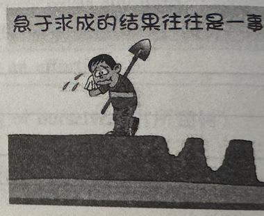

# 全国硕士研究生招生考试英语（一）全真模拟卷

## Section I: Use of English

**Directions:**

Read the following text. Choose the best word(s) for each numbered blank and mark A, B, C or D on the ANSWER SHEET. (10 points)

Scientists have often seen curiosity as a motivation that compels us to discover new information and to initiate and facilitate learning. That framing suggests curiosity **1** us to find answers as soon as possible. This **2** for answers aligns with what psychologists think is a main function of curiosity: to **3** uncertainty. This feeling of uncertainty then motivates a search for information that, **4** obtained, is met with **5** and satisfaction.

But this picture of curiosity is **6**. In a recent study, we explored whether there are multiple **7** of curiosity. **8** past work has shown that higher curiosity increases motivation to get information, our study found that it also **9** greater avoidance of “early” answers. Why do our findings differ from those of past studies? One important difference is what happens while people wait for more information. When opportunities for seeking information **10**, curiosity may favor its patient accumulation. But when the information to be gained from waiting is limited, **11** resolution may be desirable.

Our study **12** revealed that curiosity seemed to **13** along with the question a person was asking, like shifting from an exploratory musing to a more focused query. Interestingly, the **14** for information also seemed to feel different **15** the journey to resolution. When uncertainty was greatest, curiosity was experienced with **16**. But as people got **17** to the big reveal, curiosity coincided with frustration. Yet **18** how curiosity changed, we found that greater curiosity encouraged engagement in the process.

Our work underlines the **19** of curiosity, opening new avenues for research to explore its varieties. Thinking about curiosity as going **20** the need for quick answers also highlights the power of what happens when we engage with uncertainty.

1. [A] promises   [B] drives   [C] reminds   [D] requires
2. [A] impatience   [B] concern   [C] confidence   [D] optimism
3. [A] generate   [B] increase   [C] conceal   [D] reduce
4. [A] when   [B] until   [C] unless   [D] though
5. [A] surprise   [B] anxiety   [C] grief   [D] relief
6. [A] inconclusive   [B] incomplete   [C] incredible   [D] indefinite
7. [A] stages   [B] definitions   [C] levels   [D] flavors
8. [A] Although   [B] As   [C] Since   [D] After
9. [A] depends on   [B] adds to   [C] asks for   [D] contributes to
10. [A] diminish   [B] abound   [C] mature   [D] disappear
11. [A] cautious   [B] creative   [C] immediate   [D] practical
12. [A] nevertheless   [B] thus   [C] also   [D] still
13. [A] get   [B] follow   [C] carry   [D] evolve
14. [A] desire   [B] preparation   [C] preference   [D] arrangement
15. [A] by   [B] across   [C] outside   [D] from
16. [A] confusion   [B] uneasiness   [C] joy   [D] peace
17. [A] used   [B] sensitive   [C] closer   [D] exposed
18. [A] apart from   [B] regardless of   [C] according to   [D] instead of
19. [A] danger   [B] source   [C] complexity   [D] flaw
20. [A] beyond   [B] against   [C] without   [D] with

------

## Section II: Reading Comprehension

### Part A

**Directions:** Read the following four texts. Answer the questions below each text by choosing A, B, C or D. Mark your answers on the ANSWER SHEET. (40 points)

**Text 1** 

In the 1990s, Congress offered federally funded job training under a law, now known as the Workforce Innovation and Opportunity Act (WIOA), to help laid-off workers and poor parents find a new source of income. It made sense in theory. In practice, it was a failure.

In 2022, the U.S. Department of Labor published a comprehensive study of the WIOA and a host of similarly structured federal job-training initiatives. The programs did manage to put a lot of people through training, the researchers found. And many of those people were then hired in so-called in-demand jobs. But in the first three years after training, their wages increased only 6 percent compared with those of similar workers who didn't receive training and the effect didn't last. In the long term, their relative wages didn't increase at all.  

This poor track record is often attributed to ever-growing skill requirements for jobs in the fast-paced global economy. In fact, the programs fail because they're designed with potential employers rather than employees in mind. In the case of the WIOA, the local workforce boards that decide which jobs qualify as "in-demand," and therefore which are eligible for federal funding, are dominated by business interests—and what business wants is a steady stream of low-wage workers trained by someone else.  

"In-demand" jobs aren't necessarily good jobs. They might be the opposite, because, from an employer's perspective, "in-demand" is another way of saying "lots of vacancies", and sometimes employers can't fill jobs because they expect grinding, potentially dangerous work in exchange for bad pay, meager benefits, and little room for advancement.

Unfortunately, Congress is currently considering a pair of bipartisan updates to federal job-training that would double down on the WIOA's shortcomings. In April, the House of Representatives passed a new version of the law by a 378-26 vote, giving a bipartisan stamp of approval to the failed status quo. Meanwhile, a Senate bill introduced by Democrat Tim Kaine and Republican Mike Braun, with dozens of co-sponsors, would allow federal Pell grants for low-income students to be spent on short, WIOA-style training programs instead of on traditional college degrees. Taken together, the bills, if they become law, seem poised to expand the federal government's investment in fitting unemployed workers into low-wage, high-turnover jobs.

If Congress wanted to actually fix the broken system, it would make sure that federal training programs prepare workers for jobs with living wages, benefits, and the opportunity for career advancement. California's state-funded High Road Training Partnerships initiative, for example, matches workers with employers who meet standards for wages and job quality, and who commit to collaborating with workers in the design of their training programs.

Labor unions are the one force that might be able to persuade Congress to reform the WIOA system instead of doubling down on it. The Biden administration has pushed an expansive agenda to support unions, expand antitrust enforcement, and give workers more power to demand better wages and benefits. A newer, better WIOA could bring job training in line with those ideals.

**21. It can be learned from the first two paragraphs that federal job training programs** 
[A] had little effect on reducing unemployment. 
[B] were introduced to raise average family income. 
[C] failed to increase trainees' wages as expected. 
[D] made good impacts on job market in the long term.

**22. What dominates local workforce boards' decision on federal-funded jobs?**
[A] Interests of businesses and employers. 
[B] Demands of the fast-paced global economy. 
[C] The stability of in-demand jobs' training system. 
[D] The need for low-wage workers to get new skills.

**23. If passed as laws, the pair of bipartisan updates to federal job-training would**
[A] lower turnover rates in high-demand sectors. 
[B] amplify the flaws of the current WIOA system. 
[C] expand federal supports for low-income workers. 
[D] raise employment barriers for poor students.

**24. High Road Training Partnerships initiative is cited as an example of** 
[A] a fruitful collaboration between unions and employers. 
[B] a statewide campaign to raise the minimum wage. 
[C] a federal effort to encourage job creation. 
[D] a successful model of job-training programs.

**25. What does the text mainly discuss?** 
[A] The evolution of the WIOA. 
[B] Flaws and fixes of the WIOA. 
[C] Efforts to promote the WIOA. 
[D] A good alternative to the WIOA.

**Text 2** 

The decision by Sunderland University to close history, modern languages and politics degrees in favour of more "career-focused" courses has been widely criticised. One objection is simply that all these humanities subjects offer students skills that play well in the job market. But it's a problem to reduce university education to simply what sells to employers. These are subjects that matter to society as a whole, whether in working out the political implications of the climate crisis or understanding the fate of post-industrial towns. They shouldn't become the preserve of an elite.  

Course closures such as these are a predictable consequence of the government's decision to remove the quotas on student recruitment from 2015. Prior to that point, there were centrally imposed limits on how many students any given university could recruit. Since then, it's been a free-for-all. Subjects such as history and politics, which don't require expensive infrastructure to teach, were popular targets for expanding student intake in the more selective universities. That was good news for students who'd previously had to settle for their second-choice institution, but it's making it hard to sustain a full range of courses at the middle- and lower-tariff universities, as a proportion of their applicants head for more "prestigious" institutions and their student numbers decline.  

While more applicants now get into their first choice of university, not every applicant is equally mobile. The students who lose most as courses close are those who need to fit study around the school run, or other caring responsibilities, and therefore rely on local provision. Then there are the applicants who prefer a university with experience of dealing with people who are the first in their family to go into higher education, or who arrive with BTECs (specialist work-related qualifications) rather than A-levels (subject-based qualifications).  

The free market makes for losers. Academic staff at one popular institution said that they're expected to support 50 personal tutees each, making it almost impossible to get to know students individually. University staff are bearing the brunt of the volatility, whether navigating those enormous tutorial groups at one end of the scale, facing redundancy at the other, or stuck in the middle on a fixed-term contract that may or may not be renewed depending on student numbers. But the implications of this shake-up to the sector go wider. The number of university students has fallen dramatically, with inevitable knock-on effects for local economy.  

This is not a political climate that favours easy decisions in higher education. Concerns about the impact of Brexit and reliance on overseas fee income have been widespread. But these must not be the terms of the debate. A society—and indeed a world—confronting the climate crisis urgently needs people who have the education to think about big issues. Those aren't only scientific or technological. The humanities matter. And it matters that students from all backgrounds—and across the country—have the opportunity to join in these world-changing discussions.  

**26、We can learn from Paragraph 1 that **
[A] humanities majors are competitive in the job market. 
[B] humanities subjects are essential for solving social issues. 
[C] "career-focused" courses have become the preserve of an elite. 
[D] "career-focused" education doesn't open the doors to rewarding careers.

**27、It can be learned that ending student quotas has resulted in **
[A] a free market in university places that favours students. 
[B] a decline in the quality of leading universities. 
[C] students' reluctance to study humanities. 
[D] declining enrollments in less selective universities.

**28、Who will be most harmed by the course closures? **
[A] Those who are the first college student in the family. 
[B] Those who settle for their second-choice institutions. 
[C] Those who have to shoulder caring responsibilities. 
[D] Those who have already got BTecs qualifications.

**29、According to Paragraph 4, the free market in higher education may **
[A] overburden academic staff at popular institutions. 
[B] cause staff shortage at lower-tariff universities. 
[C] force academic staff to accept unfair contract terms. 
[D] cripple local economies with an ill-educated workforce.

**30、Which of the following can be inferred from the last paragraph? **
[A] The impact of politics on higher education can't be overlooked. 
[B] Climate crisis demands a scientific and technological solution. 
[C] Science students should be required to take humanities courses. 
[D] All students should have equal access to humanities education.

**Text 3**

More than 1,000 artists supported the release this week of a silent album containing nothing more than background studio noise. The 47-minute album called *Is This What We Want?* contains 12 tracks entitled: The. British. Government. Must. Not. Legalise. Music. Theft. To. Benefit. AI. Companies.

This mute protest is part of a worldwide revolt by creative artists and content companies against the unauthorised use of their work by big technology firms. In the US, the Authors Guild and 17 individual authors are pursuing a more traditional American form of protest by suing OpenAI and Microsoft for breach of copyright, alleging "systematic theft on a mass scale."

These disputes are a classic example of what happens when new technologies outpace laws written for an earlier era. When intellectual property laws were enacted, no one could have imagined a day when massive companies would scrape the entire internet as training data for their generative AI models then spew out convincing simulacra of poems, images, music and videos. But the principle that no one should profit from another's intellectual property without consent should remain inviolable.

As in many other countries, the British government is currently struggling to realign principle and practice and update its intellectual property laws for the AI age. Last month, the government published an AI Opportunities Action Plan saying the current uncertainty around intellectual property needed to be urgently resolved. It has been consulting widely but is toying with "fair use" exemptions, which would be welcomed by AI companies.

What is partly overlooked in this debate is how desperate AI companies are to obtain fresh human-generated content to develop their models—and how much they would pay if they were able to do so easily and legally. As it happens, several start-ups are experimenting with new economic models. ProRata is developing an answer engine that would pay a share of an AI company's revenue to content creators whenever their work appeared in its responses. TollBit enables AI bots and data scrapers to pay websites directly for their content and thereby reduce legal uncertainty. And Human Native is creating a two-sided marketplace allowing AI creators to license data from content creators.

Just as hackers pirated music from the record companies in the early 2000s—before the industry evolved and enabled consumers to pay to stream music online—so the creative industries are experiencing their own "Napster era," argues James Smith, Human Native's co-founder. The biggest of many differences between the Napster era and today, however, is that the pirates are no longer small groups of hackers but giant corporations with lobbying muscle. Revised legislation may be essential to solutions. **If AI companies do not bite harder on that carrot they deserve to be hit with a big stick.**

------

**31. According to the first two paragraphs, both British and American artists** 
[A] are seeking government support for creative projects. 
[B] are getting involved in legal disputes with AI companies. 
[C] have benefited from commercial use of their works. 
[D] have taken collective action against copyright violation.

**32. It can be learned that the British government is striving to** 
[A] adapt intellectual property laws to new realities. 
[B] update the definition of intellectual property theft. 
[C] learn from other countries on copyright policies. 
[D] explore the limits of generative AI models.

**33. Several start-ups are mentioned in Paragraph 5 to illustrate** 
[A] innovative approaches to AI copyright issues. 
[B] recent developments in generative AI models. 
[C] AI companies' hunger for human-generated content. 
[D] content creators' ignorance of AI's economic potential.

**34. What is the biggest difference between the Napster era and today?** 
[A] Consumers' willingness to pay for content. 
[B] Creative workers' awareness of copyright. 
[C] The scale and influence of pirates. 
[D] The pace of technological evolution.

**35. The underlined sentence (Para. 6) most probably implies that** 
[A] legislation revisions may not prove essential. 
[B] mutually beneficial mechanisms may not work. 
[C] penalties for copyright piracy should be lessened. 
[D] AI companies should embrace market solutions.

------

**Text 4**

Last week, Colossal Biosciences—a company known for trying to revive the dodo, the mammoth and the thylacine—has unveiled three large adorable white puppies, claiming it has created "the world's first successfully de-extincted animal": the dire wolf, made famous by *Game of Thrones*. Scientists have been quick to point out that the company hasn't done anything of the sort: it has instead created a new animal altogether—a larger, whiter, more muscly wolf.

Still, it's a tremendous achievement. Does this herald a solution to declining biodiversity and dying ecosystems? Not quite yet. Let's start with the obvious ethical problem: the welfare of these animals. The first generation of an extinct species will arrive without kin. Wolves are sociable creatures, but the three novel pups have no pack to join, and no parents to teach them how to survive and thrive. Nor can they be released into their natural habitat, as it no longer exists. Colossal plans to keep the three "dire wolves" in (spacious) captivity for their whole life—there is of course no other solution. They will not be allowed to breed. In fact, it is hard to imagine a future for ancient animals like the dire wolf that doesn't involve life in a zoo, kept as exotic curiosities.

At this point some employ the brutal argument zoos often do: the suffering of these animals has a greater purpose; sacrificing the welfare of a few charismatic creatures will indirectly help others. Just as keeping animals on pitiful display supposedly drives enthusiasm for conservation, so excitement over a revived mammoth might attract funding, advancing technology that could be repurposed for worthier efforts, such as bolstering populations of endangered animals and plants.

But it's a bargain that doesn't add up. Shouldn't the imminent extinction risk of swathes of creatures be motivation in itself? Would de-extinction work, even in the most promising cases? Two problems stand in our way. First, it is incredibly hard to release captive-bred animals, which do not know how to survive in the wild. Humans have not yet learned to train them in artificial environments. Second: there is little point bringing back an animal if we simply drive it to extinction again. Most animals die out because of climate change and the destruction of ecosystems.

Which brings us to the most important argument against de-extinction: the benefits that could be lost by supporting it. A study published in *Nature* has calculated that maintaining a population of revived animals would be so expensive that two species would die out for every one revived, should the money come out of government conservation budgets. If private money were redirected from de-extinction to conservation, two to eight times more species could be saved.

Trump's administration hailed Colossal's claims to argue for cutting endangered species protections. "Going forward, we must celebrate removals from the endangered list—not additions," US interior secretary Doug Burgum has said. "If we're going to be in anguish about losing a species, now we have an opportunity to bring them back."

**36. It can be learned that Colossal Biosciences** 
[A] has been known for successfully reviving animals. 
[B] has gained quick recognition among scientists. 
[C] has created an animal resembling the dire wolf. 
[D] has found a solution to declining biodiversity.

**37. According to Paragraph 2, the first generation of an extinct species** 
[A] will be held in captivity for public display. 
[B] will establish close relationships with humans. 
[C] will be trained and released into the wild. 
[D] will rebuild their population to a great extent.

**38. Which of the following would the author most probably agree with?** 
[A] The suffering of revived species serves a worthy purpose. 
[B] Captive-bred animals also need wilderness survival skills. 
[C] Endangered species should be the focus of species protection. 
[D] More funding should be allocated for reviving ancient species.

**39. The study published in \*Nature\* is mentioned to illustrate** 
[A] the urgency of saving endangered species. 
[B] the lack of budgets for de-extinction projects. 
[C] the importance of private money in de-extinction. 
[D] the cost-benefit mismatch in de-extinction efforts.

**40. In the last paragraph, the author seems to view Doug Burgum with** 
[A] respect. 
[B] skepticism. 
[C] tolerance. 
[D] gratitude.

### **Part B**

**Directions:** The following paragraphs are given in a wrong order. For Questions 41-45, you are required to reorganize these paragraphs into a coherent article by choosing from the list A-G and filling them into the numbered boxes. Two paragraphs have been placed for you in Boxes. (10 points)

- [A] Start strong
- [B] See feedback as a tool
- [C] Determine the right time
- [D] Make feedback part of the process
- [E] Challenge black-and-white thinking
- [F] Engage in effective communication
- [G] Anticipate possible situations

It's a common struggle in the workplace: How do I overcome the fear of giving feedback? Whether you worry about causing tension, demotivating your people, or handling others' emotional reactions, conflict aversion is a common trait, and managers aren't immune to it. However, you're not doing anyone a favor by avoiding conflict. Workplaces marked by poor communication and unclear expectations are breeding grounds for low trust and disengagement.  

Here's how to navigate the sense of discomfort and apprehension that comes with difficult conversations, so you can say what needs to be said.  

**41. `__________________________________________________`**  

Many leaders who avoid confrontation carry assumptions like, "no one likes a micromanager," or "bringing up this issue will ruin our working relationship." Instead, focus on what you could gain by speaking up and the potential rewards of clear communication. Not only will voicing your thoughts help you feel more confident, but your constructive criticism could help team members develop and grow in their role, opening up new career opportunities. When you look more closely, you'll see that expressing your thoughts, feelings, and opinions is far more beneficial than stuffing them down and suffering the consequences.

**42. `__________________________________________________`**  

Despite what you may believe, your team craves meaningful, candid feedback.  “Managers providing critical feedback” is important for them in career development. When team members don’t think their boss is great at giving honest feedback, their engagement scores typically drop significantly. It’s not fair to deprive your team of information they need to grow. When you reframe conflict as a healthy, normative part of leadership, it loosens the anticipatory anxiety you may feel broaching difficult topics with others.

**43. `__________________________________________________`**  

Fear of the unknown or wondering how the recipient will react can hold many leaders back from ever speaking up. You can calm your anxiety and handle uncertainty using the worst case/best case/most likely tool. Consider the worst that could happen. If your employee cries, for example, how would you handle it? Perhaps you’d take a time out. Then consider the best that could possibly happen to foster more optimism. Finally, consider what is most likely, which is usually somewhere between the two extremes.  

**44. `__________________________________________________`**  

You can also ease your whirlwind of thoughts by planning your opening. Being in control from the get-go can provide a confidence boost and allows you to set a respectful tone for the conversation. Using “I” statements whenever possible helps ensure you communicate directly without wavering or minimizing your concerns simply because you’re scared. Being specific is also important. Rather than saying, “You dropped the ball again,” try saying, “I’m concerned that I didn’t get the documents in time for the client meeting today.”  

**45. `__________________________________________________`**  

To ensure the tiny annoyances and frustrations you harbor don’t blow up into major conflicts, you should make feedback a habit. Plus, gradually exposing yourself to fearful situations is the best way to overcome them. A great way to systematize feedback is through regular one-on-ones with your team. You can also schedule project debriefs where team members can reflect, or pre-checks where people can discuss in advance any risks, potential problems, and flesh out how they’ll work with one another. Creating a positive feedback culture will give you opportunities to flex your newfound assertiveness skills while also strengthening connections and trust with your team.  

### **Part C**

**Directions:** Read the following text carefully and then translate the underlined segments into Chinese. Your translation should be written clearly on ANSWER SHEET. (10 points)

Across Britain, there is evidently a mounting problem about the gap between people’s urge to experience wild and open spaces, and their ability to cope when they actually get there. More and more people are tempted into risky locations by Instagram posts and the navigation apps being used aren’t always suitable for an outdoor environment.

Most of us know the horror and panic that comes with sudden battery loss in an unfamiliar place. `（46）But those unfortunate souls getting lost up mountains have confronted something even more fear-inducing: that once you are away from roads and built-up environments, many of the most dependable apps suddenly run out of detailed information.` When that happens, do we even have the skills any more to find our way back to safety?

Worse still, what the most-used navigation apps—Google and Apple maps—most clearly show is the location of shops and restaurants, embodying the sense that `（47）what matters most is where we stand and how we consume, often at the expense of an immersive understanding of and interaction with our physical domain.` The result is that “individuals online can be virtually connected but environmentally detached from the surrounding world, inhabiting a confused realm of spatial illiteracy”.

Wanting to believe you know everything while constantly running the risk of accident and disaster might be the basis of the human condition, but the revolution in human thinking caused by the internet seems to have taken it to a surreal new extreme. It is surely telling that `（48）amid the endless abundance of apps designed to tell us where we are, how fast or slow our heart is beating and the latest news headlines, the word that seems to constantly crop up in articles about the way we now live is “disorientation”. `In that sense, people’s inability to find their way through the physical world reflects our declining skills at navigation more generally—and through information in particular. `（49）These are the consequences of the 21st century’s insistence that everything must be personalised; it distorts our understanding of the world to the point of near-fiction.`

And so, if anyone is thinking of venturing into the wild but unsure of how to avoid disaster, I’d recommend the Ordnance Survey’s peerless phone app and a paper map as a back-up. `（50）More broadly, we clearly need to talk about improving people’s understanding of what the countryside is like up close, and how to get around it—a conversation that might revive interest in the much-mocked subject of geography.` Here, perhaps, is the key to reconnecting the world we see on our phones and the one we have to actually deal with. That is the breach that needs to be healed; if it isn’t, even more generations will find themselves lost, in every sense of the word.

------

## Section III: Writing

### Part A (10 points)

**Directions:**

51、Suppose your university is going to hold an online forum on the future of AI and education. Write an email to professor Smith to invite him to give a speech.

You should write about 100 words on the ANSWER SHEET.

**Do not** use your own name at the end of the email. Use "Li Ming" instead.

### Part B (20 points)

**Directions:**

52、Write an essay of 160–200 words based on the following picture. In your essay, you should

1. describe the picture briefly,
2. interpret the implied meaning, and
3. give your comments.

