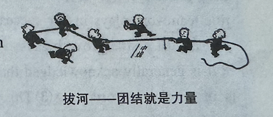

# 全国硕士研究生招生考试英语（一）全真模拟卷

## Section I: Use of English

**Directions:** Read the following text. Choose the best word(s) for each numbered blank and mark A, B, C or D on the ANSWER SHEET. (10 points)

"All happy families are alike; each unhappy family is unhappy in its own way." This is the first line of Leo Tolstoy's novel *Anna Karenina*. In a recent study of optimism, neuroscientists found a(n)  **1**  principle at play: optimists  **2**  similar patterns of activity in a key brain region when they imagined future events, but each pessimist's brain patterns were unique. The results were published on Monday in the *Proceedings of the National Academy of Sciences USA*.

The researchers scanned participants in a functional magnetic resonance imaging (fMRI) machine. To analyze the brain scans, the researchers  **3**  on one region that's  **4**  active while imagining future events,  **5**  in the middle of the very front of the brain. The team found that only pairs  **6**  two optimistic participants had similar brain activation; pairs where one or both participants were more pessimistic were  **7**  to each other.

A 2022 brain scan study showed that people who held a central  **8**  in their social network have similar activation patterns to one another—but that less central people had a lot of individual  **9** , or idiosyncrasies. Elisa Baek, a social neuroscientist now at the University of Southern California refers to these results as  **10**  of the "Anna Karenina principle," the  **11**  that successful endeavors have similar  **12**  but that unsuccessful ones are each different in their own way.

Together, these studies may point to a more general principle—that being "on the same  **13** " as others is a foundational mechanism that  **14**  the experience of social connection. If there is an Anna Karenina principle at work for positive social traits, what would be  **15**  it? After all, the traits we  **16**  "positive" vary greatly among different societies,  **17**  there’s a risk of cultural bias. The researchers think that these cultural values could actually  **18**  people toward a specific goal that is valued in a society,  **19**  being optimistic or having a lot of social connections, perhaps  **20**  those individuals to behave and think similarly over time.

1. [A] equivalent   [B] counterintuitive   [C] paradoxical   [D] unexpected
2. [A] experienced   [B] maintained   [C] shared   [D] reported
3. [A] zoomed in   [B] missed out   [C] looked down   [D] pick up
4. [A] occasionally   [B] barely   [C] generally   [D] particularly
5. [A] occupied   [B] located   [C] activated   [D] trapped
6. [A] interacting with   [B] consisting of   [C] taking on   [D] looking at
7. [A] comparable   [B] dissimilar   [C] compatible   [D] identical
8. [A] identity   [B] stance   [C] attitude   [D] position
9. [A] differences   [B] priorities   [C] weaknesses   [D] virtues
10. [A] applications   [B] tests   [C] examples   [D] exceptions
11. [A] assumption   [B] coincidence   [C] idea   [D] myth
12. [A] impacts   [B] benefits   [C] barriers   [D] characteristics
13. [A] level   [B] page   [C] stage   [D] pace
14. [A] underlies   [B] generates   [C] redefines   [D] disrupts
15. [A] following   [B] featuring   [C] causing   [D] accompanying
16. [A] mistake   [B] deem   [C] develop   [D] deny
17. [A] although   [B] since   [C] while   [D] so
18. [A] tempt   [B] slow   [C] orient   [D] divert
19. [A] such as   [B] aside from   [C] along with   [D] regardless of
20. [A] permitting   [B] enabling   [C] shifting   [D] leading

------

## Section II: Reading Comprehension

### Part A

**Directions:** Read the following four texts. Answer the questions below each text by choosing A, B, C or D. Mark your answers on the ANSWER SHEET. (40 points)

**Text 1** 

Failing train services in Britain have often been the butt of jokes, but the chaos is not funny to those who rely on them. For many in the north of England in particular, frustration has given way to despair. The pandemic's long-term impact on working patterns may be the chief culprit for slashed traveller numbers. But it is unsurprising that former passengers are declining to come back. Many are concluding that late and cancelled trains, dirty and overcrowded carriages, and broken toilets make journeys too unpredictable or unpleasant, and are driving, flying or staying put instead. Fares have risen almost twice as fast as wages since 2010.

Labour's plans to renationalise the rail industry, laid out by the shadow transport secretary, Louise Haigh, on Thursday, are sensible and welcome. It is something of a stretch to present them as evidence that the party is willing to make "bold" policy changes. Rather, they are a pragmatic solution to the glaring failure of the Conservatives' ideological fixation on the private sector, regardless of its suitability for the task in hand.

The appetite is obvious: seven in 10 people back nationalisation. In fact, many parts of the system have already been taken back by the state due to private failure. Network Rail returned to the public sector in 2014, and almost one in four passenger journeys, including in Wales and Scotland, are on trains run by the Department for Transport's own operator of last resort.

Beyond ownership, the proposals for structural reform essentially adopt Boris Johnson's plans. But the Conservatives can take no credit when they have blown hot and cold. They said the streamlined new system would save £1.5bn a year; Ms Haigh suggests removing the "friction costs" of private sector involvement could save another £700m. She was wise to warn that there will be no overnight fixes. The problems are entrenched. Given just how bad industrial relations have become, a fresh start may help. From then on, however, consistency will be key. The country has had seven transport secretaries since 2010. A committed team will be essential to success.

The public still value and rely on train services. But the more they deteriorate, the greater the danger that disenchanted passengers turn away for good. That would be bad for air quality and climate policy, the British economy and society more broadly, aggravating the UK's London-centrism and weakening the nations and regions. While some may feel embarrassed about the Great British Railways branding, a system needed to knit together different parts of the country should be a source of pride. Ms Haigh observed that the railways have become a symbol of national decline. A serious attempt to fix them also reinvigorates hope that Labour is willing and able to tackle the impoverished public sector and halt the broader slide.

21、**What can be learned about train services in Britain from the first paragraph?**
[A] They are no longer an object of mockery.
[B] They are the main cause for passenger decline.
[C] Passengers are turning away from them.
[D] Their prices' increase has kept pace with wages.

22、**The author holds that Labour's plans to renationalise the railways are**
[A] a solid proof of daring policy changes.
[B] a realistic approach in the public interest.
[C] a complete solution to the private failure.
[D] an open objection to ideological preference.

23、**Which of the following statements best represents Ms Haigh's view?**
[A] There is no quick fix for the existing problems.
[B] Good industrial relations must be a priority.
[C] Cutting friction costs may be counterproductive.
[D] A consensus on streamlining can be reached.

24、**Seven transport secretaries are mentioned to illustrate**
[A] the lack of strong leadership.
[B] the necessity of bipartisan cooperation.
[C] the difficulty of fixing the rail industry.
[D] the importance of policy consistency.

25、**It can be inferred from the last paragraph that deteriorating train services**
[A] signal a national decline.
[B] call for relevant climate policies.
[C] come with an economic slowdown.
[D] pose a threat to Labour's credibility.

**Text 2** 

In its attempt to make English more relevant, the National Council of Teachers of English (NCTE)—devoted to the improvement of language arts instruction—announced in 2022 that it would widen its doors to the digital and mediated world. The aim was to retreat from the primacy of the written word and invite more ideas to be represented by images and multimedia.

Around the time this decision was made, only 37 percent of American 12th graders were rated as proficient or better at reading. So the council’s determination that “the time has come to decenter book reading and essay writing as the culmination of English language arts education” seems highly questionable.

Literacy involves more than the scraps and fragments of mediated experiences. And reading, in particular, is an important exercise in inferiority, an insistence on listening to something without imposing your own design on it. It’s a grounding and an ascension. While we still have the institutions of school and class time as well as the books that line our walls, we need to challenge students with language and characters that may not come to them immediately but might with healthy discipline.

The notion that students can master a range of literary competencies is further diluting the already mislaid approach to English class. To put the NCTE guidelines in action, teachers are substituting intertextuality and experiential learning for engaging with the actual text. What might have been a full read of “The Great Gatsby” is replaced by students reading the first three chapters, then listening to a TED Talk on the American dream, reading a Claude McKay poem, dressing up like flappers and then writing and delivering a PowerPoint presentation on the Prohibition. They’ll experience Chapters 4 through 8 only through plot summaries and return to their texts for the final chapter.

Going mostly by summary and assumption, students get thumbnail versions of things; they may see many of the same words as in the full story, but they would lack the feeling part. They see the Cartesian grid, the lines on a map that chart the ocean, but they “don’t see the waves,” as the media theorist Douglas Rushkoff recently said about the reality in which many seem to be living in now. They see “the metrics that can be measured rather than the reality that those metrics are simply trying to approximate.”

When a semester begins, I often give my students a wicked little essay by Virginia Woolf, “How Should One Read a Book?” She advises, “Begin not by sitting on the bench among the judges, but by standing in the dock with the criminal. Be his fellow worker, become his accomplice.” Like this, a classroom allows students to travel along with dockworkers and tycoons. And when they have turned the last page, Woolf invites the reader to “leave the dock and mount the bench. He must cease to be the friend; he must become the judge.”

26、**The NCTE 2022 decision was intended to**
[A] enhance the status of English education.
[B] improve people’s reading proficiency.
[C] cultivate people’s media literacy competencies.
[D] emphasize the value of essay writing in education.

27、**The author holds that schools need to be a place to**
[A] integrate the fragments of mediated experiences.
[B] learn to add one’s own design to literary stories.
[C] guide students to engage with difficult texts.
[D] cultivate the quality of being modest in students.

28、**How do students learn “The Great Gatsby” under the NCTE guidelines?**
[A] They identify with the characters.
[B] They adopt an experiential approach.
[C] They read through the whole book.
[D] They focus on details rather than plots.

29、**Douglas Rushkoff is quoted because he showed**
[A] concern about losing connection to the reality.
[B] favor to learning literary works by summary.
[C] support for reading books by assumption.
[D] objection to reading a story in full.

30、**According to Virginia Woolf, when reading a book, we should first**
[A] judge its content from a critical perspective.
[B] get immersed in the world depicted in it.
[C] gather information relevant to its author.
[D] analyze its overall structure and main idea.

**Text 3**

Scientists have predicted that, in a worst-case scenario, Venice could be underwater by 2100. The city is now a disaster, swallowed whole by both the rise of water and the rise of tourism.

"One thing we're trying to explore in heritage practice is going beyond the impulse to save everything all the time," says cultural geography professor Caitlin DeSilvey. In her 2017 book *Curated Decay: Heritage Beyond Saving*, DeSilvey wrote about letting landscapes and landmarks transform, buffeted by the wind or eroded by waves, rather than forcing them to remain in the state in which we inherited them. As loss and destruction of global heritage sites due to climate change becomes more commonplace, we need to change the way we think about that loss and redefine our notion of failure.

The offence we may take at the idea of letting the rich cultural and artistic history of Venice fall under the waves indicates the emotional attachment we have with historical sites. But losing a built structure does not have to mean ending our connection to the site. This idea of "transformative continuity" means that places that have been damaged by climate change can serve as a "memory" and even a deterrent, to prevent the same thing happening in the future. It also allows us to discover new heritage values in a site as it evolves. Take the example of the Gardens of Ninfa in southern Italy, where a beautiful garden was cultivated in the ruins of an abandoned medieval city, giving the site a "renewed living heritage" that both celebrates its history and endows it with new values of biodiversity and a flourishing ecosystem.

That doesn't mean giving up and abandoning cultural sites to climate change as soon as they are threatened. It would require physical management of the site to make sure it doesn't become dangerous, and a process of digital documentation and archiving and profound consultation with the public and other stakeholders. Technologies like drone imaging can create immersive experiences for visitors and provide another way of seeing heritage sites.

We also have to detach our sense of national or regional identity from our heritage sites and think outside the modern, Western framework of permanence. Native American communities sometimes see impermanence as an integral part of their cultural sites and the landscape in general—some places are meant to alter with the seasons and climatic changes.

If we think of heritage sites as being in a continuous process of change, rather than in their final, fixed form, then we avoid the ticking time-bomb effect of labels like "endangered," which paint places like Venice as "last-chance destinations"—paradoxically raising the pressure of tourism as millions rush to see the city before it is submerged. By adopting a more expansive approach, we can imagine more generative ways of managing our historical sites as they are affected by climate change. In 50, or 100 years' time, our current model of heritage protection may appear hopelessly antiquated and unable to deal with the pressures of a rapidly heating world.

31、**In her 2017 book, Caitlin DeSilvey argues for the necessity of**
[A] preserving Venice's heritage values.
[B] remedying failing heritage practices.
[C] letting heritage sites naturally decay.
[D] recalculating losses due to climate change.

32、**According to the idea of "transformative continuity", places damaged by climate change**
[A] hold us on the alert for future destruction.
[B] evoke our strong emotional attachment to them.
[C] would regain their values as economy revives.
[D] suffer a great loss on biodiversity and ecosystem.

33、**The article suggests in Paragraph 4 that heritage site managers**
[A] repair the damaged parts regularly.
[B] seek financial support from the public.
[C] convert the sites into commercial assets.
[D] use technology to document the sites.

34、**The author implies that cultural heritage sites should be seen as**
[A] historical landmarks that need to be protected at all costs.
[B] evolving entities that adapt to climate and societal changes.
[C] symbols of national identity that should be preserved as they are.
[D] economic assets that must balance preservation and tourism.

35、**The text is mainly about**
[A] cultural resilience in the face of climate change.
[B] different opinions on saving endangered places.
[C] transformative concepts of heritage preservation.
[D] impact of overtourism on Venice's heritage.

------

**Text 4**

In March, an open letter signed by Elon Musk and other technologists warned that giant AI systems pose profound risks to humanity. More than 500 business and science leaders, including representatives of OpenAI and Google DeepMind, have put their names to a 23 - word statement saying that addressing the risk of human extinction from AI “should be a global priority alongside other societal - scale risks such as pandemics and nuclear war”.

Many AI researchers and ethicists are frustrated by the doomsday talk dominating debates about AI. The spectre of AI as an all - powerful machine fuels competition between nations to develop AI so that they can benefit from and control it. An actual arms race to produce next - generation AI - powered military technology is already under way, increasing the risk of catastrophic conflict—doomsday, perhaps, but not of the sort much discussed in the dominant “AI threatens human extinction” narrative.

If tech companies are serious about avoiding or reducing these risks, they must put ethics, safety and accountability at the heart of their work. Tech firms must formulate industry standards for responsible development of AI systems and tools, and undertake rigorous safety testing before products are released. They should submit data in full to independent regulatory bodies that are able to verify them, much as drug companies must submit clinical - trial data to medical authorities before drugs can go on sale.

For that to happen, governments must establish appropriate legal and regulatory frameworks, as well as applying laws that already exist. Earlier this month, the European Parliament approved the AI Act, which would regulate AI applications in the European Union according to their potential risk. There are further hurdles for the bill to clear before it becomes law in EU member states and there are questions about the lack of detail on how it will be enforced, but it could help to set global standards on AI systems. Further consultations about AI risks and regulations must invite a diverse list of attendees that includes researchers who study the harms of AI and representatives from communities that have been or are at particular risk of being harmed by the technology.

Researchers must play their part by building a culture of responsible AI from the bottom up. In April, the big machine - learning meeting NeurIPS (Neural Information Processing Systems) announced its adoption of a code of ethics for meeting submissions. This includes an expectation that all research involving human participants has been approved by an institutional review board (IRB). All researchers and institutions should follow this approach, and also ensure that IRBs have the expertise to examine potentially risky AI research. And scientists using large data sets containing data from people must find ways to obtain consent.

Fearmongering narratives about existential risks are not constructive. Serious discussion about actual risks, and action to contain them, are. The sooner humanity establishes its rules of engagement with AI, the sooner we can learn to live in harmony with the technology.

36、**The 23 - word statement was intended to**
[A] resist illegal uses of giant AI systems.
[B] reveal the benefits of giant AI systems.
[C] warn of AI’s potential existential danger.
[D] eliminate the prejudice against AI systems.

37、**According to paragraph 2, the doomsday talk would**
[A] dampen the AI enthusiasm.
[B] result in political conflicts.
[C] prompt regulations on AI.
[D] aggravate the risk of AI.

38、**The author holds that the AI Act approved by European Parliament is**
[A] an irrational decision.
[B] a well - designed plan.
[C] an unnecessary measure.
[D] a promising proposal.

39、**It is advised in paragraph 5 that AI researchers should**
[A] be granted high autonomy during research.
[B] be sceptical of IRBs’ examination results.
[C] obtain IRB approval for performing research.
[D] obtain permission for using personal data.

40、**In the last paragraph, the author argues that more emphasis should be put on**
[A] avoiding the existential risks posed by AI.
[B] addressing the actual risks caused by AI.
[C] controlling the development of AI technology.
[D] publicizing the societal benefits of AI technology.

### **Part B**

**Directions:** The following paragraphs are given in a wrong order. For Questions 41-45, you are required to reorganize these paragraphs into a coherent article by choosing from the list A-G and filling them into the numbered boxes. Two paragraphs have been placed for you in Boxes. (10 points)

[A] Honor the glory days and box up the prizes
[B] Get motivated from the past achievements
[C] Cultivate a spirit of giving instead of taking
[D] Take an honest inventory of your unique talents
[E] Utilize technologies to enhance personal skills
[F] Focus on abilities technology can never replace
[G] Take on new opportunities to stretch

Professionals across the career spectrum have moments where they fear they’re already obsolete, or becoming so. Whether you’re early in your career and facing a lifetime of technological and economic disruption, or later in your career and questioning your future relevance to the world, feelings of obsolescence don’t have to trap you in fear or futility. If you suspect that you’re haunted by deep fears of obsolescence, here are some ways to begin breaking free of them and reclaiming your agency, regardless of where you are in your career.

41、`_______________`

When we feel insecure about the relevance of our abilities, it becomes all too easy to see them through distorted lenses, either over - inflating their merits or undervaluing them. Gather tangible evidence of your contributions through feedback from colleagues and find out what they believe makes yours uniquely valuable. Ask experts you respect about which capabilities you should focus on strengthening to keep them valuable and relevant in the future.

42、`_______________`

For earlier - career employees particularly anxious about technologies like AI and robotics, don’t try and outrun their productivity or analytical powers. Instead, lean into human capabilities like empathy, curiosity, and resilience. As Tomas Chamorro - Premuzic states, “We may not know what tomorrow’s jobs will look like, but we can safely assume that when people are more curious, emotionally intelligent, resilient, driven, and intelligent, they will generally be better equipped to learn what is needed to perform those jobs and provide whatever human value technology cannot replace.”

43、`_______________`

For those later in their careers clinging to past summits of grandeur, honor what you’ve achieved — and let go. Your obsessive focus on the past may be propelling you into the very obsolescence you fear. Seal up the “awards” you keep peering at longingly and look ahead. The intersection of nostalgia and relevance is a crossroads forcing you to choose one or the other. You can’t have both. Nostalgia might get you invited to share your reflections at a professional dinner, but it’s not going to get you assigned to the latest high - profile projects.

44、`_______________`

Demonstrating the ability to learn new things is one of the strongest signals you can send to the world about your relevance. More so, it sustains confidence in your ability to adapt to changing conditions, regardless of the stage of your career. Rather than seeing imminent change as a threat to your relevance, ask yourself, “What could this uncertainty be inviting me to learn?” While humans aren’t natural fans of uncertainty, it does create opportunities.

45、`_______________`

One potential nasty side effect of fearing our obsolescence is entitlement. Early - career professionals can become irritably insistent about being given prime assignments and opportunities to shine. By contrast, permanent employees feel they’ve “earned” their right to be seen as important simply because of their track record. This conflict between legacy and potential is counterproductive. Replace any hint of such sentiments with a genuine commitment to serving and contributing across generations. Regardless of where you are in your career, maintain a posture of humility, and graciously look for opportunities to help others shine.

### **Part C**

**Directions:** Read the following text carefully and then translate the underlined segments into Chinese. Your translation should be written clearly on ANSWER SHEET. (10 points)

In our fast - paced digital age, artificial intelligence (AI) is not just transforming our world; it's reshaping how we see and engage with each other. AI has the power to unlock incredible opportunities, but it also holds a mirror to our society's imperfections. `(46) Bias in AI, whether hidden or overt, is not just a fault in the system; it's a reflection of our collective history, prejudices, and oversights.`

The reality of the progress AI brings though, is that it's built with foundational bias. When these algorithms are built on flawed data, they don't just process information; they process our past biases, assumptions, and blind spots. `(47) It's a scenario where limited and distorted inputs lead to biased and unjust outputs, perpetuating historical biases in a new digital guise.` This isn't just a replication of the past; it's amplifying our history's inequalities into the future.

Think about AI - based recruitment software with its preference to male candidates, or the U.S. justice system's AI that recommended harsher sentences for Black offenders than white offenders convicted of the same crimes. These aren't just coding errors; they are deep - rooted societal issues playing out on a new digital stage. `(48) Look what happens when AI chat - bots learn from a biased world—they can become a mouthpiece for hate within hours, spreading disinformation globally.`

`(49) The potential of unbiased AI stretches beyond our imagination: From education systems that adapt to every learner's needs to hiring practices that see beyond demographics to talent and potential. `This isn't just about correcting biases; it's about unlocking new horizons of possibility and innovation in AI.

This is why we are designing the Algorithm for Equality Manifesto, by all of us, without bias. Embracing inclusive AI is our only chance to reshape the technological landscape. By eliminating biases in AI, we create a platform for true innovation and fairness. Imagine AI that doesn't just reflect every voice but elevates it. This isn't just an opportunity; it's a responsibility and a promise for a better tomorrow.

`(50) As we move towards an increasingly globalized world, language translation tools powered by inclusive AI can break down communication barriers, fostering collaboration and understanding among people of different languages and cultures.` This not only enhances our ability to work together on global challenges but also promotes cultural exchange and mutual respect.

If anyone using AI can simply question the results of AI - created works, or help reshape AI's response, we will be one step closer to an AI that's truly reflective of our world.

------

## Section III: Writing

### Part A (10 points)

**Directions:**

You are supposed to write a notice for the organizing committee to recruit volunteers for the upcoming 19th Asian Games. The notice should include the basic qualifications for applicants and other information which you think is relative.

You should write about 100 words on the ANSWER SHEET.

**Do not** use your own name in the notice. Use "The Organizing Committee" instead.

### Part B (20 points)

**Directions:** Write an essay of 160-200 words based on the following drawing. In your essay, you should:

1. describe the drawing briefly,
2. interpret its intended meaning, and
3. give your comments.

